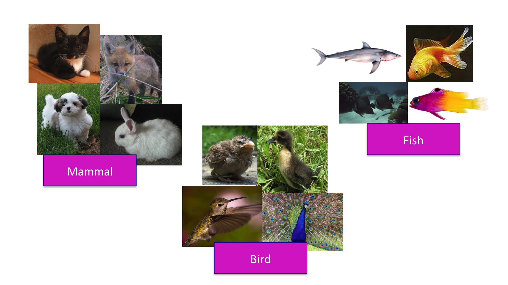

# Clustering and Dimension Reduction

```{r, echo=FALSE}

library(knitr)
knitr::opts_chunk$set( tidy = TRUE)

```
Introduction

The Rmd for this file can be found [here](https://github.com/gurinina/omic_sciences/blob/main/10-distance-and-dimension-reduction.Rmd). The concept of distance is quite intuitive. For example, when we cluster animals into subgroups, we are implicitly defining a distance that permits us to say what animals are "close" to each other.



Many of the analyses we perform with high-dimensional data relate directly or indirectly to distance. Many clustering and machine learning techniques rely on being able to define distance, using features or predictors. For example, to create _heatmaps_, which are widely used in genomics and other high-throughput fields, a distance is computed explicitly.
Image Source: Heatmap, Gaeddal, 01.28.2007 Wikimedia Commons


In these plots the measurements, which are stored in a matrix, are
represented with colors after the columns and rows have been
clustered. (A side note: red and green, a common color theme for heatmaps,
are two of the most difficult colors for many color-blind people to discern.)
Here we will learn the necessary mathematics and computing
skills to understand and create heatmaps. We start by reviewing the
mathematical definition of distance.

## Euclidean Distance

As a review, let's define the distance between two points, $A$ and $B$, on a Cartesian plane.

```{r,echo=FALSE,fig.cap=""}
library(rafalib)
mypar()
plot(c(0,1,1),c(0,0,1),pch=16,cex=2,xaxt="n",yaxt="n",xlab="",ylab="",bty="n",xlim=c(-0.25,1.25),ylim=c(-0.25,1.25))
lines(c(0,1,1,0),c(0,0,1,0))
text(0,.2,expression(paste('(A'[x]*',A'[y]*')')),cex=1.5)
text(1,1.2,expression(paste('(B'[x]*',B'[y]*')')),cex=1.5)
text(-0.1,0,"A",cex=2)
text(1.1,1,"B",cex=2)
```

The euclidean distance between $A$ and $B$ is simply:

$$Distance_{AB} =\sqrt{ (A_x-B_x)^2 + (A_y-B_y)^2}$$


## Distance in High Dimensions

We introduce a dataset with gene expression measurements for 22,215 genes from 189 samples. The R objects can be downloaded like this:

```{r,eval=FALSE}
library(devtools)
install_github("genomicsclass/tissuesGeneExpression")
```

The data represent RNA expression levels for eight tissues, each with several individuals.

```{r}
library(tissuesGeneExpression)
data(tissuesGeneExpression)
dim(e) ##e contains the expression data
table(tissue) ##tissue[i] tells us what tissue is represented by e[,i]
```

We are interested in describing distance between samples in the context of this dataset. We might also be interested in finding genes that _behave similarly_ across samples.

To define distance, we need to know what the points are since mathematical distance is computed between points. With high dimensional data, points are no longer on the Cartesian plane. Instead they are in higher dimensions. For example, sample $i$ is defined by a point in 22,215 dimensional space: $(Y_{1,i},\dots,Y_{22215,i})^\top$. Feature $g$ is defined by a point in 189 dimensions $(Y_{g,1},\dots,Y_{g,189})^\top$

Once we define points, the Euclidean distance is defined in a very similar way as it is defined for two dimensions. For instance, the distance between two samples $i$ and $j$ is:

$$
\mbox{dist}(i,j) = \sqrt{ \sum_{g=1}^{22215} (Y_{g,i}-Y_{g,j })^2 }
$$

and the distance between two features $h$ and $g$ is:

$$
\mbox{dist}(h,g) = \sqrt{ \sum_{i=1}^{189} (Y_{h,i}-Y_{g,i})^2 }
$$

Note: In practice, distances between features are typically applied after standardizing the data for each feature. This is equivalent to computing one minus the correlation. This is done because the differences in overall levels between features are often not due to biological effects but technical ones. More details on this topic can be found in [this presentation](http://master.bioconductor.org/help/course-materials/2002/Summer02Course/Distance/distance.pdf).

**Distance with matrix algebra**

The distance between samples $i$ and $j$ can be written as

$$ \mbox{dist}(i,j) = (\mathbf{Y}_i - \mathbf{Y}_j)^\top(\mathbf{Y}_i - \mathbf{Y}_j)$$

with $\mathbf{Y}_i$ and $\mathbf{Y}_j$ columns $i$ and $j$. This result can be very convenient in practice as computations can be made much faster using matrix multiplication.

**Examples**

We can now use the formulas above to compute distance. Let's compute distance between samples 1 and 2, both kidneys, and then to sample 87, a colon.

```{r}
x <- e[,1]
y <- e[,2]
z <- e[,87]
sqrt(sum((x-y)^2))
sqrt(sum((x-z)^2))
```

As expected, the kidneys are closer to each other. A faster way to compute this is using matrix algebra:

```{r}
sqrt( crossprod(x-y) )
sqrt( crossprod(x-z) )
```

Now to compute all the distances at once, we have the function `dist`. Because it computes the distance between each row, and here we are interested in the distance between samples, we transpose the matrix

```{r}
d <- dist(t(e))
class(d)
```

Note that this produces an object of class `dist` and, to access the entries using row and column indices, we need to coerce it into a matrix:

```{r}
as.matrix(d)[1,2]
as.matrix(d)[1,87]
```

It is important to remember that if we run `dist` on `e`, it will compute all pairwise distances between genes. This will try to create a $22215 \times 22215$ matrix that may crash your R sessions.

88888888888888888888888888888888888888888888888888

## Clustering 

Clustering or cluster analysis is a technique for visualizing high dimensional objects by grouping similar objects together such that objects in the same group (or cluster) are more similar to each other than objects in different groups. Cluster analysis can be helpful in getting a sense of what’s going on in a very high dimensional data set. It's used in almost every genomics techique.

We will use the tissue gene expression data to show the concepts and code needed to perform clustering analysis.

## Basic concepts

Cluster analysis organizes objects into groups based on how close they are to each other.

How is close defined?

How are objects split into groups?

How do we visualize the groups?

How do we interpret the groups?

## Hierarchical clustering

Hierarchical clustering implies organizing your groups into some kind of hierarchy and is known as an 'agglomerative' approach with each object starting out as a single cluster. The algorithm is recursive and goes as follows:

Calculate all pairwise distances between the clusters

Find the two clusters with the minimum distance and merge them into a single cluster.

Repeat until only a single cluster remains.

How do we define distance?

Classical definition of Euclidian distance: 

$Distance = \sqrt{(X_1 - X_2)^2 + (Y_1 - Y_2)^2]}$

One nice feature of Euclidean distance is that it's easily generalizable to higher dimensions. If instead of two dimensions you have 100 dimensions, you can easily take the differences between each of the 100 dimensions, square them, sum them together and then take the square root. So the Euclidean distance metric extends very naturally to very high dimensions problems.

In general the formula for Euclidean distance between point

$A = (A_1, A_2, \dots, A_n)$

and 

$B = (B_1, B_2, \dots, B_n)$

is

$Distance = \sqrt{(A_1-B_1)^2 + (A_2-B_2)^2 + \cdots + (A_n-B_n)^2}$

Simple example:

```{r,tidy=TRUE,fig.cap="Simulated clustered data"}
set.seed(1234)
x <- rnorm(12, rep(1:3,each=4), 0.2)
y <- rnorm(12, rep(c(1,2,1),each=4), 0.2)
plot(x,y,col="blue",pch=19,cex=2)
text(x+0.05,y+0.05,labels=as.character(1:12))
```
The first step in the basic clustering approach is to calculate the distance between every point with every other point. The result is a *distance matrix*, which can be computed with the `dist()` function in R. 

Here is just a piece of the distance matrix associated with the figure above.

```{r}
dataFrame <- data.frame(x=x, y=y)
dist(dataFrame)
```

The default distance metric used by the `dist()` function is Euclidean distance.

Note that usually you will *not* have to explicitly compute the distance matrix (unless you are inventing your own clustering method). Here I just print it out to show what's going on internally.

First an agglomerative clustering approach attempts to find the two points that are closest together. In other words, we want to find the smallest non-zero entry in the distance matrix.

```{r,tidy=TRUE}

rdistxy <- as.matrix(dist(dataFrame))
## Remove the diagonal from consideration
diag(rdistxy) <- diag(rdistxy) + 1e5
# Find the index of the points with minimum distance
ind <- which(rdistxy == min(rdistxy),arr.ind=TRUE)
ind
```

Now we can plot the points and show which two points are closest together according to our distance metric.

```{r,tidy=TRUE,fig.cap="Two closest points"}

plot(x,y,col="blue",pch=19,cex=2)
text(x+0.05,y+0.05,labels=as.character(1:12))
points(x[ind[1,]],y[ind[1,]],col="orange",pch=19,cex=2)
```

The next step for the algorithm is to start drawing the tree, the first step of which would be to "merge" these two points together.

```{r,tidy=TRUE,fig.width=7,fig.height=4,warning=FALSE,message=FALSE,fig.cap="Merging of first two points"}

par(mfrow = c(1, 2))
plot(x,y,col="blue",pch=19,cex=2, main = "Data")
text(x+0.05,y+0.05,labels=as.character(1:12))
points(x[ind[1,]],y[ind[1,]],col="orange",pch=19,cex=2)
# Make a cluster and cut it at the right height
library(dplyr)
hcluster <- dist(dataFrame) %>% hclust
dendro <- as.dendrogram(hcluster)
cutDendro <- cut(dendro,h=(hcluster$height[1]+0.00001) )
plot(cutDendro$lower[[11]],yaxt="n",main="Begin building tree")

```


Now that we've merged the first two "leaves" of this tree, we can turn the algorithm crank and continue to build the tree. Now, the two points we identified in the previous iteration will get "merged" into a single point, as depicted below.

```{r,echo=FALSE,fig.cap="First set of merged points/cluster"}

rdistxy <- dist(dataFrame) %>% as.matrix
diag(rdistxy) <- diag(rdistxy) + 1e5
# Find the index of the points with minimum distance
ind <- which(rdistxy == min(rdistxy),arr.ind=TRUE)
# Plot the points with the minimum overlayed
plot(x,y,col="blue",pch=19,cex=2)
text(x+0.05,y+0.05,labels=as.character(1:12))
points(x[ind[1,]],y[ind[1,]],col="orange",pch=19,cex=2)
points(mean(x[ind[1,]]),mean(y[ind[1,]]),col="black",cex=3,lwd=3,pch=3)
points(mean(x[ind[1,]]),mean(y[ind[1,]]),col="orange",cex=5,lwd=3,pch=1)

```


We need to search the distance matrix for the *next* two closest points, ignoring the first two that we already merged.

```{r}

nextmin <- rdistxy[order(rdistxy)][3]
ind <- which(rdistxy == nextmin,arr.ind=TRUE)
ind

```

Now we can plot the data with this next pair of points and the merged tree leaves.

```{r,fig.width=7,fig.height=4,echo=FALSE,fig.cap="Second set of merged points"}

par(mfrow=c(1,3))
plot(x,y,col="blue",pch=19,cex=2)
text(x+0.05,y+0.05,labels=as.character(1:12))
points(x[c(5,6)],y[c(5,6)],col="orange",pch=19,cex=2)
points(x[ind[1,]],y[ind[1,]],col="red",pch=19,cex=2)
# Make dendogram plots
distxy <- dist(dataFrame)
hcluster <- hclust(distxy)
dendro <- as.dendrogram(hcluster)
cutDendro <- cut(dendro,h=(hcluster$height[2]) )
plot(cutDendro$lower[[10]],yaxt="n")
plot(cutDendro$lower[[5]],yaxt="n")

```

And on and on in this manner. If we were to continue in this fashion--identifying the two closest points and merging them, we'd end up with a *dendrogram* that looks like this one. Here, we call the `hclust()` do run the clustering algorithm.

```{r,fig.cap="Full hierarchical clustering dendrogram"}

hClustering <- data.frame(x=x,y=y) %>% dist %>% hclust
plot(hClustering)

```

From the tree/dendrogram it's clear that there are three clusters each with four points. 


## Prettier dendrograms

It's possible to make slightly prettier dendrograms with some modification to the usual plotting method for the output of `hclust()`. Here's a function that takes the output of `hclust()` and color codes each of the cluster members by their cluster membership.

```{r myplclust,tidy = TRUE, eval = FALSE}

myplclust <- function (hclust, labels = hclust$labels, lab.col = rep(1, length(hclust$labels)), 
    hang = 0.1, xlab = "", sub = "", ...) 
{
    y <- rep(hclust$height, 2)
    x <- as.numeric(hclust$merge)
    y <- y[which(x < 0)]
    x <- x[which(x < 0)]
    x <- abs(x)
    y <- y[order(x)]
    x <- x[order(x)]
    plot(hclust, labels = FALSE, hang = hang, xlab = xlab, sub = sub, 
        ...)
    text(x = x, y = y[hclust$order] - (max(hclust$height) * hang), 
        labels = labels[hclust$order], col = lab.col[hclust$order], 
        srt = 90, adj = c(1, 0.5), xpd = NA, ...)
}

```

And here's the output the function produces.

```{r, fig.width=7,fig.height=4,tidy=TRUE, fig.cap="Prettier dendrogram"}

hClustering <- data.frame(x=x,y=y) %>% dist %>% hclust
myplclust(hClustering,lab=rep(1:3,each=4),
          lab.col=rep(1:3,each=4))
```

88888888888888888888888888888888888888888888888888

## Hiigh-dimensional data:clustering tissue data
```{r tissue-data, echo = FALSE}

library(tissuesGeneExpression)
data(tissuesGeneExpression)

```
So most of the time you'll be dealing with high-dimensional datasets. Exploratory analysis can help you figure out what you are dealing with before you do any real analysis. So we've been looking at this RNA-seq data, which has the following samples annotated only by tissue:

```{r}

table(tissue)
pData = data.frame(sample = colnames(e),tissue = tissue,
                   stringsAsFactors = F)

```

To illustrate the main application of clustering in the life sciences, let's pretend that we don't know these are different tissues and are interested in clustering. The first step is to compute the distance between each sample:

```{r, tissue}
d <- dist( t(e) )
```

With the distance between each pair of samples computed, we need clustering algorithms to join them into groups. Hierarchical clustering is one of the many clustering algorithms available to do this. Each sample is assigned to its own group and then the algorithm continues iteratively, joining the two most similar clusters at each step, and continuing until there is just one group. 

```{r hc-tissue, fig.cap="Dendrogram showing hierarchical clustering of tissue gene expression data.",fig.width=10.5,fig.height=5.25}

mypar()
d <- dist( t(e) )
hc <- hclust(d)
hc
plot(hc,labels=tissue,cex=0.5)
```

Does this technique "discover" the clusters defined by the different tissues? In this plot, it is not easy to see the different tissues so we add colors by using the `myplclust` function from the `rafalib` package. 
 
```{r tissueclust, fig.cap="Dendrogram showing hierarchical clustering of tissue gene expression data with colors denoting tissues.",fig.width=10.5,fig.height=5.25}

hc <- hclust(dist( t(e) ))
myplclust(hc, labels=tissue, lab.col = as.fumeric(tissue), cex=0.5)

```

Visually, it does seem as if the clustering technique has discovered the tissues. However,  hierarchical clustering does not define specific clusters, but rather defines the dendrogram above. From the dendrogram we can decipher the distance between any two groups by looking at the height at which the two groups split into two. To define clusters, we need to "cut the tree" at some distance and group all samples that are within that distance into groups below. To visualize this, we draw a horizontal line at the height we wish to cut and this defines that line. We use 120 as an example:

```{r plcluster, fig.cap="Dendrogram showing hierarchical clustering of tissue gene expression data with colors denoting tissues. Horizontal line defines actual clusters.",fig.width=10.5,fig.height=5.25}

hc <- hclust(dist( t(e) ))
myplclust(hc, labels=tissue, lab.col=as.fumeric(tissue),cex=0.5)
abline(h=120)

```

If we use the line above to cut the tree into clusters, we can examine how the clusters overlap with the actual tissues:

```{r, table}

hc <- hclust(dist( t(e) ))
hclusters <- cutree(hc, h=120)
table(true=tissue, cluster=hclusters)

```

We can also ask `cutree` to give us back a given number of clusters. The function then automatically finds the height that results in the requested number of clusters:

```{r, k}

hc <- hclust(dist( t(e) ))
hclusters <- cutree(hc, k=8)
table(true=tissue, cluster=hclusters)

```

In both cases we do see that, with some exceptions, each tissue is uniquely represented by one of the clusters. In some instances, the one tissue is spread across two tissues, which is due to selecting too many clusters. Selecting the number of clusters is generally a challenging step in practice and an active area of research.

In both cases we do see that, with some exceptions, each tissue is uniquely represented by one of the clusters. In some instances, the one tissue is spread across two tissues, which is due to selecting too many clusters. Selecting the number of clusters is generally a challenging step in practice and an active area of research.

<a name="kmeans"></a>

## K-means clustering
The K-means approach, like many clustering methods, is highly algorithmic (can’t be summarized in a formula) and is iterative. The basic idea is that you are trying to find the centroids of a fixed number of clusters of points in a high-dimensional space. In two dimensions, you can imagine that there are a bunch of clouds of points on the plane and you want to figure out where the centers of each one of those clouds is.

The K-means approach is a partitioning approach, whereby the data are partitioned into groups at each iteration of the algorithm. One requirement is that you must pre-specify how many clusters there are. Of course, this may not be known in advance, but you can guess and just run the algorithm anyway. Afterwards, you can change the number of clusters and run the algorithm again to see if anything changes.

The outline of the algorithm is

Fix the number of clusters at some integer greater than or equal to 2

Start with the “centroids” of each cluster; initially you might just pick a random set of points as the centroids

Assign points to their closest centroid; cluster membership corresponds to the centroid assignment

Reclaculate centroid positions and repeat.

This approach, like most clustering methods requires a defined distance metric, a fixed number of clusters, and an initial guess as to the cluster centriods. There’s no set approach to determining the initial configuration of centroids, but many algorithms simply randomly select data points from your dataset as the initial centroids.

The K-means algorithm produces

A final estimate of cluster centroids (i.e. their coordinates)

An assignment of each point to their respective cluster

Using the `kmeans` function to perform k-means clustering, centroids are chosen by random from the observations based on the number of desired clusters. Membership is then assigned based on the closest centroid.
Centroids are recalculated and process is repeated.

As an example, let's run k-means on the samples in the space of the first two genes:

```{r kmeans, fig.cap="Plot of gene expression for first two genes (order of appearance in data) with color representing tissue (left) and clusters found with kmeans (right).",fig.width=10.5,fig.height=5.25}

set.seed(1)
km <- kmeans(t(e[1:2,]), centers=7)
names(km)

mypar(1,2)
plot(e[1,], e[2,], col=as.fumeric(tissue), pch=16)
plot(e[1,], e[2,], col=km$cluster, pch=16)

```

In the first plot, color represents the actual tissues, while in the second, color represents the clusters that were defined by `kmeans`. We can see from tabulating the results that this particular clustering exercise did not perform well:

```{r kmtable}

km <- kmeans(t(e[1:2,]), centers=7)
table(true=tissue,cluster=km$cluster)

```

This is very likely due to the fact that the first two genes are not informative regarding tissue type. We can see this in the first plot above. If we instead perform k-means clustering using all of the genes, we obtain a much improved result. To visualize this, we can use an MDS plot:


```{r kmeans_mds, fig.cap="Plot of gene expression for first two PCs with color representing tissues (left) and clusters found using all genes (right).",fig.width=10.5,fig.height=5.25}

km <- kmeans(t(e), centers=7)
mds <- cmdscale(d)

mypar(1,2)
plot(mds[,1], mds[,2]) 
plot(mds[,1], mds[,2], col=km$cluster, pch=16)

```

Multidimensional scaling (MDS) is a multivariate data analysis approach that is used to visualize the similarity/dissimilarity between samples by plotting points in two dimensional plots. We'll talk more about this later today.

By tabulating the results, we see that we obtain a similar answer to that obtained with hierarchical clustering.

```{r tissuetable}

table(true=tissue,cluster=km$cluster)

```


### Heatmaps

Heatmaps are ubiquitous in the genomics literature. They are very useful plots for visualizing the measurements for a subset of rows over all the samples. A *dendrogram* is added on top and on the side that is created with hierarchical clustering. We will demonstrate how to create heatmaps from within R. Let's begin by defining a color palette:

```{r colorramp}

library(RColorBrewer) 
hmcol <- colorRampPalette(brewer.pal(9, "GnBu"))(100)
```

Now, pick the genes with the top variance over all samples:

```{r genefilter, message=FALSE}

library(genefilter)

```

While a `heatmap` function is included in R, we recommend the `heatmap.2` function from the `gplots` package on CRAN because it is a bit more customized. For example, it stretches to fill the window. Here we add colors to indicate the tissue on the top:

```{r heatmap2,message=FALSE,fig.cap="Heatmap created using the 40 most variable genes and the function heatmap.2.", fig.width=10.5,fig.height=5.25}

library(gplots) ##Available from CRAN

rv <- rowVars(e)
idx <- order(-rv)[1:40]
cols <- palette(brewer.pal(8, "Dark2"))[as.fumeric(tissue)]
head(cbind(colnames(e),cols))
h=heatmap.2(e[idx,], labCol=tissue,
          trace="none", 
          ColSideColors=cols, 
          col=hmcol)
names(h)

```

We did not use tissue information to create this heatmap, and we can quickly see, with just 40 genes, good separation across tissues.


88888888888888888888888888888888888888888888888888

**Other exploratory analysis techniques** 
## Dimension Reduction: SVD

The key aspect of matrix data, which is what we deal withh in genomics data, is that every element of the matrix is the same type and represents the same kind of measurement. This is in contrast to a data frame, where every column of a data frame can potentially be of a different class.

Matrix data have some special statistical methods that can be applied to them. One category of statistical dimension reduction techniques is commonly called principal components analysis (PCA) or the singular value decomposition (SVD). These techniques generally are applied in situations where the rows of a matrix represent observations of some sort and the columns of the matrix represent features or variables (but this is by no means a requirement). All of our genomic datasets are in matrix format, where rows are genes and columns are samples, e.g. RNA-seq, Chip-chip.

In an abstract sense, the SVD or PCA can be thought of as a way to approximate a high-dimensional matrix (i.e. a large number of columns) with a a few low-dimensional matrices. So there’s a bit of data compression angle to it. We’ll take a look at what’s going on in this chapter.

```{r}

set.seed(12345)
dataMatrix <- matrix(rnorm(400), nrow = 40)
image(1:10, 1:40, t(dataMatrix)[, nrow(dataMatrix):1])
heatmap(dataMatrix)

```

Not surprisingly, there aren’t really any interesting patterns given that we just simulated random noise. At least it’s good to know that the clustering algorithm won’t pick up something when there’s nothing there!

But now what if there were a pattern in the data? How would we discover it?

Let’s first simulate some data that indeed does have a pattern. In the code below, we cycle through all the rows of the matrix and randomly add 3 to the last 5 columns of the matrix.
```{r}

set.seed(678910)
for (i in 1:40) {
coinFlip <- rbinom(1, size = 1, prob = 0.5)
## If coin is heads add a common pattern to that row
 if (coinFlip) {
 dataMatrix[i, ] <- dataMatrix[i, ] + rep(c(0, 3), each = 5)
 }
}

image(1:10, 1:40, t(dataMatrix)[, nrow(dataMatrix):1])

```
You can see that some of the rows on the right side of the matrix have higher values than on the left side.

Now what happens if we cluster the data?

```{r}

heatmap(dataMatrix)

```

## Patterns in rows and columns
In general, with matrix data, there may be patterns that occur accross the rows and columns of the matrix. In the example above, we shifted the mean of some of the observations in columns 5 through 10. We can display this a bit more explicitly by looking at the row and column means of the data.

```{r}

 library(dplyr)
 hh <- dist(dataMatrix) %>% hclust
 dataMatrixOrdered <- dataMatrix[hh$order, ]
 par(mfrow = c(1, 3))
 
 ## Complete data
 image(t(dataMatrixOrdered)[, nrow(dataMatrixOrdered):1])
 
 ## Show the row means
 plot(rowMeans(dataMatrixOrdered), 40:1, xlab = "Row Mean", ylab = "Row", pch = 19)
 
 ## Show the column means
 plot(colMeans(dataMatrixOrdered), xlab = "Column", ylab = "Column Mean", pch = 19)
 
```

However, there may be other patterns beyond a simple mean shift and so more sophisticated methods will be needed. Futhermore, there may be multiple patterns layered on top of each other so we need a method that can distangle these patterns.

## Related problem
Here’s another way to formulate the problem that matrix data present. Suppose you have multivariate observations

$$X_1,...,X_n$$

so that each of the n observations has m features,


$$X_1 = (X_{11},...,X_{1m})$$
 

Given this setup, the goal is to find a new set of variables/features that are uncorrelated and explain as much variance in the data as possible. Put another way, if you were to put all these multivariate observations together in one matrix, find the best matrix created with fewer variables (lower rank) that explains the original data.

The first goal is statistical in nature and the second goal is perhaps better characterized as lossy data compression.

## SVD and PCA

If X is a matrix with each variable in a column and each observation in a row then the SVD is a matrix decomposition that represents X as a matrix product of three matrices:

$$X = UDV^-1$$

where the columns of U (left singular vectors) are orthogonal, the columns of V (right singular vectors) are orthogonal and  
D is a diagonal matrix of singular values.

Principal components analysis (PCA) is simply an application of the SVD. The principal components are equal to the right singular values if you first scale the data by subtracting the column mean and dividing each column by its standard deviation (that can be done with the scale() function).

## Unpacking the SVD: u and v

The SVD can be computed in R using the svd() function. 

```{r}
svd1 <- svd(scale(dataMatrixOrdered))
```

Here, we scale our original matrix data with the pattern in it and apply the svd.
The svd() function returns a list containing three components named u, d, and v. The u and v components correspond to the matrices of left and right singular vectors, respectively, while the d component is a vector of singular values, corresponding to the diagonal of the matrix D described above.

Below we plot the first left and right singular vectors along with the original data.
```{r}

 par(mfrow = c(1, 3))
 image(t(dataMatrixOrdered)[, nrow(dataMatrixOrdered):1], main = "Original Data")
 plot(svd1$u[, 1], 40:1, ylab = "Row", xlab = "First left singular vector", pch = 19)
 plot(svd1$v[, 1], xlab = "Column", ylab = "First right singular vector", pch = 19)
 
```

You can see how the first left and right singular vectors pick up the mean shift in both the rows and columns of the matrix.

## SVD for data compression
If we believed that the first left and right singular vectors, call them u1 and v1, captured all of the variation in the data, then we could approximate the original data matrix with

$$X \approx u_1v^t_1$$

Thus, we would reduce 400 numbers in the original matrix to 40 + 10 = 50 numbers in the compressed matrix, a nearly 90% reduction in information. Here’s what the original data and the approximation would look like.

## Approximate original data with outer product of first singular vectors
```{r}

 approx <- with(svd1, outer(u[, 1], v[, 1]))
#approx = svd1$u[,1] %*%t(svd1$v[,1])
 ## Plot original data and approximated data
 par(mfrow = c(1, 2))
 image(t(dataMatrixOrdered)[, nrow(dataMatrixOrdered):1], main = "Original Matrix")
 image(t(approx)[, nrow(approx):1], main = "Approximated Matrix")
 
```

Obviously, the two matrices are not identical, but the approximation seems reasonable in this case. This is not surprising given that there was only one real feature in the original data.

## Components of the SVD - Variance explained
The statistical interpretation of singular values is in the form of variance in the data explained by the various components. The singular values produced by the svd() are in order from largest to smallest and when squared are proportional the amount of variance explained by a given singular vector.

To show how this works, here’s a very simple example. First, we’ll simulate a “dataset” that just takes two values, 0 and 1.
```{r}

constantMatrix <- dataMatrixOrdered * 0
for (i in 1:dim(dataMatrixOrdered)[1]) {
    constantMatrix[i, ] <- rep(c(0, 1), each = 5)
}

```

Then we can take the SVD of this matrix and show the singular values as well as the proportion of variance explained.

```{r}

 svd1 <- svd(constantMatrix)
 par(mfrow = c(1, 3))
 image(t(constantMatrix)[, nrow(constantMatrix):1], main = "Original Data")
 plot(svd1$d, xlab = "Column", ylab = "Singular value", pch = 19)
 plot(svd1$d^2/sum(svd1$d^2), xlab = "Column", ylab = "Prop. of variance explained", pch = 19)
 
```


As we can see from the right-most plot, 100% of the variation in this “dataset” can be explained by the first singular value. Or, all of the variation in this dataset occurs in a single dimension. This is clear because all of the variation in the data occurs as you go from left to right across the columns. Otherwise, the values of the data are constant.

In the plot below, we plot the singular values (left) and the proportion of variance explained for the slightly more complex dataset that we’d been using previously.

```{r}

 par(mfrow = c(1, 2))
 svd1 <- svd(scale(dataMatrixOrdered))
 plot(svd1$d, xlab = "Column", ylab = "Singular value", pch = 19)
 plot(svd1$d^2/sum(svd1$d^2), xlab = "Column", ylab = "Prop. of variance explained", pch = 19)
 
```

We can see that the first component explains about 40% of all the variation in the data. In other words, even though there are 10 dimensions in the data, 40% of the variation in the data can be explained by a single dimension. That suggests that the data could be simplified quite a bit, a phenomenon we observed in the last section where it appeared the data could be reasonably approximated by the first left and right singular vectors.


**How is this useful?**

It is not immediately obvious how incredibly useful the SVD can be, so let's consider some examples. In this example, we will greatly reduce the dimension of $V$ and still be able to reconstruct $Y$.

Its really just a way of seeing where the variation in your  data is coming from.

Let's compute the SVD on the gene expression table we have been working with.  As an exploratory step, we wish to know if gene expression profiles stored in the columns of `mat` show more similarity between tissues than across tissues. Unfortunately, as mentioned above, we can't plot multi-dimensional points. In general, we prefer two-dimensional plots, but making plots for every pair of genes or every pair of samples is not practical. 
```{r}

library(tissuesGeneExpression)
data(tissuesGeneExpression)

```

The `svd` command returns the three matrices (only the diagonal entries are returned for $D$). To obtain the _principal components_ from the SVD,
we multiply the diagonal matrix with t(V) and take the rows. Alternatively, you can multiply the singular vector d by the columns of V.
```{r}
library(tissuesGeneExpression)
data(tissuesGeneExpression)
Y = e - rowMeans(e)
s <- svd(Y)
U <- s$u
V <- s$v
D <- diag(s$d) ##turn it into a matrix
DVT <-  D %*%t(V)


PC1 <- DVT[1,]
PC2 <- DVT[2,]

# or

# PC1 = s$d[1]*s$v[,1]
# PC2 = s$d[2]*s$v[,2]

library(RColorBrewer)
library(rafalib)
f = factor(tissue)
group <- as.fumeric(tissue)
cols <- palette(brewer.pal(8, "Dark2"))[group]
par(pch = 19)
plot(PC1, PC2, col=cols,main = "SVD",
xlab = "PC1",ylab = "PC2")
legend("bottomright",levels(f),col = cols, cex = 0.75)

```


Note that we can in fact reconstruct y:

```{r}

Yhat <- U %*% D %*% t(V)
resid <- Y - Yhat
max(abs(resid))

```

If we look at the sum of squares of $\mathbf{UD}$, we see that the last few are quite close to 0 (perhaps we have some replicated columns).  

```{r D_entries, fig.width=4,fig.height=4,fig.cap="Entries of the diagonal of D for gene expression data."}

par(pch = 19)
plot(s$d)

```

This implies that the last columns of `V` have a very small effect on the reconstruction of `Y`. To see this, consider the extreme example in which the last entry of $V$ is 0. In this case the last column of $V$ is not needed at all. Because of the way the SVD is created, the columns of $V$ have less and less influence on the reconstruction of $Y$. You commonly see this described as "explaining less variance". This implies that for a large matrix, by the time you get to the last columns, it is possible that there is not much left to "explain" As an example, we will look at what happens if we remove the four last columns:

```{r}

k <- ncol(U)-4
Yhat <- U[,1:k] %*% D[1:k,1:k] %*% t(V[,1:k])
resid <- Y - Yhat 
max(abs(resid))

```

The largest residual is practically 0, meaning that we `Yhat` is practically the same as `Y`, yet we need 4 fewer dimensions to transmit the information.

By looking at $d$, we can see that, in this particular dataset, we can obtain a good approximation keeping only 94 columns. The following plots are useful for seeing how much of the variability is explained by each column:

```{r percent_var_explained, fig.cap="Percent variance explained by each principal component of gene expression data.",fig.width=4,fig.height=4}

par(pch = 19)
plot(s$d^2/sum(s$d^2)*100,ylab="Percent variability explained")
ex = s$d^2/sum(s$d^2)*100

```


Although we start with 189 dimensions, we can approximate $Y$ with just 95:

```{r reconstruction_with_less_dimensions, fig.cap="Residuals from comparing a reconstructed gene expression table using 95 PCs to the original data with 189 dimensions.",fig.width=4,fig.height=4}

k <- 95 ##out a possible 189
Yhat <- U[,1:k] %*% D[1:k,1:k] %*% t(V[,1:k])
resid <- Y - Yhat
boxplot(resid,ylim=quantile(Y,c(0.01,0.99)),range=0)

```

Therefore, by using only half as many dimensions, we retain most of the variability in our data and we say that we explain 96% of the variability.

Note that we can compute this proportion from $D$:
```{r}

1-sum(s$d[1:k]^2)/sum(s$d^2)

```

The entries of $D$ therefore tell us how much each PC contributes in term of variability explained.

## PCA 
As we mentioned above, the SVD has a close connection to principal components analysis (PCA). PCA can be applied to the data by calling the prcomp() function in R. Here, we show that the first right singular vector from the SVD is equal to the first principal component vector returned by PCA.

```{r,fig.width=4,fig.height=4}

svd1 <- svd(t(dataMatrixOrdered))
pca1 <- prcomp(t(dataMatrixOrdered), scale = FALSE,center = FALSE)
plot(pca1$rotation[, 1], svd1$v[, 1], pch = 19, xlab = "Principal Component 1", ylab = "Right Singular Vector 1")
abline(c(0, 1))


theoreticalScores <- svd1$u %*% diag(svd1$d)
table(all(round(pca1$x,5) == round(theoreticalScores,5)))
recoverMatSVD <- theoreticalScores %*% t(svd1$v)
table(all(round(t(dataMatrixOrdered),5) == round(recoverMatSVD,5)))
recoverMatPCA <- pca1$x %*% t(pca1$rotation)
table(all(round(t(dataMatrixOrdered),5) == round(recoverMatPCA,5)))

```

Whether you call this procedure SVD or PCA really just depends on who you talk to. Statisticians and people with that kind of background will typically call it PCA while engineers and mathematicians will tend to call it SVD.

## Multi-Dimensional Scaling Plots

Multi-dimensional scaling (MDS) plots are another form of PCA. with a gene expression example. To simplify the illustration we will only consider three tissues:

```{r,message=FALSE}

library(rafalib)
library(tissuesGeneExpression)
data(tissuesGeneExpression)
colind <- tissue%in%c("kidney","colon","liver")
mat <- e[,colind]
group <- factor(tissue[colind])
dim(mat)

```

As an exploratory step, we wish to know if gene expression profiles stored in the columns of `mat` show more similarity between tissues than across tissues. Unfortunately, as mentioned above, we can't plot multi-dimensional points. In general, we prefer two-dimensional plots, but making plots for every pair of genes or every pair of samples is not practical. MDS plots become a powerful tool in this situation.


**`cmdscale`**

Although we used the `svd` functions above, there is a special function that is specifically made for MDS plots. It takes a distance object as an argument and then uses principal component analysis to provide the best approximation to this distance that can be obtained with $k$ dimensions. This function is more efficient because one does not have to perform the full SVD, which can be time consuming. By default it returns two dimensions, but we can change that through the parameter `k` which defaults to 2.

```{r mds2, fig.cap="MDS computed with cmdscale function.",fig.width=6,fig.height=4} 

d <- dist(t(mat))
mds <- cmdscale(d)
s = svd(mat)
mypar()
plot(mds[,1],mds[,2],bg=as.numeric(group),pch=21,
     xlab="First dimension",ylab="Second dimension")
legend("bottomleft",levels(group),col=seq(along=levels(group)),pch=15)

```

These two approaches are equivalent up to an arbitrary sign change.

```{r mds_same_as_svd, fig.cap="Comparison of MDS first two PCs to SVD first two PCs.",fig.width=6,fig.height=4}

mypar(1,2)
par(pch = 19)
for(i in 1:2){
  plot(mds[,i],s$d[i]*s$v[,i],main=paste("PC",i),col = group)
  b = ifelse( cor(mds[,i],s$d[i]*s$v[,i]) > 0, 1, -1)
  abline(0,b) ##b is 1 or -1 depending on the arbitrary sign "flip"
}

```

In summary: Why dimension reduction is useful; example: exploratory data analysis with the tissueGeneExpression dataset. Assist in guiding clustering analysis, gut checks.
```{r}

library(rafalib)
library(gplots) ##Available from CRAN
library(RColorBrewer)
library(tissuesGeneExpression)
data(tissuesGeneExpression)
colind <- tissue%in%c("kidney","colon","liver")
mat <- e[,colind]


group <- as.fumeric(tissue[colind])

cols <- palette(brewer.pal(8, "Dark2"))[group]
f=factor(tissue[colind])

pc = prcomp(t(mat))
s = svd(mat-rowMeans(mat))
d <- dist(t(mat))
mds <- cmdscale(d)
dv = diag(s$d)%*%t(s$v)
dv = t(dv)

```


```{r}

par(pch=19)
mypar(1,2)

plot(pc$x[,1],pc$x[,2],col=cols,main = "PCA",
xlab="PC1",ylab="PC2")
legend("bottomright",levels(f),col=seq(along=levels(f)),pch=15, cex = 0.75)

plot(dv[,1],dv[,2],col=cols,main = "SVD",
xlab="PC1",ylab="PC2")
legend("bottomright",levels(f),col=seq(along=levels(f)),pch=15, cex = 0.75)

plot(pc$x[,1],pc$x[,2],col=cols,main = "PCA",
xlab="PC1",ylab="PC2")
legend("bottomright",levels(f),col=seq(along=levels(f)),pch=15, cex = 0.75)

plot(mds[,1],mds[,2],col= cols,main = "MDS",
xlab="First dimension",ylab="Second dimension")
legend("bottomleft",levels(f),col=seq(along=levels(f)),pch=15, cex = 0.75)

```
Little differences between PCA, SVD and MDS aside from sign flip.


