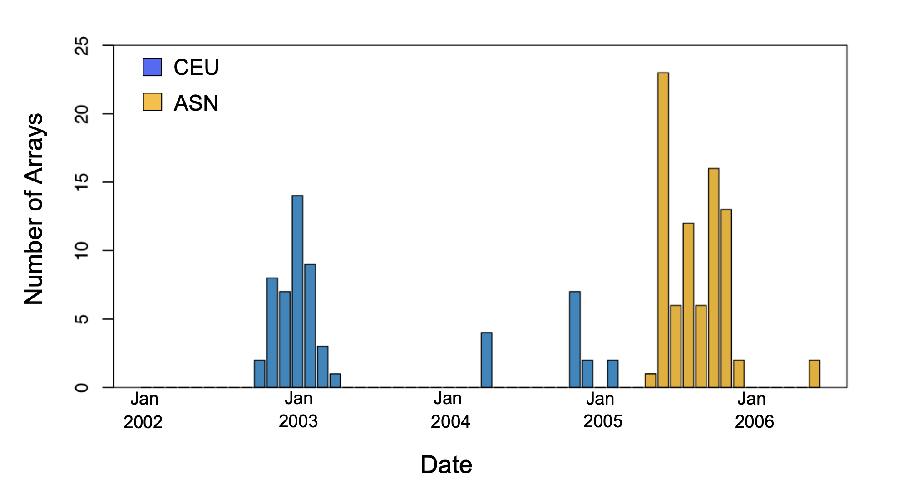
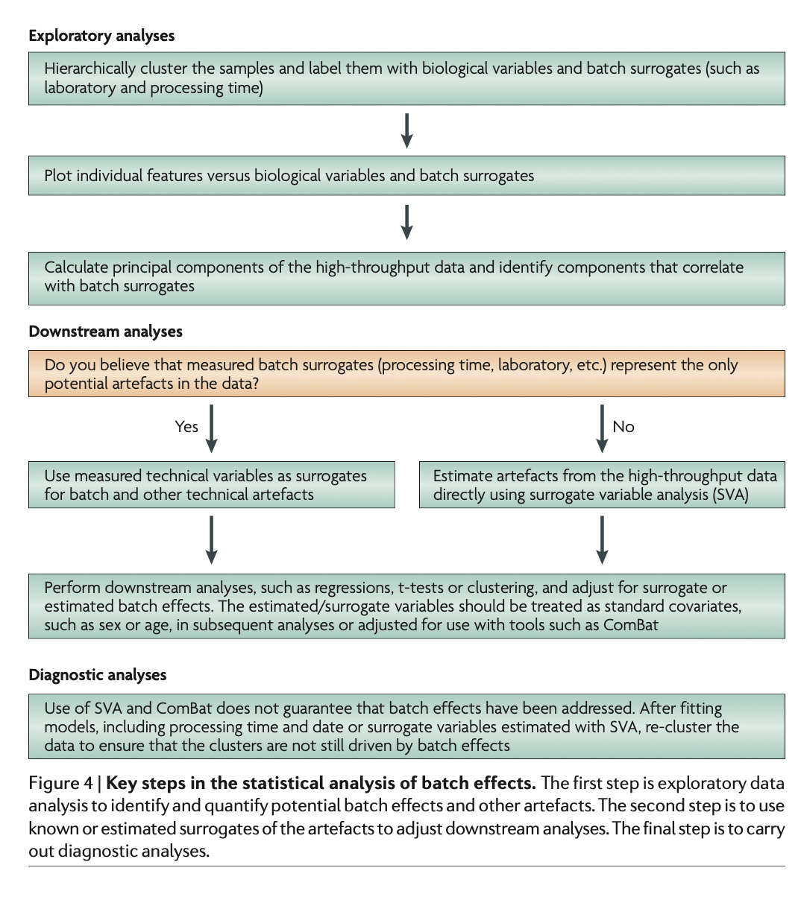

# Confounding

The Rmd for this file can be found [here](https://github.com/gurinina/omic_sciences/blob/main/11-confounding.Rmd). Batch effects have the most devastating effects when they are _confounded_ with outcomes of interest. Here we describe confounding and how it relates to data interpretation.

"Correlation is not causation" is one of the most important lessons you should take from this or any other data analysis course. A common example for why this statement is so often true is confounding. Simply stated confounding occurs when we observe a correlation or association between $X$ and $Y$, but  this is strictly the result of both $X$ and $Y$ depending on an extraneous variable $Z$. Here we describe Simpson's paradox, a phenomenon in probability and statistics in which a trend appears in several groups of data but disappears or reverses when the groups are combined. 


Simpson's Paradox in baseball

Simpson's Paradox is commonly seen in baseball statistics. Here is a well known example in which David Justice had a higher batting average than Derek Jeter in both 1995 and 1996, but Jeter had a higher overall average:

|               | 1995           | 1996           | Combined        |
| ------------- | -------------- | -------------- | --------------- |
| Derek Jeter   | 12/48 (.250)   | 183/582 (.314) | 195/630 (.310)  |
| David Justice | 104/411 (.253) | 45/140 (.321)  | 149/551 (.270)  |

The confounder here is games played. Jeter played more games during the year he batted better, while the opposite is true for Justice.

<a name="genomics"></a>

## Confounding: Very Simple Example

Sex confounded with treatment
A confounded RNA-Seq experiment is one where you cannot distinguish the separate effects of two different sources of variation in the data.

For example, we know that sex has large effects on gene expression, and if all of our control mice were female and all of the treatment mice were male, then our treatment effect would be confounded by sex. We could not differentiate the effect of treatment from the effect of sex.


To AVOID confounding:

Ensure animals in each condition are all the same sex, age, litter, and batch, if possible.

If not possible, then ensure to split the animals equally between conditions


## Confounding: High-Throughput Example

To describe the problem of confounding with a real example, we will use a dataset from [this paper](http://www.ncbi.nlm.nih.gov/pubmed/17206142) entitled "Common genetic variants account for differences in gene expression among ethnic groups", published in Nature Genetics 2007. In this study, Spielman et al. estimate the number of genes differentially expressed between individuals of European (CEU) and Asian (ASN) ancestry and suggest that these differences can be accounted for by measured genetic variants. Specifically, they claimed that roughly 50% of genes were differentially expressed when comparing blood from these two ethnic groups. We include the data in one of our data packages:

```{r,message=FALSE}
library(rafalib)
library(Biobase) ##available from Bioconductor
library(genefilter) 
library(GSE5859) ##available from github
data(GSE5859)
```

We can extract the gene expression data and sample information table using the Bioconductor functions `exprs` and `pData` like this:

```{r}
geneExpression = exprs(e)
sampleInfo = pData(e)
```

Note that some samples were processed at different times.

```{r}
head(sampleInfo$date)
```

Date is an extraneous variable and should not affect the values in `geneExpression`. However, it does appear to have an effect. We will therefore explore this here.

We can immediately see that year and ethnicity are almost completely confounded:

```{r}
year = factor( format(sampleInfo$date,"%y") )
tab = table(year,sampleInfo$ethnicity)
print(tab)
```

In response to this paper, Akey, Biswas, Leek and Storey (Leek and Storey are heavy hitters in R bioinformatics and the microarray world) wrote a letter to the [Nature Genetics editor](https://pubmed.ncbi.nlm.nih.gov/17597765/): Spielman et al.(1) estimate the number of genes differentially expressed between individuals of European (CEU) and Asian (ASN) ancestry and suggest that these differences can be accounted for by measured genetic variants. We recently performed a similar study comparing differences in gene expression among individuals of European and Yoruban ancestry(2). Given the scientific, medical and societal implications of this research area, it is important for the scientific community to carefully revisit and critically evaluate the conclusions of such studies. To this end, we have reanalyzed the data in Spielman et al.(1) to provide a common basis for comparison with our study. In doing so, we found that important issues arise about the accuracy of their results. 

Spielman et al categorized genes as differentially expressed if they had P-values <1e-5, corresponding to a Sidak corrected P-value <0.05 for multiple hypothesis tests. At this significance threshold, they report that approximately 26% of genes are differentially expressed between the CEU and ASN samples (ASN denotes the combined HapMap Beijing Chinese (CHB) and Japanese (JPT) HapMap individuals). As a Sidak correction is similar to a Bonferroni correction, the proportion of genes found to be significant is a conservative estimate of the true overall proportion of differentially expressed genes. A more widely used and less conservatively biased approach is to analyze the complete distribution of P-values, which provides a lower bound estimate of the proportion of truly differentially expressed genes (3,4). Applying this methodology to the distribution of P-values obtained by P-values obtained by t tests on genes expressed in lymphoblastoid cell lines as defined in Spielman et al.(1), we estimate that at least 78% of these genes are differentially expressed between the CEU and ASN samples. 

Figure 3. Distribution of P-values for tests of differential expression. (a) P-values resulting from tests of P-values resulting from tests of P differential expression between the CEU and ASN samples. 

Let's have a look at that:

```{r Figure 3.(a), fig.cap="Comparison by ethnicity", fig.width=7,fig.height=4}

library(qvalue)
## remove control genes
out <- grep("AFFX",rownames(geneExpression))

eth <- sampleInfo$ethnicity
ind<- which(eth%in%c("CEU","ASN"))
res1 <- rowttests(geneExpression[-out,ind],droplevels(eth[ind]))

q = qvalue(res1$p.value)
wq = which(q$qvalues < 0.05)
wp = which(res1$p.value<1e-5)


XLIM <- max(abs(c(res1$dm)))*c(-1,1)
YLIM <- range(-log10(c(res1$p)))
h=hist(q)
mypar(1,2)
par(pch=19)
plot(res1$dm,-log10(res1$p),xlim=XLIM,ylim=YLIM,
     xlab="Effect size",ylab="-log10(p-value)",main="Populations")
hist(h$data$pvals,freq=F,ylim=c(0,15), xlab="p-values",main="Comparison by ethnicity")


round(length(wq)/nrow(res1)*100,1)
```

It seemed implausible that as many as 78% of genes are differentially expressed between the CEU and ASN samples. For example, based on the complete distribution of P-values, the Akey et al. estimated that approximately 17% of genes are differentially expressed between individuals of European and African ancestry(2). To rule out the possibility that this difference was related to the larger sample size of Spielman et al.(1) and is thus not simply a power issue, they sampled eight CEU and eight ASN individuals (corresponding to the sample size of Storey et al.(2) 1,000 times, and for each sample estimated the proportion of differentially expressed genes as described above. The average proportion was 43% (standard deviation (s.d.) = 8%), demonstrating that differences in power between their study and Spielman et al.(1) did not fully account for differences in the estimated proportion of differentially expressed genes among the two human populations. 

To explore these issues in more detail, the Akey et al. downloaded the raw CEL files from Gene Expression Omnibus (GSE5859) and extracted from the header line the date on which the file was created. Notably, the arrays used to measure expression for the CEU individuals were primarily processed from 2003 to 2004,whereas the arrays used to measure expression for the ASN individuals were all processed in 2005–2006 (see figure3). We tested for differential expression with respect to the year in which the microarrays were processed and found that at least 94% of genes are estimated to be differentially expressed. 



Let's look at these arrays:
Figure 2.(b) P-values resulting from tests of differential P-values resulting from tests of differential P expression with respect to year in which the microarrays were processed. 
```{r Figure 2.(b), fig.cap="Comparison by year", fig.width=7,fig.height=4}

## remove control genes
out <- grep("AFFX",rownames(geneExpression))


eth <- sampleInfo$ethnicity
ind2<- which(eth%in%c("CEU","ASN") & year%in% c("02","03") )
res2 <- rowttests(geneExpression[-out,ind2],droplevels(eth[ind2]))
q2 = qvalue(res2$p.value,lambda=0)
wq2 = which(q2$qvalues < 0.05)
wp2 = which(res2$p.value<1e-5)


XLIM <- max(abs(c(res2$dm)))*c(-1,1)
YLIM <- range(-log10(c(res2$p.value)))
h2=hist(q2)
mypar(1,2)
par(pch=19)
plot(res2$dm,-log10(res1$p),xlim=XLIM,ylim=YLIM,
     xlab="Effect size",ylab="-log10(p-value)",main="Populations")
hist(h2$data$pvals,freq=F,xlab="p-values",main="Comparison 2002 vs 2003")


ind4 <- which(year%in%c("02","04") & eth%in%c("CEU","ASN"))
res4 <- rowttests(geneExpression[-out,ind4],droplevels(year[ind4]))

q4 = qvalue(res4$p.value)
h4=hist(q4)
wq4 = which(q4$qvalues < 0.05)
hist(h4$data$pvals,freq=F,ylim=c(0,10), xlab="p-values",main="Comparison 2002 vs 2004")

ind5 <- which(year%in%c("02","05") & eth%in%c("CEU","ASN"))
res5 <- rowttests(geneExpression[-out,ind5],droplevels(year[ind5]))
q5 = qvalue(res5$p.value)
h5=hist(q5)
wq5 = which(q5$qvalues < 0.05)
hist(h5$data$pvals,freq=F,xlab="p-values",main="Comparison 2002 vs 2005")


ind6 <- which(year%in%c("02","06") & eth=="CEU")
res6 <- rowttests(geneExpression[-out,ind6],droplevels(year[ind6]))
q6 = qvalue(res6$p.value,lambda=0)
h6=hist(q6)
wq6 = which(q6$qvalues < 0.05)
hist(h6$data$pvals,freq=F, xlab="p-values",main="Comparison 2002 vs 2006")
i = unique(c(wq2,wq4,wq5,wq6))
# of unique genes altered by year for CEU population
round(length(i)/nrow(res6)*100,1)
res= rbind(res2,res4,res5,res6)
q = qvalue(res$p.value)


h=hist(q)
hist(h$data$pvals,freq=F, xlab="p-values",main="Summary by year")


```

Typically, one would take these batch effects into account before performing any differential expression analyses.  When the authors used a standard method for batch correction they found no evidence for differential expression between populations.

We have not yet discussed these methods, but we can model it none the less in the following way, though it's not clear if this is the correct way to model it.

Figure 2.(c) P-values resulting from tests P-values differential expression between the CEU and ASN samples while controlling for the year in which the sample was processed.
```{r Figure 2.(c), fig.cap="Comparison by batch", fig.width=7,fig.height=4}

## remove control genes
out <- grep("AFFX",rownames(geneExpression))

eth <- sampleInfo$ethnicity
ind2<- which(eth%in%c("CEU","ASN") & year%in% c("02","03","04","05","06") )

ex = geneExpression[-out,ind2]
et = eth[ind2]
yr =  year[ind2]
et = droplevels(et)
yr = droplevels(yr)
library(limma)
mod = model.matrix(~et*yr) 
#fit = lmFit(ex,mod) this throws an error
mod = mod[,1:6]
fit = lmFit(ex,mod)
colnames(mod)[2]
t2= topTable(eBayes(fit),coef = 2,number = nrow(ex),sort= "none")
qit2 = qvalue(t2$P.Value)
wfit2 = which(qit2$qvalues < 0.05)

XLIM <- max(abs(c(t2$logFC)))*c(-1,1)
YLIM <- range(-log10(c(t2$P.Value)))
hit2=hist(qit2)
mypar(1,2)
par(pch=19)
plot(t2$logFC,-log10(t2$P.Value),xlim=XLIM,ylim=YLIM,
     xlab="Effect size",ylab="-log10(p-value)",main="Populations")
hist(hit2$data$pvals,freq=F, xlab="p-values",main="Comparison by batch")


round(length(wfit2)/nrow(t2)*100,1)
```


Only ~3% of genes are differentially expressed between ASN and CEU, which is not surprising, given that microarray batch effects seem to be completely confounded with population effects.

Obviously, these findings do not mean that all differentially expressed genes in Spielman et al.1 are due to batch effects; rather, the source of population differences in expression cannot be uniquely attributed to biological causes. To gain insight into the magnitude of the batch effects in Spielman et al.(1), we tested for differential expression within the CEU sample with respect to the year of processing. 

(d) P-values resulting from tests of differential expression with respect to year P-values resulting from tests of differential expression with respect to year P in which the microarrays were processed only among the CEU samples.
```{r Figure 2.(d), fig.cap="CEU ethnicity and year", fig.width=7,fig.height=4}

## remove control genes
out <- grep("AFFX",rownames(geneExpression))

ind3 <- which(year%in%c("02","03") & eth=="CEU")
res3 <- rowttests(geneExpression[-out,ind3],droplevels(year[ind3]))
q3 = qvalue(res3$p.value)
wq3 = which(q3$qvalues < 0.05)
wp3 = which(res3$p.value<1e-5)
XLIM <- max(abs(c(res3$dm)))*c(-1,1)
YLIM <- range(-log10(c(res3$p)))
mypar(1,2)
par(pch=19)
h3 = hist(q3)
plot(res3$dm,-log10(res3$p),xlim=XLIM,ylim=YLIM,
     xlab="Effect size",ylab="-log10(p-value)",main="CEU 2003 vs 2002")
hist(h3$data$pvals,freq=F,ylim=c(0,10)    , xlab="p-values",main="CEU 2003 vs 2002")
ind4 <- which(year%in%c("02","04") & eth=="CEU")
res4 <- rowttests(geneExpression[-out,ind4],droplevels(year[ind4]))
q4 = qvalue(res4$p.value)
wq4 = which(q4$qvalues < 0.05)


ind5 <- which(year%in%c("02","05") & eth=="CEU")
res5 <- rowttests(geneExpression[-out,ind5],droplevels(year[ind5]))
q5 = qvalue(res5$p.value)
wq5 = which(q5$qvalues < 0.05)


ind6 <- which(year%in%c("02","06") & eth=="CEU")
res6 <- rowttests(geneExpression[-out,ind6],droplevels(year[ind6]))
q6 = qvalue(res6$p.value,lambda=0)
wq6 = which(q6$qvalues < 0.05)

i = unique(c(wq3,wq4,wq5,wq6))
# of unique genes altered by year for CEU population
round(length(i)/nrow(res6)*100,1)


```

Strikingly, ~70% of genes among CEU individuals are estimated to be differentially expressed between processing years (Fig. 1d). Collectively, these results suggest that the expression data analyzed in Spielman et al.(1) possess systematic and uncorrectable bias, raising concerns about the accuracy of their reported results. 

The genotype-phenotype correlations made with the data set of Spielman et al. should also be viewed with caution. Specifically, because batch effect appears to be the major source of differential expression, any marker with allele frequency differences among batches is therefore also vulnerable to confounding when testing for genotype-phenotype correlations. Even though our primary purpose here was to explore potential explanations for the large number of genes estimated to be differentially expressed between the CEU and ASN samples, the consequences of microarray batch effects on the gene expression association results of Spielman et al.(1) also warrant further investigation.

**Author's conclusion**
In summary, characterizing patterns of gene expression variation within and among human populations is an important and interesting problem. However, it is critical that experimental design and statistical analyses be carefully thought out and implemented in order for accurate conclusions to be drawn. In particular, components of variation from both measured and unmeasured variables must be taken into account, for example, by balancing or randomizing the study design with respect to sex, time of sample preparation and processing and microarray batch. 

Joshua M Akey^1, Shameek Biswas^1, Jeffrey T Leek^2 & John D Storey^{1,2}


888888888888888888888888888888888888888888

Motivation for Statistical Approaches to Correct for Batch Effects

Data example

To illustrate how we can adjust for batch effects using statistical methods, we will create a data example in which the outcome of interest is somewhat confounded with batch, but not completely. To aid with the illustration and assessment of the methods we demonstrate, we will also select an outcome for which we have an expectation of what genes should be differentially expressed. Namely, we make sex the outcome of interest and expect genes on the Y chromosome to be differentially expressed. We may also see genes from the X chromosome as differentially expressed since some escape X inactivation. The data with these properties is the one included in this dataset:

```{r}
##available from course github repository
library(GSE5859Subset)
data(GSE5859Subset)
```

We can see the correlation between sex and month:
```{r}
month <- format(sampleInfo$date,"%m")
table(sampleInfo$group, month)
```


To illustrate the confounding, we will pick some genes to show in a heatmap plot. We pick 1) all Y chromosome genes, 2) some genes that we see correlate with batch, and 3) some randomly selected genes. The image below (code not shown) shows high values in red, low values in blue, middle values in yellow. Each column is a sample and each row is one of the randomly selected genes:

```{r image_of_subset, fig.cap="Image of gene expression data for genes selected to show difference in group as well as the batch effect, along with some randomly chosen genes.", message=FALSE, echo=FALSE}
library(rafalib)
library(RColorBrewer)


batch <- factor(format(sampleInfo$date,"%m"))

chr <- geneAnnotation$CHR

tt<-rowttests(geneExpression,batch)

ind1 <- which(chr=="chrY") ##real differences
ind2 <- setdiff(c(order(tt$dm)[1:25],order(-tt$dm)[1:25]),ind1)## which order of lowest and highest 25 differences in group mean do not                                                                          ## overlap Y chromosome

set.seed(1)
ind0 <- setdiff(sample(seq(along=tt$dm),50),c(ind2,ind1))
geneindex<-c(ind2,ind0,ind1)
mat<-geneExpression[geneindex,]
mat <- mat -rowMeans(mat)

icolors <- colorRampPalette(rev(brewer.pal(11,"RdYlBu")))(100)
mypar(1,1)
image(1:24,1:nrow(mat), t(mat),xaxt="n",yaxt="n",col=icolors,xlab="",ylab="")
axis(3,1:24,rep(c("F","M"),each=12),cex.axis=0.5)
axis(1,1:24,month,cex.axis=0.5)
```

In the plot above, the first 12 columns are females (1s) and the last 12 columns are males (0s). We can see some Y chromosome genes towards the top since they are blue for females and red from males. We can also see some genes that correlate with month towards the bottom of the image. Some genes are low in June (6) and high in October (10), while others do the opposite. The month effect is not as clear as the sex effect, but it is certainly present.  

In what follows, we will imitate the typical analysis we would do in practice. We will act as if we don't know which genes are supposed to be differentially expressed between males and females, find genes that are differentially expressed, and the evaluate these methods by comparing to what we expect to be correct. Note while in the plot we only show a few genes, for the analysis we analyze 
all 8,793.


Assessment plots and summaries

For the assessment of the methods we present, we will assume that 
autosomal (not on chromosome X or Y) genes on the list are likely false positives. We will also assume that genes on chromosome Y are likely true positives. Chromosome X genes could go either way. This gives us the opportunity to estimate both specificity and sensitivity. Since in practice we rarely know the "truth", these evaluations are not possible. Simulations are therefore commonly used for evaluation purposes: we know the truth because we construct the data. However, simulations are at risk of not capturing all the nuances of real experimental data. In contrast, this dataset is an experimental dataset. 

In the next sections, we will use the histogram p-values  to evaluate the specificity (low false positive rates) of the batch adjustment procedures presented here. Because the autosomal genes are not expected to be differentially expressed, we should see a a flat p-value histogram. To evaluate sensitivity (low false negative rates), we will report the number of the reported genes on chromosome X and chromosome Y for which we reject the null hypothesis. We also include a volcano plot with a horizontal dashed line separating the genes called significant from those that are not, and colors used to highlight chromosome X and Y genes.

Below are the results of applying a naive t-test and report genes with q-values smaller than 0.1. 

```{r pvalue_hist_and_volcano_plots, fig.cap="p-value histogram and volcano plot for comparison between sexes. The Y chromosome genes (considered to be positives) are highlighted in red. The X chromosome genes (a subset is considered to be positive) are shown in green.",fig.width=7,fig.height=4,warning=FALSE}
library(qvalue)
res <- rowttests(geneExpression,as.factor( sampleInfo$group ))
mypar(1,2)
hist(res$p.value[which(!chr%in%c("chrX","chrY") )],main="",ylim=c(0,1300))

plot(res$dm,-log10(res$p.value))
points(res$dm[which(chr=="chrX")],-log10(res$p.value[which(chr=="chrX")]),col=1,pch=16)
points(res$dm[which(chr=="chrY")],-log10(res$p.value[which(chr=="chrY")]),col=2,pch=16,
       xlab="Effect size",ylab="-log10(p-value)")
legend("bottomright",c("chrX","chrY"),col=1:2,pch=16)
qvals <- qvalue(res$p.value)$qvalue
index <- which(qvals<0.1)
abline(h=-log10(max(res$p.value[index])))

cat("Total genes with q-value < 0.1: ",length(index),"\n",
    "Number of selected genes on chrY: ", sum(chr[index]=="chrY",na.rm=TRUE),"\n",
    "Number of selected genes on chrX: ", sum(chr[index]=="chrX",na.rm=TRUE),sep="")
```

We immediately note that the histogram is not flat. Instead, low p-values are over-represented. Furthermore, more than half of the genes on the final list are autosomal. We now describe two statistical solutions and try to improve on this.

Adjusting for Batch Effects with Linear Models

We have already observed that processing date has an effect on gene expression.  We will therefore try to _adjust_ for this by including it in a model.  When we perform a t-test comparing the two groups, it is equivalent to fitting the following linear model:

$$Y_{ij} = \alpha_j + x_i \beta_{j} + \varepsilon_{ij}$$

to each gene $j$ with $x_i=1$ if subject $i$ is female and 0 otherwise. Note that $\beta_{j}$ represents the estimated difference for gene $j$ and $\varepsilon_{ij}$ represents the within group variation. So what is the problem?

The theory we described in the linear models chapter assumes that the error terms are independent. We know that this is not the case for all genes because we know the error terms from October will be more alike to each other than the June error terms. We can _adjust_ for this by including a term that models this effect:


$$Y_{ij} = \alpha_j + x_i \beta_{j} + z_i \gamma_j+\varepsilon_{ij}.$$

Here $z_i=1$ if sample $i$ was processed in October and 0 otherwise and $\gamma_j$ is the month effect for gene $j$. This an example of how linear models give us much more flexibility than procedures such as the t-test.

We construct a model matrix that includes batch.
```{r}
sex <- sampleInfo$group
X <- model.matrix(~sex+batch)
```

Now we can fit a model for each gene. For example, note the difference between the original model and one that has been adjusted for batch:

```{r}
j <- 7635
y <- geneExpression[j,]
X0 <- model.matrix(~sex) 
fit <- lm(y~X0)
summary(fit)$coef

X <- model.matrix(~sex+batch)
fit <- lm(y~X)
summary(fit)$coef
```

We then fit this new model for each gene. For instance, we can use `sapply` to recover the estimated coefficient and p-value in the following way:

```{r pvalue_hist_and_volcano_plots2, fig.cap="p-value histogram and volcano plot for comparison between sexes after adjustment for month. The Y chromosome genes (considered to be positives) are highlighted in red. The X chromosome genes (a subset is considered to be positive) are shown in green.",fig.width=7,fig.height=4}
res <- t( sapply(1:nrow(geneExpression),function(j){
  y <- geneExpression[j,]
  fit <- lm(y~X)
  summary(fit)$coef[2,c(1,4)]
} ) )


##turn into data.frame so we can use the same code for plots as above
res <- data.frame(res)
names(res) <- c("dm","p.value")

mypar(1,2)
hist(res$p.value[which(!chr%in%c("chrX","chrY") )],main="",ylim=c(0,1300))

plot(res$dm,-log10(res$p.value))
points(res$dm[which(chr=="chrX")],-log10(res$p.value[which(chr=="chrX")]),col=1,pch=16)
points(res$dm[which(chr=="chrY")],-log10(res$p.value[which(chr=="chrY")]),col=2,pch=16,
       xlab="Effect size",ylab="-log10(p-value)")
legend("bottomright",c("chrX","chrY"),col=1:2,pch=16)
qvals <- qvalue(res$p.value)$qvalue
index <- which(qvals<0.1)
abline(h=-log10(max(res$p.value[index])))

cat("Total genes with q-value < 0.1: ",length(index),"\n",
    "Number of selected genes on chrY: ", sum(chr[index]=="chrY",na.rm=TRUE),"\n",
    "Number of selected genes on chrX: ", sum(chr[index]=="chrX",na.rm=TRUE),sep="")
```

There is a great improvement in specificity (less false positives) without much loss in sensitivity (we still find many chromosome Y genes). However, we still see some bias in the histogram. In a later section we will see that month does not perfectly account for the batch effect and that better estimates are possible.


A note on computing efficiency

In the code above, the design matrix does not change within the iterations we are computing $(X^\top X)^{-1}$ repeatedly and applying to each gene. Instead we can perform this calculation in one matrix algebra calculation by computing it once and then obtaining all the betas by multiplying $(X^\top X)^{-1}X^\top Y$ with the columns of $Y$ representing genes in this case. The `stats` package has an implementation of this idea (using the QR decomposition). Notice how much faster this is:

```{r}

X <- model.matrix(~sex+batch)
fit = lm.fit(X,t(geneExpression))

```

The estimated regression coefficients for each gene are obtained like this:
```{r}
dim(t( fit$coef))
```
We have the fitted values. We need to transform these to get the matrix back in the right format.

```{r}
fv = t(fit$fitted.values)
```
 
## Combat

 [Combat](http://biostatistics.oxfordjournals.org/content/8/1/118.short) is a popular method and is based on using linear models to adjust for batch effects. It fits a hierarchical model to estimate and remove row specific batch effects. Combat uses a modular approach. In a first step, what is considered to be a batch effect is removed:

```{r, message=FALSE}
library(sva) #available from Bioconductor
mod <- model.matrix(~sex)
cleandat <- ComBat(geneExpression,batch,mod)
```


We can then compare the three methods as im the image above:
```{r}
comb = cleandat[geneindex,]
comb =  comb - rowMeans(comb ) 
icolors <- colorRampPalette(rev(brewer.pal(11,"RdYlBu")))(100)

#fval = fv[geneindex,]
#fval  = fval - rowMeans(fval ) 


mypar(1,2)
par(mar= c(5,2.5 ,1.6 ,2.5))

mat<-geneExpression[geneindex,]
mat <- mat -rowMeans(mat)
image(1:24,1:nrow(mat), t(mat),xaxt="n",yaxt="n",col=icolors,xlab="",ylab="",main = "No correction")
axis(1,1:24,labels = rep(c("F","M"),each=12),cex.axis=0.5)
axis(1,1:24,labels = month,cex.axis=0.5,pos = par("usr")[3] - 1 * 0.1 * (par("usr")[4] - par("usr")[3]),tick=FALSE)

#(1:24,1:nrow(fval), t(fval ),xaxt="n",yaxt="n",col=icolors,xlab="",ylab="",main = "Modeled batch correction")
image(1:24,1:nrow(comb ), t(comb ),xaxt="n",yaxt="n",col=icolors,xlab="",ylab="",main = "Combat correction")
axis(1,1:24,labels = rep(c("F","M"),each=12),cex.axis=0.5)
axis(1,1:24,labels = month,cex.axis=0.5,pos = par("usr")[3] - 1 * 0.1 * (par("usr")[4] - par("usr")[3]),tick=FALSE)

```
You can see in the second image we have successfully subtracted out a substantial amount of the batch effects. 

You can see that as well by doing some gene tests

Then the results can be used to fit a model with our variable of interest:
```{r}
res<-genefilter::rowttests(cleandat,factor(sex))
```

In this case, the results are less specific than what we obtain by fitting the simple linear model:

```{r pvalue_hist_and_volcano_plots3, fig.cap="p-value histogram and volcano plot for comparison between sexes for Combat. The Y chromosome genes (considered to be positives) are highlighted in red. The X chromosome genes (a subset is considered to be positive) are shown in green.",fig.width=7,fig.height=4}
mypar(1,2)
hist(res$p.value[which(!chr%in%c("chrX","chrY") )],main="",ylim=c(0,1300))

plot(res$dm,-log10(res$p.value))
points(res$dm[which(chr=="chrX")],-log10(res$p.value[which(chr=="chrX")]),col=1,pch=16)
points(res$dm[which(chr=="chrY")],-log10(res$p.value[which(chr=="chrY")]),col=2,pch=16,
       xlab="Effect size",ylab="-log10(p-value)")
legend("bottomright",c("chrX","chrY"),col=1:2,pch=16)
qvals <- qvalue(res$p.value)$qvalue
index <- which(qvals<0.1)
abline(h=-log10(max(res$p.value[index])))

cat("Total genes with q-value < 0.1: ",length(index),"\n",
    "Number of selected genes on chrY: ", sum(chr[index]=="chrY",na.rm=TRUE),"\n",
    "Number of selected genes on chrX: ", sum(chr[index]=="chrX",na.rm=TRUE),sep="")
```
888888888888888888888888888888888888888888

{width=940px,height = 3760px}

## A more subtle example:bladderbatch

```{r load}
suppressMessages({
suppressWarnings({
suppressPackageStartupMessages({
  
  library(Biobase)
  library(bladderbatch)
})
})
})
```

The analyses performed in this experiment are based on gene expression measurements from a bladder cancer study: [Gene expression in the urinary bladder: a common carcinoma in situ gene expression signature exists disregarding histopathological classification.](http://cancerres.aacrjournals.org/content/64/11/4040.full.pdf) The data can be loaded from the [bladderbatch](http://bioconductor.org/packages/release/data/experiment/html/bladderbatch.html) data package. 

```{r}
data(bladderdata)
```

Set up the data

```{r}
pheno = pData(bladderEset)
edata = exprs(bladderEset)
```

Adjusting for batch effects with a linear model

We will use two models. One with the variable we care about (cancer status) and the other that is just the known adjustment variables (in this case we will assume none) 

```{r}
mod = model.matrix(~as.factor(cancer) + as.factor(batch),data=pheno)
fit = lm.fit(mod,t(edata))
hist(fit$coefficients[2,],col=2,breaks=100)
```

This will only work if the batch effects aren't too highly correlated with the outcome. Let's check that

```{r}
table(pheno$cancer,pheno$batch)
```


Not completely independent of batch...
Adjusting for batch effects with Combat

Another approach is to use Combat. Combat returns a "cleaned" data matrix after batch effects have been removed. Here we pass a model matrix with any known adjustment variables and a second parameter that is the batch variable.  

```{r}
batch = pheno$batch
modcombat = model.matrix(~1, data=pheno)
modcancer = model.matrix(~cancer, data=pheno)
combat_edata = ComBat(dat=edata, batch=batch, mod=modcombat, par.prior=TRUE, prior.plots=FALSE)
combat_fit = lm.fit(modcancer,t(combat_edata))
hist(combat_fit$coefficients[2,],col=2,breaks=100)
```

## Comparing Combat and linear adjustment 
```{r}
h=hclust(dist(t(edata)))
fitv = t(combat_fit$fitted.values)

hv = hclust(dist(t(fitv)))
pheno$cancer = as.character(pheno$cancer)
myplclust(h,lab.col=as.fumeric(pheno$cancer),main = "no batch correction")

myplclust(hv,lab.col=as.fumeric(pheno$cancer),main = "combat batch corrected")
```
We can compare the estimated coefficients from Combat and linear adjustment by looking at the right coefficients for each model. 

```{r}
plot(fit$coefficients[2,],combat_fit$coefficients[2,],col=2,
      xlab="Linear Model",ylab="Combat",xlim=c(-5,5),ylim=c(-5,5))
abline(c(0,1),col=1,lwd=3)
```


## Adjusting for batch effects with sva


First we need to estimate the surrogate variables. To do this, we need to build a model with any known adjustment variables and the variable we care about `mod` and another model with only the adjustment variables. Here we won't adjust for anything to see if `sva` can "discover" the batch effect. 

```{r}
mod = model.matrix(~cancer,data=pheno)
mod0 = model.matrix(~1, data=pheno)
sva1 = sva(edata,mod,mod0,n.sv=2)
```

See if any of the variables correlate with batch

```{r}
summary(lm(sva1$sv ~ pheno$batch))
par(pch = 19)

boxplot(sva1$sv[,1] ~ pheno$batch, col = 0)
points(sva1$sv[,1] ~ jitter(as.numeric(pheno$batch)),col=as.numeric(pheno$batch))
boxplot(sva1$sv[,2] ~ pheno$batch, col = 0)
points(sva1$sv[,2] ~ jitter(as.numeric(pheno$batch)),col=as.numeric(pheno$batch))
```

Add the surrogate variables to the model matrix and perform the model fit

```{r}
modsv = cbind(mod,sva1$sv)
fitsv = lm.fit(modsv,t(edata))
```

Compare the fit from surrogate variable analysis to the other two. 

```{r}
par(mfrow=c(1,2),pch = 19)
plot(fitsv$coefficients[2,],combat_fit$coefficients[2,],col=2,
      xlab="SVA",ylab="Combat",xlim=c(-5,5),ylim=c(-5,5))
abline(c(0,1),col=1,lwd=3)
plot(fitsv$coefficients[2,], fit$coefficients[2,],col=2,
      xlab="SVA",ylab="linear model",xlim=c(-5,5),ylim=c(-5,5))
abline(c(0,1),col=1,lwd=3)
```


## Applying the fsva function to remove batch effects for prediction
The surrogate variable analysis functions have been developed for population-level analyses such as differential expression analysis in microarrays. In some cases, the goal of an analysis is prediction. In this case, data sets are generally composed a training set and a test set. For each sample in the training set, the outcome/class is known, but latent sources of variability are unknown. For the samples in the test set, neither the outcome/class or the latent sources of variability are known.
“Frozen” surrogate variable analysis can be used to remove latent variation in the test data set. To illustrate these functions, the bladder data can be separated into a training and test set.


```{r}

library(RColorBrewer)
data(bladderdata)
library(pamr)
library(limma)


pheno = pData(bladderEset)
edata = exprs(bladderEset)

set.seed(10)
trainIndicator = sample(1:57,size=30,replace=FALSE)
testIndicator = (1:57)[-trainIndicator]
trainData = edata[,trainIndicator]
testData = edata[,testIndicator]
trainPheno = pheno[trainIndicator,]
testPheno = pheno[testIndicator,]


```

Using these data sets, the pamr package can be used to train a predictive model on the training data, as well as test that prediction on a test data set.

```{r}

mydata = list(x=trainData,y=trainPheno$cancer)
mytrain = pamr.train(mydata)
table(pamr.predict(mytrain,testData,threshold=2),testPheno$cancer)

```


Next, the sva function can be used to calculate surrogate variables for the training set.
```{r}

trainMod = model.matrix(~cancer,data=trainPheno)
trainMod0 = model.matrix(~1,data=trainPheno)
trainSv = sva(trainData,trainMod,trainMod0)
```

The fsva function can be used to adjust both the training data and the test data. The train- ing data is adjusted using the calculated surrogate variables. The testing data is adjusted using the “frozen” surrogate variable algorithm (to be submitted). The output of the fsva function is an adjusted training set and an adjusted test set. These can be used to train and test a second, more accurate, prediction function.

```{r}

fsvaobj = fsva(trainData,trainMod,trainSv,testData)
mydataSv = list(x=fsvaobj$db,y=trainPheno$cancer)
mytrainSv = pamr.train(mydataSv)
table(pamr.predict(mytrainSv,fsvaobj$new,threshold=1),testPheno$cancer)

```
Furthermore, we can cluster both the corrected and uncorrected training samples. Before fsva is applied, the biopsy and normal samples do not all cluster together (Figure 1 left panel). After fsva adjustment, the clustering of the test set is improved, with only one cancer sample clustering with the normals and biopsies (Figure 1 right panel).

```{r, fig.cap="Clustering of the test samples in the bladder cancer study before (left) and after (right) adjustment with the fsva function. After using the fsva function, the normal and biopsy samples cluster together and only one cancer sample is misclustered"}

mypar()
tmp = apply(testData,1,var)
keep = which(rank(-tmp) < 2000)
hBefore = hclust(dist(t(testData[keep,])))
tmp2 = apply(fsvaobj$new,1,var)
keep2 = which(rank(-tmp2) < 2000)
hAfter = hclust(dist(t(fsvaobj$new[keep2,])))
par(mfrow=c(1,2))
rafalib::myplclust(hBefore,lab=testPheno$cancer,
 lab.col=as.numeric(testPheno$cancer),main="Before fsva",xlab="")
rafalib::myplclust(hAfter,lab=testPheno$cancer,
 lab.col=as.numeric(testPheno$cancer),main="After fsva",xlab="")

```

You can read more about batch effect corrections in the [sva package vignette](https://www.bioconductor.org/packages/release/bioc/html/sva.html).There are actually a large number of variants on the sva batch correction idea.


