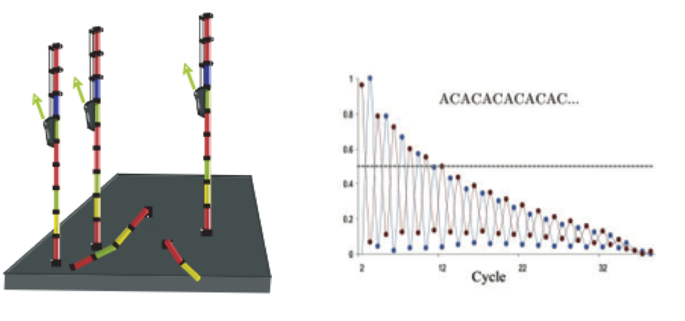
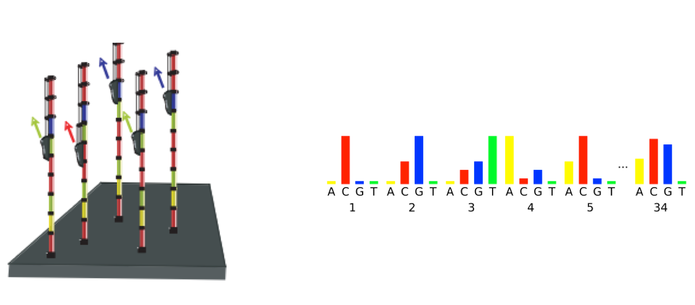
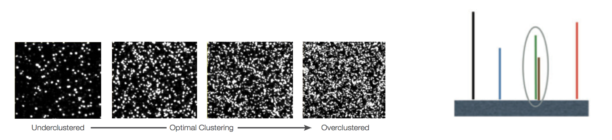
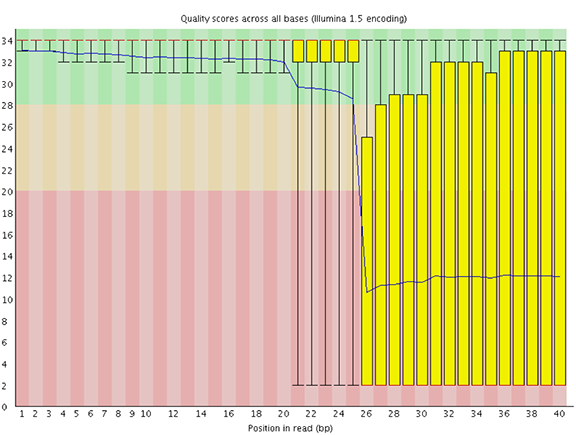
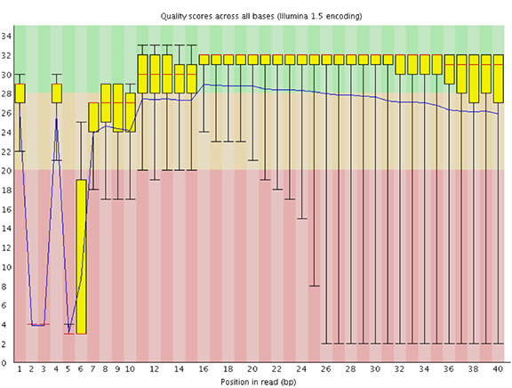
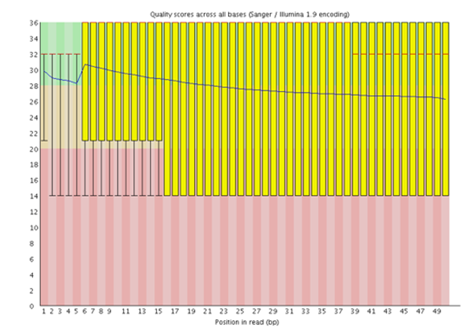

# FASTQC

```{r, echo = FALSE}
library(knitr)
```


We are going to walk through the general steps of a Next Generation Sequencing pipeline. The Rmd for this file can be found
[here](https://github.com/gurinina/omic-sciences/blob/main/12-fastq.Rmd). We can though walk through a great deal of it using small chunks of sequences and R programs. For our examples we will mainly focus on RNA-seq as that is the most manageable computationally as opposed to methylation, Chip-chip and DNA variant analysis. Its also, probably for this reason, one of the more frequently used technologies in research.

Ok, so our first files that we encounter are FASTQ...

## Introduction to FASTQ

The first step in NGS sequencing is to read the FASTQ files and align them. We're going to do that in another lecture. Generally the FASTQ files are too big, but we will use FASTQ files from yeast that are relatively small. There are many many software programs for alignment.

First let's just look at a FASTQ file, which we can read in R using the ShortRead package

Reading FASTQ files in R
```{r echo = FALSE,warning=FALSE,  message = FALSE}

library(ShortRead)

library(Biostrings)
qc.dir = file.path(getwd(),"data")
fastqc = list.files(qc.dir)
g = grep("gz",fastqc)
fastqFile = file.path(qc.dir,fastqc[g])


# read fastq file
fq = readFastq(fastqFile)
fq
#class: ShortReadQ
#length: 10000 reads; width: 51 cycles


reads = sread(fq)
reads[2]
reverseComplement(reads[2])
alphabetFrequency(reads[1:5] ,baseOnly = TRUE)
w = vcountPattern("GCTGGGC",reads)
ww = which(w!=0)
strsplit(reads[ww],"GCTGGGC")

```


```{r echo = FALSE,warning=FALSE, message = FALSE}

library(fastqcr)


qc <- qc_aggregate(qc.dir) ## if you have more than one file
library(dplyr)
  tmp = qc %>%
    group_by(sample, module, status) %>%
    filter(status %in% c("WARN", "FAIL")) %>%
    arrange(sample)
  # Summary of qc


  
  
summary(qc)
qc_stats(qc)
qc_fails(qc)#: Displays samples or modules that failed.
qc_warns(qc)#: Displays samples or modules that warned.
qc_problems(qc)#: Union of qc_fails() and qc_warns(). Display which #samples or modules that failed or warned.

qc_problems(qc, "module", compact = FALSE)
qc_fails(qc, "sample")

### THIS ONE IS MOST IMPORTANT; BUT ALL OF THIS IS IN THE HTML FILE
qc_report(qc.path=qc.dir,
          result.file="reportFile", preview = TRUE)


```

Quality scores
```{r}
# get quality scores per base as a matrix

qPerBase = as(quality(fq), "matrix")
qPerBase[1:3,]
# get number of bases per read that have quality score below 20
# we use this
qcount = rowSums( qPerBase < 20)
# Number of reads where all Phred scores >= 20
mean(qcount == 0)
# 51% of the reads

```

We could save these filtered files
```{r  echo = FALSE,eval = FALSE}

# write out fastq file with only reads where all
# quality scores per base are above 20
# out = gsub("ERR458500.fastq.gz","Qfiltered_ERR458500.fastq",fastqFile)
# writeFastq(fq[qcount == 0],
#            file = out)
           
```

**~ 51 % of the reads have all 51 bp >= 20, is that enough? (see below)**

do we filter reads here or wait for the exon match to do it? what is a per tile quality score, how to read the QC reports? lets go back and look at an unfiltered fastq file many of these questions are application dependent The FASTQ file is 1.9e+06 reads long (prefiltered). We could write out the filtered fastq file with the ShortRead::writeFastq() function. Just be aware that there are a lot more efficient ways of doing the filtering that don't involve R. Let's talk about Phred scores.

**Phred-scaled quality scores** 
The Phred scale was originally used to represent base quality scores emitted by the Phred program in the early days of the Human Genome Project. Now they are widely used to represent probabilities and confidence scores in other contexts of genome science.

**Phred scale in context**
In the context of sequencing, Phred-scaled quality scores are used to represent how confident we are in the assignment of each base call by the sequencer.

In the context of variant calling, Phred-scaled quality scores can be used to represent many types of probabilities. The most commonly used in GATK (Genome Analysis Toolkit) is the QUAL score, or variant quality score. It is used in much the same way as the base quality score: the variant quality score is a Phred-scaled estimate of how confident we are that the variant caller correctly identified that a given genome position displays variation in at least one sample.

**Phred scale in practice**
In today’s sequencing output, by convention, most useable Phred-scaled base quality scores range from 2 to 40, with some variations in the range depending on the origin of the sequence data. However, Phred-scaled quality scores in general can range anywhere from 0 to infinity. A higher score indicates a higher probability that a particular decision is correct, while conversely, a lower score indicates a higher probability that the decision is incorrect.

The Phred quality score (Q) is logarithmically related to the error probability (E).

$$Q = -log10(E)$$

So we can interpret this score as an estimate of error, where the error is e.g. the probability that the base is called incorrectly by the sequencer, but we can also interpret it as an estimate of accuracy, where the accuracy is e.g. the probability that the base was identified correctly by the sequencer. Depending on how we decide to express it, we can make the following calculations:

If we want the probability of error (E), we take:

$$E = 10^{-\frac{Q}{10}}$$

And conversely, if we want to express this as the estimate of accuracy (A), we simply take
$$
\begin{aligned}
A &= 1 - E \\
& = -10^{-\frac{Q}{10}} \\
\end{aligned}
$$
Here is a table of how to interpret a range of Phred Quality Scores. It is largely adapted from the Wikipedia page for Phred Quality Score.

For many purposes, a Phred Score of 20 or above is acceptable, because this means that whatever it qualifies is 99% accurate, with a 1% chance of error.

|Phred Quality Score | Probability of incorrect base call | Base call accuracy|
|--|--|--|
|10|10%|90%|
|20|1%|99%|
|30|0.1%|99.9%|
|40|0.01%|99.99%|
|50|0.001%|99.999%|
|60|0.0001%|99.9999%|


Let's look at the FastQC report in more detail.

FastQC has a really well documented manual page with detailed
explanations about every plot in the report.

Within our report, a summary of all of the modules is given on the
left-hand side of the report. Don't take the yellow "WARNING"s and red
"FAIL"s too seriously; they should be interpreted as flags for modules
to check out.

```{r summary, fig.cap = c("Summary","A. Sample fastq","B. Our fastq"),fig.show='hold',fig.align='center', echo=FALSE}
knitr::include_graphics(c('12-fastq/fastqc_summary.png','12-fastq/my_fastq_summary.png'))
```

The first module gives the basic statistics for the sample. Generally it
is a good idea to keep track of the total number of reads sequenced for
each sample and to make sure the read length and %GC content is as
expected.
```{r stats, fig.cap = c("Basic stats","A. Sample fastq","B. Our fastq"),fig.show='hold',fig.align='center', echo=FALSE}
knitr::include_graphics(c('12-fastq/fastqc_basic_stats.png','12-fastq/basic_stats.png'))
```


One of the most important analysis modules is the "Per base sequence
quality" plot. This plot provides the distribution of quality scores at
each position in the read across all reads. This plot can alert us to
whether there were any problems occuring during sequencing and whether
we might need to contact the sequencing facility.

```{r perbasequal, fig.cap = c("FastQC sequence per base sequence quality","A. Sample fastq","B. Our fastq"),fig.show='hold',fig.align='center', echo=FALSE, dpi = 40}
knitr::include_graphics(c('12-fastq/FASTQC_seq_qual.png','12-fastq/my_perbase_seq_quality.png'))
```

The y-axis gives the quality scores, while the x-axis represents the
position in the read. The color coding of the plot denotes what are
considered high, medium and low quality scores.

For example, the box plot at nucleotide 1 shows the distribution of
quality scores for the first nucleotide of all reads in the Mov10_oe_1
sample. The yellow box represents the 25th and 75th percentiles, with
the red line as the median. The whiskers are the 10th and 90th
percentiles. The blue line represents the average quality score for the
nucleotide. Based on these metrics, the quality scores for the first
nucleotide are quite high, with nearly all reads having scores above 28.

The quality scores appear to drop going from the beginning toward the
end of the reads. For reads generated by Illumina sequencing, this is
not unexpected, and there are known causes for this drop in quality. To
better interpret this plot it is helpful to understand the different
sequencing error profiles.

Sequencing error profiles For Illumina sequencing, the quality of the
nucleotide base calls are related to the signal intensity and purity of
the fluorescent signal. Low intensity fluorescence or the presence of
multiple different fluorescent signals can lead to a drop in the quality
score assigned to the nucleotide. Due to the nature of
sequencing-by-synthesis there are some drops in quality that can be
expected, but other quality issues can be indicative of a problem at the
sequencing facility.

We will now explore different quality issues arising from the
sequencing-by-synthesis used by Illumina, both expected and unexpected.

Expected As sequencing progresses from the first cycle to the last cycle
we often anticipate a drop in the quality of the base calls. This is
often due to signal decay and phasing as the sequencing run progresses.

Signal decay: As sequencing proceeds, the fluorescent signal intensity
decays with each cycle, yielding decreasing quality scores at the 3' end
of the read. This is due to: Degrading fluorophores A proportion of the
strands in the cluster not being elongated Therefore, the proportion of
signal being emitted continues to decrease with each cycle.

```{r decay, fig.cap = c("Signal decay"), echo=FALSE, dpi = 40}

```

Phasing: As the number of cycles increases, the signal starts to blur as
the cluster loses synchronicity, also yielding a decrease in quality
scores at the 3' end of the read. As the cycles progress, some strands
get random failure of nucleotides to incorporate due to: Incomplete
removal of the 3' terminators and fluorophores Incorporation of
nucleotides without effective 3' terminators
```{r phasing, fig.cap = c("Phasing"), echo=FALSE, dpi = 40}

```

Worrisome Overclustering: Sequencing facilities can overcluster the flow
cells, which results in small distances between clusters and an overlap
in the signals. The two clusters can be interpreted as a single cluster
with mixed fluorescent signals being detected, decreasing signal purity,
generating lower quality scores across the entire read.

```{r clustering, fig.cap = c("Overclustering"), echo=FALSE, dpi = 40}

```

Instrumentation breakdown: Sequencing facilities can occasionally have
issues with the sequencing instruments during a run. Any sudden drop in
quality or a large percentage of low quality reads across the read could
indicate a problem at the facility. Examples of such issues are shown
below, including a manifold burst, cycles lost, and read 2 failure. For
such data, the sequencing facility should be contacted for resolution,
if possible.
```{r manifold, fig.cap = c("Manifold burst"), echo=FALSE, dpi = 40}

```

```{r cycles, fig.cap = c("Cycles lost"), echo=FALSE, dpi = 40}

```

```{r failure, fig.cap = c("Read2 failure"), echo=FALSE, dpi = 40}

```

  Quality assessment Now if we return back to our plot, we can see a drop
in quality towards the ends of the reads, which could be explained by
signal decay or phasing. No other worrisome signs are present, so the
sequencing data from the facility is of good quality.

FastQC sequence quality
```{r perbasequal2, fig.cap = c("FastQC sequence per base sequence quality","A. Sample fastq","B. Our fastq"),fig.show='hold',fig.align='center', echo=FALSE, dpi = 40}
knitr::include_graphics(c('12-fastq/FASTQC_seq_qual.png','12-fastq/my_perbase_seq_quality.png'))
```

The other modules in the FastQC report can also help interpret the
quality of the data.

The "Per sequence quality scores" plot gives you the average quality
score on the x-axis and the number of sequences with that average on the
y-axis. We hope the majority of our reads have a high average quality
score with no large bumps at the lower quality values.

```{r perseqqual, fig.cap = c("FastQC sequence per base sequence quality","A. Sample fastq","B. Our fastq"),fig.show='hold',fig.align='center', echo=FALSE, dpi = 40}
knitr::include_graphics(c('12-fastq/fastqc_per_sequence_quality_scores.png','12-fastq/my_per_seq_quality.png'))
```

This data has a small bump at a mean quality of 12. Since it doesn't
represent a large proportion of the data, it isn't extremely worrisome,
but it might be worth a quick check of the reads resulting in the poor
quality scores.

The next plot gives the "Per base sequence content", which always gives
a FAIL for RNA-seq data. This is because the first 10-12 bases result
from the 'random' hexamer priming that occurs during RNA-seq library
preparation. This priming is not as random as we might hope giving an
enrichment in particular bases for these intial nucleotides.

```{r seqcontent, fig.cap = c("FastQC per base sequence content","A. Sample fastq","B. Ours fastq"),fig.show='hold',fig.align='center', echo=FALSE, dpi = 40}
knitr::include_graphics(c('12-fastq/fastqc_per_base_sequence_content.png','12-fastq/my_base_seq_content.png'))
```

The "Per sequence GC content" plot gives the GC distribution over all
sequences. Generally is a good idea to note whether the GC content of
the central peak corresponds to the expected % GC for the organism.
Also, the distribution should be normal unless over-represented
sequences (sharp peaks on a normal distribution) or contamination with
another organism (broad peak).

This plot would indicate some type of over-represented sequence with the
sharp peaks, indicating either contamination or a highly over-expressed
gene.

```{r gc, fig.cap = c("FastQC per sequence GC content","A. Sample fastq","B. Our fastq"),fig.show='hold',fig.align='center', echo=FALSE, dpi = 40}
knitr::include_graphics(c('12-fastq/fastqc_GC.png','12-fastq/myGC.png'))
```

The next module explores numbers of duplicated sequences in the library.
This plot can help identify a low complexity library, which could result
from too many cycles of PCR amplification or too little starting
material. For RNA-seq we don't normally do anything to address this in
the analysis, but if this were a pilot experiment, we might adjust the
number of PCR cycles, amount of input, or amount of sequencing for
future libraries. In this analysis we seem to have a large number of
duplicated sequences, but this is expected due to the subset of data we
are working with containing the over-expression of MOV10.

```{r dup, fig.cap = c("FastQC duplicated sequences","A. Sample fastq","B. Our fastq"),fig.show='hold',fig.align='center', echo=FALSE, dpi = 40}
knitr::include_graphics(c('12-fastq/fastqc_duplication.png','12-fastq/my_seq_dup.png'))
```
The "Overrepresented sequences" table is another important module as it
displays the sequences (at least 20 bp) that occur in more than 0.1% of
the total number of sequences. This table aids in identifying
contamination, such as vector or adapter sequences. If the %GC content
was off in the above module, this table can help identify the source. If
not listed as a known adapter or vector, it can help to BLAST the
sequence to determine the identity.

Since our data is just a subset of the original data and it contains the
over-expressed MOV10 gene, if we BLAST the sequences we will find they
belong to MOV10. For this experiment, these over-represented sequences
are not concerning.

```{r overrepresented, fig.cap = c("FastQC overrepresented sequences","A. Sample fastq","B. Our fastq"),fig.show='hold',fig.align='center', echo=FALSE, dpi = 40}
knitr::include_graphics(c('12-fastq/FastQC_contam.png','12-fastq/overrepresented.png'))
```

As our report only represents a subset of reads (chromosome 1) for
Mov10_oe_1.subset.fq, which can skew the QC results. We encourage you to
look at the full set of reads and note how the QC results differ when
using the entire dataset.

After exploring the quality of the data, we determine from which gene or
transcript the reads originated from using mapping tools. The quality of
the data is important when determining where it aligns to on the genome
or transcriptome, but the mapping tools we use (salmon and STAR) are
able to account for adapter contamination, vector contamination and
low-quality bases at the ends of reads. Therefore, after noting any QC
issues, we can use our raw reads for the alignment or mapping to the
reference genome or transcriptome.