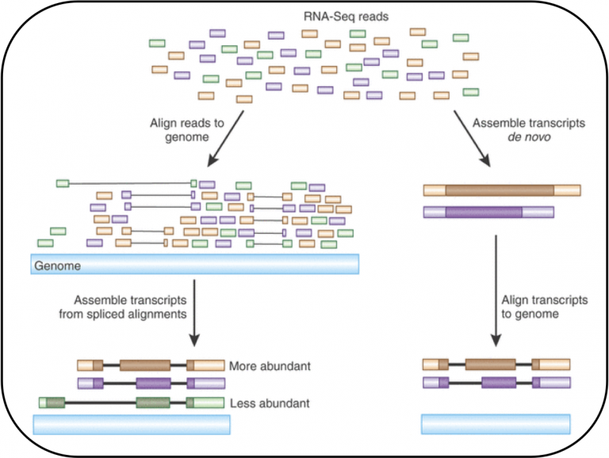

# NGS Pipeline

```{r, echo=FALSE}
library(knitr)
knitr::opts_chunk$set(echo=FALSE)
opts_knit$set(progress=FALSE, verbose=FALSE)
knitr::opts_chunk$set(tidy.opts = list(width.cutoff = 40), tidy = TRUE)
```

## Short intro to mapping RNA-Seq reads 

from [Wikipedia](https://en.wikipedia.org/wiki/RNA-Seq#Transcriptome_assembly)

Read mapping or alignment
Once high-quality FASTQ data are obtained from pre-processing, the next step is the read mapping or alignment. There are two main options depending on the availability of a genome sequence (Figure 1):

Two methods are used to assign raw sequence reads to genomic features (i.e., assemble the transcriptome):

De novo: This approach does not require a reference genome to reconstruct the transcriptome, and is typically used if the genome is unknown, incomplete, or substantially altered compared to the reference.[59] Challenges when using short reads for de novo assembly include 1) determining which reads should be joined together into contiguous sequences (contigs), 2) robustness to sequencing errors and other artifacts, and 3) computational efficiency. The primary algorithm used for de novo assembly transitioned from overlap graphs, which identify all pair-wise overlaps between reads, to de Bruijn graphs, which break reads into sequences of length k and collapse all k-mers into a hash table.[60] Overlap graphs were used with Sanger sequencing, but do not scale well to the millions of reads generated with RNA-Seq. Examples of assemblers that use de Bruijn graphs are Trinity,[59] Oases[61] (derived from the genome assembler Velvet[62]), Bridger,[63] and rnaSPAdes.[64] Paired-end and long-read sequencing of the same sample can mitigate the deficits in short read sequencing by serving as a template or skeleton. Metrics to assess the quality of a de novo assembly include median contig length, number of contigs and N50.[65]

RNA-Seq alignment with intron-split short reads. Alignment of short reads to an mRNA sequence and the reference genome. Alignment software has to account for short reads that overlap exon-exon junctions (in red) and thereby skip intronic sections of the pre-mRNA and reference genome.

Genome guided: This approach relies on the same methods used for DNA alignment, with the additional complexity of aligning reads that cover non-continuous portions of the reference genome.[66] These non-continuous reads are the result of sequencing spliced transcripts (see figure). Typically, alignment algorithms have two steps: 1) align short portions of the read (i.e., seed the genome), and 2) use dynamic programming to find an optimal alignment, sometimes in combination with known annotations. Software tools that use genome-guided alignment include Bowtie,[67] TopHat (which builds on BowTie results to align splice junctions),[68][69] Subread,[70] STAR,[66] HISAT2,[71] and GMAP.[72] The output of genome guided alignment (mapping) tools can be further used by tools such as Cufflinks[69] or StringTie[73] to reconstruct contiguous transcript sequences (i.e., a FASTA file). The quality of a genome guided assembly can be measured with both 1) de novo assembly metrics (e.g., N50) and 2) comparisons to known transcript, splice junction, genome, and protein sequences using precision, recall, or their combination (e.g., F1 score).[65] In addition, in silico assessment could be performed using simulated reads.[74][75]

A note on assembly quality: The current consensus is that 1) assembly quality can vary depending on which metric is used, 2) assembly tools that scored well in one species do not necessarily perform well in the other species, and 3) combining different approaches might be the most reliable.[76][77][78]


When studying an organism with a reference genome, it is possible to infer which transcripts are expressed by mapping the reads to the reference genome (genome mapping) or transcriptome (transcriptome mapping). Mapping reads to the genome requires no knowledge of the set of transcribed regions or the way in which exons are spliced together. This approach allows the discovery of new, unannotated transcripts.
 
When working on an organism without a reference genome, reads need to be assembled first into longer contigs (de novo assembly). These contigs can then be considered as the expressed transcriptome to which reads are re-mapped for quantification.

Alignment tools

There are many bioinformatics tools available to perform the alignment of short reads. One of the most popular RNA-seq mappers is TopHat, which aligns reads in two steps:

unspliced reads are mapped to locate exons (with Bowtie)
unmapped reads are then split and aligned independently to identify exon junctions (9)

The RNA-seq read alignment program HISAT2 is another one, which stands for “hierarchical indexing for spliced alignment of transcripts 2”, and provides more accurate results with fast and sensitive alignment. HISAT2 uses a graph-based approach to index the reference genome, combined with the Bowtie2 algorithm for alignment.

It is important to check the quality of the mapping process. The percentage of mapped reads is a global indicator of the overall sequencing accuracy and of the presence of contaminating DNA. Picard can be used for quality control in mapping.



Either with a reference or de novo assembly, the complete reconstruction of transcriptomes using short reads is challenging. For example, short reads can sometimes align equally well to multiple locations (multi-mapped reads or multi-reads). Paired-end reads reduce the problem of multi-mapping, because a pair of reads must map within a certain distance of each other and in a certain order. Finally, long-read technologies, such as SMRT from Pacific Biosciences, provide reads that are long enough to sequence complete transcripts for most genes and are a promising alternative.

The output of the alignment are bamfiles. We're going to look at them in more detail today.

## Importing NGS data into Bioconductor

There are two main packages for working with NGS data in R: the **Rsamtools** package and the **GenomicAlignments** package. You can think of the difference as:

-   **Rsamtools** provides raw access to the information in NGS data files
-   **GenomicAlignments** uses the Rsamtools functions to provide NGS data in R as high-level Bioconductor objects (based on **GRanges** for example). We will see more examples below.

## What are BAM files?

You might not be familiar with all these formats, but the ones we are interested in for now are SAM and it's compressed form BAM. We will refer here to BAM files, because these are the kind of files which are kept most often because they are smaller (there is a [SAMtools](http://samtools.sourceforge.net/) utility for converting SAM to BAM and BAM to SAM).

SAM and BAM files contain information about the alignment of NGS reads to a reference genome. These files are produced by alignment software, which take as input:

the FASTQ files from the sequencing machine (either 1 file for a single-end sequencing sample, or 2 files for a paired-end sequencing sample).

a genomic index, which is typically produced by special software packaged with the alignment software. The genomic index is created from the reference genome. Sometimes the genomic index files for popular reference genomes can be downloaded.

Note: alignment software is typically application specific. In particular, alignment programs for RNA-seq are different than those for genomic DNA sequencing, because in the case of the former, it is expected that reads might fall on exon-exon boundaries. The read will not contain intron sequence, because it is typically the mature, spliced mRNA which is converted to cDNA and sequenced, and the introns are already spliced out of this molecule. This is not a concern for genomic DNA sequencing.

## How to import NGS data using Rsamtools

We will use example BAM files from the **pasillaBamSubset** package to examine the Rsamtools functions:

```{r setup, message=FALSE}
suppressPackageStartupMessages({library(pasillaBamSubset)
library(Rsamtools)})
filename <- untreated1_chr4()
```

We can create a `BamFile` object using the function `BamFile`, which allows other functions to know how to process the file.

```{r}
(bf <- BamFile(filename))
```

We can ask about information on the chromosomes which are declared in the header of the BAM file:

```{r}
seqinfo(bf)
(sl <- seqlengths(bf))
```

A summary of the kind of alignments in the file can be generated:

```{r quick}
quickBamFlagSummary(bf)
```

## Specifying: what and which

A number of functions in Rsamtools take an argument `param`, which expects a `ScanBamParam` specification. There are full details available by looking up `?scanBamParam`, but two important options are:

-   what - what kind of information to extract?
-   which - which ranges of alignments to extract?

BAM files are often paired with an index file (if not they can be indexed from R with `indexBam`), and so we can quickly pull out information about reads from a particular genomic range. Here we count the number of records (reads) on chromosome 4:

```{r}
(gr <- GRanges("chr4",IRanges(1, sl["chr4"])))
countBam(bf, param=ScanBamParam(which = gr))
```

We can pull out all the information with `scanBam`. Here, we specify a new `BamFile`, and use the `yieldSize` argument. This limits the number of reads which will be extracted to 5 at a time. Each time we call `scanBam` we will get 5 more reads, until there are no reads left. If we do not specify `yieldSize` we get all the reads at once. `yieldSize` is useful mainly for two reasons: (1) for limiting the number of reads at a time, for example, 1 or 2 million reads at a time, to keep within the memory limits of a given machine, say in the 5 GB range (2) or, for debugging, working through small examples while writing software.

```{r bam}
reads <- scanBam(BamFile(filename, yieldSize=5))
```

## Examining the output of scanBam

`reads` is a list of lists. The outer list indexes over the ranges in the `which` command. Since we didn't specify `which`, here it is a list of length 1. The inner list contains different pieces of information from the BAM file. Since we didn't specify `what` we get everything. See `?scanBam` for the possible kinds of information to specify for `what`.

```{r class}
class(reads)
names(reads[[1]])
reads[[1]]$pos # the aligned start position
reads[[1]]$rname # the chromosome
reads[[1]]$strand # the strand
reads[[1]]$qwidth # the width of the read
reads[[1]]$seq # the sequence of the read
```

Here we give an example of specifying `what` and `which`:

```{r  granges1}
gr <- GRanges("chr4",IRanges(500000, 700000))
reads <- scanBam(bf, param=ScanBamParam(what=c("pos","strand","seq"), which=gr))
```

How are the start positions distributed:

```{r hist}
hist(reads[[1]]$pos)
```

A slightly more complicated picture: split positions by strand, tabulate in bins and make a stacked barplot:

```{r strand}
readsByStrand <- split(reads[[1]]$pos, reads[[1]]$strand)
myHist <- function(x) table(cut(x, 50:70 * 10000 ))
tab <- sapply(readsByStrand, myHist)
barplot( t(tab) )
```

## GenomicAlignments description

The GenomicAlignments package is described with:

Provides efficient containers for storing and manipulating short genomic alignments (typically obtained by aligning short reads to a reference genome). This includes read counting, computing the coverage, junction detection, and working with the nucleotide content of the alignments.

This package defines the classes and functions which are used to represent genomic alignments in Biopconductor. Two of the most important functions in GenomicAlignments are:

-   readGAlignments - this and other similarly named functions read data from BAM files
-   summarizeOverlaps - this function simplifies counting reads in genomic ranges across one or more files

The `summarizeOverlaps` function is covered in more depth in the [read counting](read_counting.html) page. `summarizeOverlaps` is a function which wraps up other functions in GenomicAlignments function for counting reads.

Here we will examine the output of the `readGAlignments` function, continuing with the BAM file from the pasilla dataset.

```{r library, message=FALSE}
suppressPackageStartupMessages({library(GenomicAlignments)})
```

```{r ga}
(ga <- readGAlignments(bf))
length(ga)
```

Note that we can extract the **GRanges** object within the **GAlignments** object, although we will see below that we can often work directly with the **GAlignments** object.

```{r granges}
granges(ga[1])
```

Some of our familiar GenomicRanges functions work on GAlignments: we can use `findOverlaps`, `countOverlaps` and `%over%` directly on the **GAlignments** object. Note that location of `ga` and `gr` in the calls below:

```{r find}
gr <- GRanges("chr4", IRanges(700000, 800000))
(fo <- findOverlaps(ga, gr)) # which reads over this range
countOverlaps(gr, ga) # count overlaps of range with the reads
table(ga %over% gr) # logical vector of read overlaps with the range
```

If we had run `countOverlaps(ga, gr)` it would return an integer vector with the number of overlaps for each read with the range in `gr`.

88888888888888888888888888888888888888888888888888

```{r supress}
suppressPackageStartupMessages({
library(BiocStyle) # for Biocpkg
library(IRanges)
library(GenomicRanges)
})
```

## More on IRanges and GRanges

<a name="IRanges"></a>

The IRanges and GRanges objects are core components of the Bioconductor infrastructure for defining **integer ranges** in general (IRanges), and specifically for addressing locations in the genome and hence including chromosome and strand information (GRanges). Here we will briefly explore what these objects are and a subset of the operations which manipulate IRanges and GRanges.

First we load the IRanges package. This is included in the base installation of Bioconductor, but as with all Bioconductor packages it can be installed with `BiocManager::install`. R will print out a bunch of messages when you load IRanges about objects which are masked from other packages. This is part of the normal loading process. Here we print these messages, although on some other book pages we suppress the messages for cleanliness:

```{r iranges}
suppressPackageStartupMessages({library(IRanges)})
```

The `IRanges` function defines interval ranges. If you provide it with two numbers, these are the start and end of a inclusive range, e.g. $[5,10] = \{ 5,6,7,8,9,10 \}$, which has **width** 6. When referring to the size of a range, the term **width** is used, instead of **length**.

```{r ir1}
ir <- IRanges(5,10)
ir
start(ir)
end(ir)
width(ir)
# for detailed information on the IRanges class:
# ?IRanges
```

A single **IRanges** object can hold more than one range. We do this by specifying vector to the `start` and `end` arguments.

```{r ir2}
IRanges(start=c(3,5,17), end=c(10,8,20))
```

<a name="intrarange"></a>

### Intra-range operations

We will continue to work with the single range $[5,10]$. We can look up a number of **intra-range** methods for IRanges objects, which mean that the operations work on each range independently. For example, we can shift all the ranges two integers to the left. By left and right, we refer to the direction on the integer number line: $\{ \dots, -2, -1, 0, 1, 2, \dots \}$. Compare `ir` and `shift(ir, -2)`:

```{r ir3}
# full details on the intra-range methods:
# ?"intra-range-methods"
ir
shift(ir, -2)
```

Here we show the result of a number of different operations applied to `ir`, with a picture below.

```{r ir4}
ir
narrow(ir, start=2)
narrow(ir, end=5)
flank(ir, width=3, start=TRUE, both=FALSE)
flank(ir, width=3, start=FALSE, both=FALSE)
flank(ir, width=3, start=TRUE, both=TRUE)
ir * 2
ir * -2
ir + 2
ir - 2
resize(ir, 1)
```

Those same operations plotted in a single window. The red bar shows the shadow of the original range `ir`. The best way to get the hang of these operations is to try them out yourself in the console on ranges you define yourself.

```{r ir5, echo=FALSE}
# set up a plotting window so we can look at range operations
plot(0,0,xlim=c(0,23),ylim=c(0,13),type="n",xlab="",ylab="",xaxt="n")
axis(1,0:15)
abline(v=0:14 + .5,col=rgb(0,0,0,.5))

# plot the original IRange
plotir <- function(ir,i) { arrows(start(ir)-.5,i,end(ir)+.5,i,code=3,angle=90,lwd=3) }
plotir(ir,1)

# draw a red shadow for the original IRange
polygon(c(start(ir)-.5,start(ir)-.5,end(ir)+.5,end(ir)+.5),c(-1,15,15,-1),col=rgb(1,0,0,.2),border=NA)

# draw the different ranges
plotir(shift(ir,-2), 2)
plotir(narrow(ir, start=2), 3)
plotir(narrow(ir, end=5), 4)
plotir(flank(ir, width=3, start=TRUE, both=FALSE), 5)
plotir(flank(ir, width=3, start=FALSE, both=FALSE), 6)
plotir(flank(ir, width=3, start=TRUE, both=TRUE), 7)
plotir(ir * 2, 8)
plotir(ir * -2, 9)
plotir(ir + 2, 10)
plotir(ir - 2, 11)
plotir(resize(ir, 1), 12)

text(rep(15,12), 1:12, c("ir","shift(ir,-2)","narrow(ir,start=2)",
                         "narrow(ir,end=5)",
                         "flank(ir, start=T, both=F)",
                         "flank(ir, start=F, both=F)",
                         "flank(ir, start=T, both=T)",
                         "ir * 2","ir * -2","ir + 2","ir - 2",
                         "resize(ir, 1)"), pos=4)

```

<a name="interrange"></a>

### Inter-range operations

There are also a set of **inter-range** methods. These are operations which work on a set of ranges, and the output depends on all the ranges, thus distinguishes these methods from the **intra-range** methods, for which the other ranges in the set do not change the output. This is best explained with some examples. The `range` function gives the integer range from the start of the leftmost range to the end of the rightmost range:

```{r ir6}
# full details on the inter-range methods:
# ?"inter-range-methods"
(ir <- IRanges(start=c(3,5,17), end=c(10,8,20)))
range(ir)
```

The `reduce` function collapses the ranges, so that integers are covered by only one range in the output.

```{r ir7}
reduce(ir)
```

The `gaps` function gives back the ranges of integers which are in `range(ir)` but not covered by any of the ranges in `ir`:

```{r ir8}
gaps(ir)
```

The `disjoin` function breaks up the ranges in `ir` into discrete ranges. This is best explained with examples, but here is the formal definition first:

returns a disjoint object, by finding the union of the end points in 'x'. In other words, the result consists of a range for every interval, of maximal length, over which the set of overlapping ranges in 'x' is the same and at least of size 1.

```{r ir9}
disjoin(ir)
```

Note that this is not a comprehensive list. Check the man pages we listed above, and the best way to get the hang of the functions is to try them out on some ranges you construct yourself. Note that most of the functions are defined both for IRanges and for GRanges, which will be described below.

<a name="granges"></a>

## GRanges

**GRanges** are objects which contain **IRanges** and two more important pieces of information:

-   the chromosome we are referring to (called `seqnames` in Bioconductor)
-   the strand of DNA we are referring to

Strand can be specified as plus "+" or minus "-", or left unspecified with "\*". Plus strand features have the biological direction from left to right on the number line, and minus strand features have the biological direction from right to left. In terms of the **IRanges**, plus strand features go from `start` to `end`, and minus strand features go from `end` to `start`. This may seem a bit confusing at first, but this is required because `width` is defined as `end - start + 1`, and negative width ranges are not allowed. Because DNA has two strands, which have an opposite directionality, strand is necessary for uniquely referring to DNA.

With an **IRange**, a chromosome name, and a strand, we can be sure we are uniquely referring to the same region and strand of the DNA molecule as another researcher, given that we are using the same build of **genome**. There are other pieces of information which can be contained within a GRanges object, but the two above are the most important.

```{r ir10, message=FALSE}
suppressPackageStartupMessages({library(GenomicRanges)})
```

Let's create a set of two ranges on a made-up chromosome, **chrZ**. And we will say that these ranges refer to the genome **hg19**. Because we have not linked our genome to a database, we are allowed to specify a chromosome which does not really exist in **hg19**.

```{r ir11}
gr <- GRanges("chrZ", IRanges(start=c(5,10),end=c(35,45)),
              strand="+", seqlengths=c(chrZ=100L))
gr
genome(gr) <- "hg19"
gr
```

Note the `seqnames` and `seqlengths` which we defined in the call above:

```{r ir100}
seqnames(gr)
seqlengths(gr)
```

We can use the `shift` function as we did with the IRanges. However, notice the warning when we try to shift the range beyond the length of the chromosome:

```{r ir12}
shift(gr, 10)
shift(gr, 80)
```

If we `trim` the ranges, we obtain the ranges which are left, disregarding the portion that stretched beyond the length of the chromosome:

```{r ir13}
trim(shift(gr, 80))
```

We can add columns of information to each range using the `mcols` function (stands for **metadata columns**). Note: this is also possible with IRanges. We can remove the columns by assigning `NULL`.

```{r ir14}
mcols(gr)
mcols(gr)$value <- c(-1,4)
gr
mcols(gr)$value <- NULL
```

### GRangesList

Especially when referring to genes, it is useful to create a **list** of GRanges. This is useful for representing groupings, for example the [exons](http://en.wikipedia.org/wiki/Exon) which belong to each gene. The elements of the list are the genes, and within each element the exon ranges are defined as GRanges.

```{r ir15}
gr2 <- GRanges("chrZ",IRanges(11:13,51:53))
grl <- GRangesList(gr, gr2)
grl
```

The length of the **GRangesList** is the number of **GRanges** object within. To get the length of each GRanges we call `elementNROWS`. We can index into the list using typical list indexing of two square brackets.

```{r ir16}
length(grl)
elementNROWS(grl)
grl[[1]]
```

If we ask the `width`, the result is an **IntegerList**. If we apply `sum`, we get a numeric vector of the sum of the widths of each GRanges object in the list.

```{r ir17}
width(grl)
sum(width(grl))
```

We can add metadata columns as before, now one row of metadata for each GRanges object, not for each range. It doesn't show up when we print the GRangesList, but it is still stored and accessible with `mcols`. mcols is a very useful function when dealing with granges.

```{r ir180}
mcols(grl)$value <- c(5,7)
grl
mcols(grl)
```

<a name="findoverlaps"></a>

### findOverlaps and %over%

We will demonstrate two commonly used methods for comparing GRanges objects. First we build two sets of ranges:

```{r ir18}
(gr1 <- GRanges("chrZ",IRanges(c(1,11,21,31,41),width=5),strand="*"))
(gr2 <- GRanges("chrZ",IRanges(c(19,33),c(38,35)),strand="*"))
```

`findOverlaps` returns a **Hits** object which contains the information about which ranges in the query (the first argument) overlapped which ranges in the subject (the second argument). There are many options for specifying what kind of overlaps should be counted.

```{r ir19}
fo <- findOverlaps(gr1, gr2)
fo
queryHits(fo)
subjectHits(fo)
```

Another way of getting at overlap information is to use `%over%` which returns a logical vector of which ranges in the first argument overlapped any ranges in the second.

```{r ir20}
gr1 %over% gr2
gr1[gr1 %over% gr2]
```

Note that both of these are **strand-specific**, although `findOverlaps` has an `ignore.strand` option.

```{r ir21}
gr1 <- GRanges("chrZ",IRanges(1,10),strand="+")
gr2 <- GRanges("chrZ",IRanges(1,10),strand="-")
gr1 %over% gr2
```

```{=html}
<style>
div.blue { background-color:#e6f0ff; border-radius: 5px; padding: 20px;}
</style>
```
::: blue
## HOW TO SECTION: Applications of GenomicRanges
:::

```{r}
suppressPackageStartupMessages({
library(pasillaBamSubset)
library(AnnotationHub)
library(TxDb.Hsapiens.UCSC.hg19.knownGene)
library(DESeq2)
library(edgeR)
library(GenomicRanges)
library(Rsamtools)
library(GenomicAlignments)
library(GenomicFeatures)
library(Biostrings)
library(TxDb.Athaliana.BioMart.plantsmart22)
library(TxDb.Dmelanogaster.UCSC.dm3.ensGene)
library(BSgenome.Hsapiens.UCSC.hg19)
library(KEGGREST)
library(KEGGgraph)
})
```

***

This section is a collection of **HOWTOs**. Each **HOWTO** is a short section that demonstrates how to use the containers and operations implemented in the `GenomicRanges` and related packages `IRanges`, `Biostrings`, `Rsamtools`, `GenomicAlignment`,`BSgenome`, and `GenomicFeatures` to perform a task typically found in the context of a high throughput sequence analysis.

Unless stated otherwise, the **HOWTOs** are self contained, independent of each other, and can be studied and reproduced in any order.

The `pasillaBamSubset`data package: contains both a BAM file with single-end reads (untreated1 chr4) and a BAM file with paired-end reads (untreated3 chr4). Each file is a subset of chr4 from the "Pasilla" experiment.

Gene models and `TxDb` objects: A gene model is essentially a set of annotations that describes the genomic locations of the known genes, transcripts, exons, and CDS, for a given organism. In `Bioconductor` it is typically represented as a `TxDb` object but also sometimes as a `GRanges`or `GRangesList` object. The `GenomicFeatures` package contains tools for making and manipulating `TxDb` objects.

##How to read single-end reads from a BAM file

As sample data we use the `pasillaBamSubset` data package described in the introduction.

%%%%%%%%%%%%%%%%%%%%%%%%%%%%%%%%%%%%%%%%%%%%%%%%%%% 
%%% code chunk number 5: readGAlignments_1 %%%%%%%%%%%%%%%%%%%%%%%%%%%%%%%%%%%%%%%%%%%%%
```{r}
un1 <- untreated1_chr4()  # single-end reads
```

Several functions are available for reading BAM files into R:

        `readGAlignments()`
        `readGAlignmentPairs()`
        `readGAlignmentsList()`
        `scanBam()`

`scanBam` is a low-level function that returns a list of lists and is not discussed further here. See ?`scanBam` in the `Rsamtools` package for more information.

Single-end reads can be loaded with the `readGAlignments` function from the `GenomicAlignments` package.

%%%%%%%%%%%%%%%%%%%%%%%%%%%%%%%%%%%%%%%%%%%%%%%%%%% 
%%% code chunk number 6: readGAlignments_2 %%%%%%%%%%%%%%%%%%%%%%%%%%%%%%%%%%%%%%%%%%%%%

```{r}
gal <- readGAlignments(un1)
```

Data subsets can be specified by genomic position, field names, or flag criteria in the `ScanBamParam`. Here we input records that overlap position 1 to 5000 on the negative strand with `flag` and `cigar` as metadata columns.

%%%%%%%%%%%%%%%%%%%%%%%%%%%%%%%%%%%%%%%%%%%%%%%%%%% 
%%% code chunk number 7: readGAlignments_3 %%%%%%%%%%%%%%%%%%%%%%%%%%%%%%%%%%%%%%%%%%%%%

```{r}
what <- c("flag", "cigar") 
which <- GRanges("chr4", IRanges(1, 5000)) 
flag <- scanBamFlag(isMinusStrand = TRUE)
param <- ScanBamParam(which=which, what=what, flag=flag)
neg <- readGAlignments(un1, param=param)
neg
```

Another approach to subsetting the data is to use filterBam. This function creates a new BAM file of records passing user-defined criteria. See ?`filterBam` in the \``Rsamtools` package for more information.

##How to read paired-end reads from a BAM file

As sample data we use the `pasillaBamSubset` data package described in the introduction.

%%%%%%%%%%%%%%%%%%%%%%%%%%%%%%%%%%%%%%%%%%%%%%%%%%% 
%%% code chunk number 3: pasillaBamSubset %%%%%%%%%%%%%%%%%%%%%%%%%%%%%%%%%%%%%%%%%%%%%
```{r}
untreated1_chr4()
untreated3_chr4()
```

%%%%%%%%%%%%%%%%%%%%%%%%%%%%%%%%%%%%%%%%%%%%%%%%%%% 
%%% code chunk number 4: pasillaBamSubset_help %%%%%%%%%%%%%%%%%%%%%%%%%%%%%%%%%%%%%%%%%%%%%
```{r,eval = FALSE}
?pasillaBamSubset
```

Paired-end reads can be loaded with the `readGAlignmentPairs`or `readGAlignmentsList` function from the `GenomicAlignments` package. These functions use the same mate paring algorithm but output different objects.

Let's start with `readGAlignmentPairs`:
%%%%%%%%%%%%%%%%%%%%%%%%%%%%%%%%%%%%%%%%%%%%%%%%%%% 
%%% code chunk number 8: readGAlignmentPairs_1 %%%%%%%%%%%%%%%%%%%%%%%%%%%%%%%%%%%%%%%%%%%%%
```{r}
un3 <- untreated3_chr4()  # paired-end reads
```

%%%%%%%%%%%%%%%%%%%%%%%%%%%%%%%%%%%%%%%%%%%%%%%%%%% 
%%% code chunk number 9: readGAlignmentPairs_2 %%%%%%%%%%%%%%%%%%%%%%%%%%%%%%%%%%%%%%%%%%%%%
```{r}
un3 <- untreated3_chr4()
gapairs <- readGAlignmentPairs(un3)
```

The `GAlignmentPairs` class holds only pairs; reads with no mate or with ambiguous pairing are discarded. Each list element holds exactly 2 records (a mated pair). Records can be accessed as the `first` and `last` segments in a template or as `left` and `right` alignments. See ?`GAlignmentPairs` in the `GenomicAlignments` package for more information. 

%%%%%%%%%%%%%%%%%%%%%%%%%%%%%%%%%%%%%%%%%%%%%%%%%%% 
%%% code chunk number 10: readGAlignmentPairs_3 %%%%%%%%%%%%%%%%%%%%%%%%%%%%%%%%%%%%%%%%%%%%%
```{r}
gapairs
```

For `readGAlignmentsList`, mate pairing is performed when `asMates` is set to `TRUE` on the `BamFile` object, otherwise records are treated as single-end. 

%%%%%%%%%%%%%%%%%%%%%%%%%%%%%%%%%%%%%%%%%%%%%%%%%%% 
%%% code chunk number 11: readGAlignmentsList_1 %%%%%%%%%%%%%%%%%%%%%%%%%%%%%%%%%%%%%%%%%%%%%
```{r}
galist <- readGAlignmentsList(BamFile(un3, asMates=TRUE))
```

`GAlignmentsList` is a more general `list-like' structure that holds mate pairs as well as non-mates (i.e., singletons, records with unmapped mates etc.) A`mates_status`metadata column (accessed with`mcols\` indicates which records were paired.

%%%%%%%%%%%%%%%%%%%%%%%%%%%%%%%%%%%%%%%%%%%%%%%%%%% 
%%% code chunk number 12: readGAlignmentsList_2 %%%%%%%%%%%%%%%%%%%%%%%%%%%%%%%%%%%%%%%%%%%%%
```{r}
galist
```

Non-mated reads are returned as groups by QNAME and contain any number of records. Here the non-mate groups range in size from 1 to 9. 

%%%%%%%%%%%%%%%%%%%%%%%%%%%%%%%%%%%%%%%%%%%%%%%%%%% 
%%% code chunk number 13: readGAlignmentsList_3 %%%%%%%%%%%%%%%%%%%%%%%%%%%%%%%%%%%%%%%%%%%%%
```{r}
non_mates <- galist[unlist(mcols(galist)$mate_status) == "unmated"]
table(elementNROWS(non_mates))
```


##How to read and process a big BAM file by chunks in order to reduce memory usage

A large BAM file can be iterated through in chunks by setting a `yieldSize` on the `BamFile` object. As sample data we use the `pasillaBamSubset` data package described in the introduction. 

%%%%%%%%%%%%%%%%%%%%%%%%%%%%%%%%%%%%%%%%%%%%%%%%%%% 
%%% code chunk number 5: readGAlignments_1 %%%%%%%%%%%%%%%%%%%%%%%%%%%%%%%%%%%%%%%%%%%%%
```{r}
un1 <- untreated1_chr4()  # single-end reads
gal <- readGAlignments(un1)
bf <- BamFile(un1, yieldSize=100000)
```

Iteration through a BAM file requires that the file be opened, repeatedly queried inside a loop, then closed. Repeated calls to `readGAlignments` without opening the file first result in the same 100000 records returned each time. 

%%%%%%%%%%%%%%%%%%%%%%%%%%%%%%%%%%%%%%%%%%%%%%%%%%% 
%%% code chunk number 15: readGAlignments_by_chunk %%%%%%%%%%%%%%%%%%%%%%%%%%%%%%%%%%%%%%%%%%%%%
```{r}
open(bf)
cvg <- NULL
repeat {
    chunk <- readGAlignments(bf)
    if (length(chunk) == 0L)
        break
    chunk_cvg <- coverage(chunk)
    if (is.null(cvg)) {
        cvg <- chunk_cvg
    } else {
        cvg <- cvg + chunk_cvg
    }
}
close(bf)
cvg
```

##How to compute read coverage}

The "read coverage" is the number of reads that cover a given genomic position. Computing the read coverage generally consists in computing the coverage at each position in the genome. This can be done with the `coverage` function.

As sample data we use the `pasillaBamSubset` data package described in the introduction. 

%%%%%%%%%%%%%%%%%%%%%%%%%%%%%%%%%%%%%%%%%%%%%%%%%%% 
%%% code chunk number 16: coverage_1 
%%%%%%%%%%%%%%%%%%%%%%%%%%%%%%%%%%%%%%%%%%%%%
```{r}
un1 <- untreated1_chr4()  # single-end reads
reads1 <- readGAlignments(un1)
cvg1 <- coverage(reads1)
cvg1
```

Coverage on chr4: 

%%%%%%%%%%%%%%%%%%%%%%%%%%%%%%%%%%%%%%%%%%%%%%%%%%% 
%%% code chunk number 17: coverage_2 
%%%%%%%%%%%%%%%%%%%%%%%%%%%%%%%%%%%%%%%%%%%%%
```{r}
cvg1$chr4
```

Average and max coverage: 

%%%%%%%%%%%%%%%%%%%%%%%%%%%%%%%%%%%%%%%%%%%%%%%%%%% 
%%% code chunk number 18: coverage_3 
%%%%%%%%%%%%%%%%%%%%%%%%%%%%%%%%%%%%%%%%%%%%%
```{r}
mean(cvg1$chr4)
max(cvg1$chr4)
```

Note that `coverage` is a generic function with methods for different types of objects. See ? `coverage` for more information.

##How to find peaks in read coverage

ChIP-Seq analysis usually involves finding peaks in read coverage. This process is sometimes called "peak calling" or "peak detection". Here we're only showing a naive way to find peaks in the object returned by the `coverage` function. Bioconductor packages `BayesPeak`, `bumphunter`, `Starr`, `CexoR`, `exomePeak`, `RIPSeeker`, and others, provide sophisticated peak calling tools for ChIP-Seq, RIP-Seq, and other kind of high throughput sequencing data.

Let's assume `cvg1` is the object returned by `coverage` . We can use the `slice` function to find the genomic regions where the coverage is greater or equal to a given threshold. So what this function does is it walks through the reads and counts how many times a read is consecutively greater than a given threshold, so in this way it finds the "hot spots" of coverage in this case, or peaks if this had been a Chip-Seq experiment. 

%%%%%%%%%%%%%%%%%%%%%%%%%%%%%%%%%%%%%%%%%%%%%%%%%%% 
%%% code chunk number 19: peaks_1 %%%%%%%%%%%%%%%%%%%%%%%%%%%%%%%%%%%%%%%%%%%%%
```{r}
chr4_peaks <- IRanges::slice(cvg1$chr4, lower=500)
chr4_peaks
length(chr4_peaks)  # nb of peaks
```

The weight of a given peak can be defined as the number of aligned nucleotides that belong to the peak (a.k.a. the area under the peak in mathematics). It can be obtained with `sum`}: 

%%%%%%%%%%%%%%%%%%%%%%%%%%%%%%%%%%%%%%%%%%%%%%%%%%% 
%%% code chunk number 20: peaks_2 %%%%%%%%%%%%%%%%%%%%%%%%%%%%%%%%%%%%%%%%%%%%%
```{r}
sum(chr4_peaks)
```

##How to retrieve a gene model from the UCSC genome browser

See introduction for a quick description of what **gene models** and `TxDb` objects are. We can use the `makeTxDbFromUCSC` function from the `GenomicFeatures` package to import a UCSC genome browser track as a `TxDb` object.

%%%%%%%%%%%%%%%%%%%%%%%%%%%%%%%%%%%%%%%%%%%%%%%%%%% 
%%% code chunk number 21: makeTxDbFromUCSC_1 (eval = FALSE) %%%%%%%%%%%%%%%%%%%%%%%%%%%%%%%%%%%%%%%%%%%%%
```{r, eval = FALSE}
## ### Internet connection required! Can take several minutes...
txdb <- makeTxDbFromUCSC(genome="sacCer2", tablename="ensGene")
```

See `makeTxDbFromUCSC` in the `GenomicFeatures` package for more information.

Note that some of the most frequently used gene models are available as TxDb packages. A TxDb package consists of a pre-made `TxDb` object wrapped into an annotation data package. Go to [TxDb](http://bioconductor.org/packages/release/BiocViews.html#___TxDb) to browse the list of available TxDb packages.

%%%%%%%%%%%%%%%%%%%%%%%%%%%%%%%%%%%%%%%%%%%%%%%%%%% 
%%% code chunk number 22: TxDb.Hsapiens.UCSC.hg19.knownGene_1 %%%%%%%%%%%%%%%%%%%%%%%%%%%%%%%%%%%%%%%%%%%%%
```{r}
txdb <- TxDb.Hsapiens.UCSC.hg19.knownGene
txdb
```

Extract the transcript coordinates from this gene model: %%%%%%%%%%%%%%%%%%%%%%%%%%%%%%%%%%%%%%%%%%%%%%%%%%% 
%%% code chunk number 23: TxDb.Hsapiens.UCSC.hg19.knownGene_2 %%%%%%%%%%%%%%%%%%%%%%%%%%%%%%%%%%%%%%%%%%%%%
```{r}
transcripts(txdb)
```

##How to retrieve a gene model from Ensembl

See introduction for a quick description of what **gene models** and `TxDb` objects are. We can use the `makeTxDbFromBiomart` function from the `GenomicFeatures` package to retrieve a gene model from the Ensembl Mart.

%%%%%%%%%%%%%%%%%%%%%%%%%%%%%%%%%%%%%%%%%%%%%%%%%%% 
%%% code chunk number 24: makeTxDbFromBiomart_1 (eval = FALSE) %%%%%%%%%%%%%%%%%%%%%%%%%%%%%%%%%%%%%%%%%%%%%
```{r, eval=FALSE}
## ### Internet connection required! Can take several minutes...
txdb <- makeTxDbFromBiomart(biomart="ensembl",
                             dataset="hsapiens_gene_ensembl")
```

See ? `makeTxDbFromBiomart` in the `GenomicFeatures` package for more information.

Note that some of the most frequently used gene models are available as TxDb packages. A TxDb package consists of a pre-made `TxDb` object wrapped into an annotation data package. Go to \url{http://bioconductor.org/packages/release/BiocViews.html#\_\_\_TxDb} to browse the list of available TxDb packages.

%%%%%%%%%%%%%%%%%%%%%%%%%%%%%%%%%%%%%%%%%%%%%%%%%%% 
%%% code chunk number 25: TxDb.Athaliana.BioMart.plantsmart22_1 %%%%%%%%%%%%%%%%%%%%%%%%%%%%%%%%%%%%%%%%%%%%%
```{r}
txdb <- TxDb.Athaliana.BioMart.plantsmart22
txdb
```

Extract the exon coordinates from this gene model:

%%%%%%%%%%%%%%%%%%%%%%%%%%%%%%%%%%%%%%%%%%%%%%%%%%% 
%%% code chunk number 26: TxDb.Athaliana.BioMart.plantsmart22_2 %%%%%%%%%%%%%%%%%%%%%%%%%%%%%%%%%%%%%%%%%%%%%
```{r}
exons(txdb)
```


##How to create DNA consensus sequences for read group \`families'}

The motivation for this **HOWTO** comes from a study which explored the dynamics of point mutations. The mutations of interest exist with a range of frequencies in the control group (e.g., 0.1% - 50%). PCR and sequencing error rates make it difficult to identify low frequency events (e.g., \< 20%).

When a library is prepared with Nextera, random fragments are generated followed by a few rounds of PCR. When the genome is large enough, reads aligning to the same start position are likely descendant from the same template fragment and should have identical sequences.

The goal is to elimininate noise by grouping the reads by common start position and discarding those that do not exceed a certain threshold within each family. A new consensus sequence will be created for each read group family.

##Sort reads into groups by start position

Load the BAM file into a GAlignments object.

%%%%%%%%%%%%%%%%%%%%%%%%%%%%%%%%%%%%%%%%%%%%%%%%%%% 
%%% code chunk number 67: cseq_1 %%%%%%%%%%%%%%%%%%%%%%%%%%%%%%%%%%%%%%%%%%%%%
``` [r]
bamfile <- system.file("extdata", "ex1.bam", package="Rsamtools")
param <- ScanBamParam(what=c("seq", "qual"))
gal <- readGAlignments(bamfile, use.names=TRUE, param=param)
```

Use the `sequenceLayer` function to **lay** the query sequences and quality strings on the reference.

%%%%%%%%%%%%%%%%%%%%%%%%%%%%%%%%%%%%%%%%%%%%%%%%%%% 
%%% code chunk number 68: cseq_2 %%%%%%%%%%%%%%%%%%%%%%%%%%%%%%%%%%%%%%%%%%%%%
``` [r]
qseq <- setNames(mcols(gal)$seq, names(gal))
qual <- setNames(mcols(gal)$qual, names(gal))
qseq_on_ref <- sequenceLayer(qseq, cigar(gal),
                             from="query", to="reference")
qual_on_ref <- sequenceLayer(qual, cigar(gal),
                             from="query", to="reference")
```

Split by chromosome.

%%%%%%%%%%%%%%%%%%%%%%%%%%%%%%%%%%%%%%%%%%%%%%%%%%% 
%%% code chunk number 69: cseq_3 %%%%%%%%%%%%%%%%%%%%%%%%%%%%%%%%%%%%%%%%%%%%%
``` [r]
qseq_on_ref_by_chrom <- splitAsList(qseq_on_ref, seqnames(gal))
qual_on_ref_by_chrom <- splitAsList(qual_on_ref, seqnames(gal))
pos_by_chrom <- splitAsList(start(gal), seqnames(gal))
```

For each chromosome generate one GRanges object that contains unique alignment start positions and attach 3 metadata columns to it: the number of reads, the query sequences, and the quality strings.

%%%%%%%%%%%%%%%%%%%%%%%%%%%%%%%%%%%%%%%%%%%%%%%%%%% 
%%% code chunk number 70: cseq_4 %%%%%%%%%%%%%%%%%%%%%%%%%%%%%%%%%%%%%%%%%%%%%
``` [r]
gr_by_chrom <- lapply(seqlevels(gal),
  function(seqname)
  {
    qseq_on_ref2 <- qseq_on_ref_by_chrom[[seqname]]
    qual_on_ref2 <- qual_on_ref_by_chrom[[seqname]]
    pos2 <- pos_by_chrom[[seqname]]
    qseq_on_ref_per_pos <- split(qseq_on_ref2, pos2)
    qual_on_ref_per_pos <- split(qual_on_ref2, pos2)
    nread <- elementNROWS(qseq_on_ref_per_pos)
    gr_mcols <- DataFrame(nread=unname(nread),
                          qseq_on_ref=unname(qseq_on_ref_per_pos),
                          qual_on_ref=unname(qual_on_ref_per_pos))
    gr <- GRanges(Rle(seqname, nrow(gr_mcols)),
                  IRanges(as.integer(names(nread)), width=1))
    mcols(gr) <- gr_mcols
    seqlevels(gr) <- seqlevels(gal)
    gr
  })
```

Concatenate all the GRanges objects obtained in (4) together in 1 big GRanges object:

%%%%%%%%%%%%%%%%%%%%%%%%%%%%%%%%%%%%%%%%%%%%%%%%%%% 
%%% code chunk number 71: cseq_5 %%%%%%%%%%%%%%%%%%%%%%%%%%%%%%%%%%%%%%%%%%%%%
``` [r]
gr <- do.call(c, gr_by_chrom)
seqinfo(gr) <- seqinfo(gal)

`gr' is a GRanges object that contains unique alignment start positions:
```

%%%%%%%%%%%%%%%%%%%%%%%%%%%%%%%%%%%%%%%%%%%%%%%%%%% 
%%% code chunk number 72: cseq_6 %%%%%%%%%%%%%%%%%%%%%%%%%%%%%%%%%%%%%%%%%%%%%
``` [r]
gr[1:6]
```

Look at qseq_on_ref and qual_on_ref.

%%%%%%%%%%%%%%%%%%%%%%%%%%%%%%%%%%%%%%%%%%%%%%%%%%% 
%%% code chunk number 73: cseq_7 %%%%%%%%%%%%%%%%%%%%%%%%%%%%%%%%%%%%%%%%%%%%%
``` [r]
qseq_on_ref
qual_on_ref
```

2 reads align to start position 13. Let's have a close look at their sequences:

%%%%%%%%%%%%%%%%%%%%%%%%%%%%%%%%%%%%%%%%%%%%%%%%%%% 
%%% code chunk number 74: cseq_8 %%%%%%%%%%%%%%%%%%%%%%%%%%%%%%%%%%%%%%%%%%%%%
``` [r]
mcols(gr)$qseq_on_ref[[6]]
```

and their qualities:

%%%%%%%%%%%%%%%%%%%%%%%%%%%%%%%%%%%%%%%%%%%%%%%%%%% 
%%% code chunk number 75: cseq_9 %%%%%%%%%%%%%%%%%%%%%%%%%%%%%%%%%%%%%%%%%%%%%'
``` [r]
mcols(gr)$qual_on_ref[[6]]
```

Note that the sequence and quality strings are those projected to the reference so the first letter in those strings are on top of start position 13, the 2nd letter on top of position 14, etc...

## Remove low frequency reads

For each start position, remove reads with under-represented sequence (e.g. threshold = 20% for the data used here which is low coverage). A unique number is assigned to each unique sequence. This will make future calculations easier and a little bit faster.

%%%%%%%%%%%%%%%%%%%%%%%%%%%%%%%%%%%%%%%%%%%%%%%%%%% 
%%% code chunk number 76: cseq_10 %%%%%%%%%%%%%%%%%%%%%%%%%%%%%%%%%%%%%%%%%%%%%
``` [r]
qseq_on_ref <- mcols(gr)$qseq_on_ref
tmp <- unlist(qseq_on_ref, use.names=FALSE)
qseq_on_ref_id <- relist(match(tmp, tmp), qseq_on_ref)
```

Quick look at `qseq_on_ref_id': It's an IntegerList object with the same length and "shape" as`qseq_on_ref'.

%%%%%%%%%%%%%%%%%%%%%%%%%%%%%%%%%%%%%%%%%%%%%%%%%%% 
%%% code chunk number 77: cseq_11 %%%%%%%%%%%%%%%%%%%%%%%%%%%%%%%%%%%%%%%%%%%%%
``` [r]
qseq_on_ref_id
```

Remove the under represented ids from each list element of qseq_on_ref_id:

%%%%%%%%%%%%%%%%%%%%%%%%%%%%%%%%%%%%%%%%%%%%%%%%%%% 
%%% code chunk number 78: cseq_12 %%%%%%%%%%%%%%%%%%%%%%%%%%%%%%%%%%%%%%%%%%%%%
``` [r]
qseq_on_ref_id2 <- endoapply(qseq_on_ref_id,
    function(ids) ids[countMatches(ids, ids) >= 0.2 * length(ids)])
```

Remove corresponding sequences from qseq_on_ref:

%%%%%%%%%%%%%%%%%%%%%%%%%%%%%%%%%%%%%%%%%%%%%%%%%%% 
%%% code chunk number 79: cseq_13 %%%%%%%%%%%%%%%%%%%%%%%%%%%%%%%%%%%%%%%%%%%%%
``` [r]
tmp <- unlist(qseq_on_ref_id2, use.names=FALSE)
qseq_on_ref2 <- relist(unlist(qseq_on_ref, use.names=FALSE)[tmp],
                       qseq_on_ref_id2)
```

## Create a consensus sequence for each read group family

Compute 1 consensus matrix per chromosome:

%%%%%%%%%%%%%%%%%%%%%%%%%%%%%%%%%%%%%%%%%%%%%%%%%%% 
%%% code chunk number 80: cseq_14 %%%%%%%%%%%%%%%%%%%%%%%%%%%%%%%%%%%%%%%%%%%%%
``` [r]
split_factor <- rep.int(seqnames(gr), elementNROWS(qseq_on_ref2))
qseq_on_ref2 <- unlist(qseq_on_ref2, use.names=FALSE)
qseq_on_ref2_by_chrom <- splitAsList(qseq_on_ref2, split_factor)
qseq_pos_by_chrom <- splitAsList(start(gr), split_factor)

cm_by_chrom <- lapply(names(qseq_pos_by_chrom),
    function(seqname)
        consensusMatrix(qseq_on_ref2_by_chrom[[seqname]],
                        as.prob=TRUE,
                        shift=qseq_pos_by_chrom[[seqname]]-1,
                        width=seqlengths(gr)[[seqname]]))
names(cm_by_chrom) <- names(qseq_pos_by_chrom)

cm_by_chrom is a list of consensus matrices. Each matrix has 17 rows 
(1 per letter in the DNA alphabet) and 1 column per chromosome position.
```
%%%%%%%%%%%%%%%%%%%%%%%%%%%%%%%%%%%%%%%%%%%%%%%%%%% 
%%% code chunk number 81: cseq_15 %%%%%%%%%%%%%%%%%%%%%%%%%%%%%%%%%%%%%%%%%%%%%
``` [r]
lapply(cm_by_chrom, dim)
```
Compute the consensus string from each consensus matrix. We'll put "+" in the strings wherever there is no coverage for that position, and "N" where there is coverage but no consensus.

%%%%%%%%%%%%%%%%%%%%%%%%%%%%%%%%%%%%%%%%%%%%%%%%%%% 
%%% code chunk number 82: cseq_16 %%%%%%%%%%%%%%%%%%%%%%%%%%%%%%%%%%%%%%%%%%%%%
``` [r]
cs_by_chrom <- lapply(cm_by_chrom,
    function(cm) {
        ## need to "fix" 'cm' because consensusString()
        ## doesn't like consensus matrices with columns
        ## that contain only zeroes (e.g., chromosome
        ## positions with no coverage)
        idx <- colSums(cm) == 0L
        cm["+", idx] <- 1
        DNAString(consensusString(cm, ambiguityMap="N"))
    })
```

The new consensus strings.

%%%%%%%%%%%%%%%%%%%%%%%%%%%%%%%%%%%%%%%%%%%%%%%%%%% 
%%% code chunk number 83: cseq_17 %%%%%%%%%%%%%%%%%%%%%%%%%%%%%%%%%%%%%%%%%%%%%
``` [r]
cs_by_chrom
```
***

### Rle and Views

Lastly, we give you a short glimpse into two related classes defined in IRanges, the **Rle** and **Views** classes. **Rle** stands for **run-length encoding**, which is a form of compression for repetitive data. Instead of storing: $[1,1,1,1]$, we would store the number 1, and the number of repeats: 4. The more repetitive the data, the greater the compression with **Rle**.

We use `str` to examine the internal structure of the Rle, to show it is only storing the numeric values and the number of repeats

```{r}
(r <- Rle(c(1,1,1,0,0,-2,-2,-2,rep(-1,20))))
str(r)
as.numeric(r)
```

A **Views** object can be thought of as "windows" looking into a sequence.

```{r ir23}
(v <- Views(r, start=c(4,2), end=c(7,6)))
```

Note that the internal structure of the Views object is just the original object, and the **IRanges** which specify the windows. The great benefit of Views is when the original object is not stored in memory, in which case the Views object is a lightweight class which helps us reference subsequences, without having to load the entire sequence into memory.

```{r ir204}
str(v)
```

<a name="genomic"></a>

## Applications with genomic elements: strand-aware operations

In this document we work with a small set of ranges and illustrate basic intra-range operations reduce, disjoin, gaps. We then add strand and seqname information and show how resize and flank are useful for identifying TSS and promoter regions.

### A simple set of ranges

```{r newr}
ir <- IRanges(c(3, 8, 14, 15, 19, 34, 40),
  width = c(12, 6, 6, 15, 6, 2, 7))
```

```{r plotr,echo=FALSE}
plotRanges <- function(x, xlim = x, main = deparse(substitute(x)),
                       col = "black", sep = 0.5, ...)
{
  height <- 1
  if (is(xlim, "Ranges"))
    xlim <- c(min(start(xlim)), max(end(xlim)))
  bins <- disjointBins(IRanges(start(x), end(x) + 1))
  plot.new()
  plot.window(xlim, c(0, max(bins)*(height + sep)))
  ybottom <- bins * (sep + height) - height
  rect(start(x)-0.5, ybottom, end(x)+0.5, ybottom + height, col = col, ...)
  title(main)
  axis(1)
}

plotGRanges = function (x, xlim = x, col = "black", sep = 0.5, xlimits = c(0, 
    60), ...) 
{
    main = deparse(substitute(x))
    ch = as.character(seqnames(x)[1])
    x = ranges(x)
    height <- 1
    if (is(xlim, "Ranges")) 
        xlim <- c(min(start(xlim)), max(end(xlim)))
    bins <- disjointBins(IRanges(start(x), end(x) + 1))
    plot.new()
    plot.window(xlim = xlimits, c(0, max(bins) * (height + sep)))
    ybottom <- bins * (sep + height) - height
    rect(start(x) - 0.5, ybottom, end(x) + 0.5, ybottom + height, 
        col = col, ...)
    title(main, xlab = ch)
    axis(1)
}
```

Let's visualize `ir` and several intra-range operations.

```{r lkir}
par(mfrow=c(4,1), mar=c(4,2,2,2))
plotRanges(ir, xlim=c(0,60))
plotRanges(reduce(ir), xlim=c(0,60))
plotRanges(disjoin(ir), xlim=c(0,60))
plotRanges(gaps(ir), xlim=c(0,60))
```

reduce(x) produces a set of nonoverlapping ranges that cover all positions covered by x. This can be used to reduce complexity of a gene model with many transcripts, where we may just want the addresses of intervals known to be transcribed, regardless of transcript of residence.

disjoin(x) produces a set of ranges that cover all positions covered by x, such that none of the ranges in the disjoin output overlaps any end points of intervals in x. This gives us the largest possible collection of contiguous intervals that are separated wherever the original set of intervals had an endpoint.

gaps(x) produces a set of ranges covering the positions in [start(x), end(x)] that are not covered by any range in x. Given coding sequence addresses and exon intervals, this can be used to enumerate introns.

### Extension to GRanges

We add chromosome and strand information.

```{r dogr}
gir = GRanges(seqnames="chr1", ir, strand=c(rep("+", 4), rep("-",3)))
```

Let's assume the intervals represent genes. The following plots illustrate the identification of transcription start sites (green), upstream promoter regions (purple), downstream promoter regions (brown).

```{r dopr}
par(mfrow=c(4,1), mar=c(4,2,2,2))
plotGRanges(gir, xlim=c(0,60))
plotGRanges(resize(gir,1), xlim=c(0,60),col="green")
plotGRanges(flank(gir,3), xlim=c(0,60), col="purple")
plotGRanges(flank(gir,2,start=FALSE), xlim=c(0,60), col="brown")
```

Note that we do not need to take special steps to deal with the differences in strand.

## Footnotes

For more information about the `GenomicRanges` package, check out the PLOS Comp Bio paper, which the authors of GenomicRanges published:

<http://www.ploscompbiol.org/article/info%3Adoi%2F10.1371%2Fjournal.pcbi.1003118>

Also the software vignettes have a lot of details about the functionality. Check out the "An Introduction to GenomicRanges" vignette. All of the vignette PDFs are available here:

```{r ir24, eval=FALSE}
browseVignettes("GenomicRanges")
```

Or the help pages here:

```{r ir25, eval=FALSE}
help(package="GenomicRanges", help_type="html")
```

88888888888888888888888888888888888888888888888888

Finally, let's briefly go over an example of how we go from reads to counts for an RNA-seq experiment.

## Read counting: RNA-seq

RNA-seq is a valuable experiment for quantifying both the types and the amount of RNA molecules in a sample. We've covered the basic idea of the protocol in lectures, but some early references for RNA-seq include [Mortazavi (2008)](#foot) and [Marioni (2008)](#foot).

## NGS read counting

The following lab will describe how to count NGS reads which fall into genomic features. We want to end up with a count matrix which has rows corresponding to genomic ranges and columns which correspond to different experiments or samples. As an example, we will a subset of the bam files we aligned previosly. However, the same functions can be used for DNA-Seq, ChIP-Seq, etc.

We load a transcript database object. These are prebuilt in R for various well studied organisms, for example TxDb.Hsapiens.UCSC.hg19.knownGene. In addition the makeTranscriptDbFromGFF file can be used to import GFF or GTF gene models. We use the exonsBy function to get a GRangesList object of the exons for each gene.

```{r ir26, messages=FALSE}
suppressPackageStartupMessages({library(airway)})
dir <- system.file("extdata", package="airway", mustWork=TRUE)
csv.file <- file.path(dir, "sample_table.csv")
sample.table <- read.csv(csv.file, row.names=1)

```

First, make variables for the different BAM files and GTF file. Use the `sample.table` to contruct the BAM file vector, so that the count matrix will be in the same order as the `sample.table`.

```{r ir27, messages=FALSE}
dir <- system.file("extdata", package="airway", mustWork=TRUE)
csv.file <- file.path(dir, "sample_table.csv")
sample.table <- read.csv(csv.file, row.names=1)
bam.files <- file.path(dir, paste0(sample.table$Run, "_subset.bam"))
gtf.file <- file.path(dir, "Homo_sapiens.GRCh37.75_subset.gtf")
```

Next we create an **Rsamtools** variable which wraps our BAM files, and create a transcript database from the GTF file. We can ignore the warning about `matchCircularity`. Finally, we make a **GRangesList** which contains the exons for each gene.

```{r ir28, messages=FALSE}
bam.list <- BamFileList(bam.files)
# for Bioc 3.0 use the commented out line
# txdb <- makeTranscriptDbFromGFF(gtf.file, format="gtf")
txdb <- makeTxDbFromGFF(gtf.file, format="gtf")
exons.by.gene <- exonsBy(txdb, by="gene")
```

The following code chunk creates a **SummarizedExperiment** containing the counts for the reads in each BAM file (columns) for each gene in `exons.by.gene` (the rows). We add the `sample.table` as column data. Remember, we know the order is correct, because the `bam.list` was constructed from a column of `sample.table`.

```{r ir29}
se <- summarizeOverlaps(exons.by.gene, bam.list,
                        mode="Union",
                        singleEnd=FALSE,
                        ignore.strand=TRUE,
                        fragments=TRUE)
colData(se) <- DataFrame(sample.table)
```

A similar function in the **Rsubread** library can be used to construct a count matrix:

```{r ir30}
# not available for Windows - use above method instead
suppressPackageStartupMessages({library(Rsubread)})
fc <- featureCounts(bam.files, annot.ext=gtf.file,
                    isGTFAnnotationFile=TRUE, 
                    isPaired=TRUE)
names(fc)
unname(fc$counts) # hide the colnames
```

Plot the first column from each function against each other (after matching the rows of the **featureCounts** matrix to the one returned by **summarizeOverlaps**.

```{r ir31, eval = FALSE }
plot(assay(se)[,1], 
     fc$counts[match(rownames(se),rownames(fc$counts)),1])
abline(0,1)
```

So we see that we get the same counts using either function. If you 
can't get the package RSubread installed, you'll just have to
take our word for it.