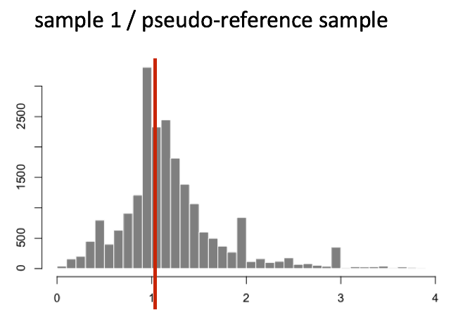

# Normalization methods

## Gene count normalization theory
The ultimate goal of most RNA-seq experiments is to accurately quantify the different transcripts present in a biological sample of interest. Yet, due to technical and biological causes, RNA-seq is prone to several biases that can affect sample / condition comparisons and therefore result interpretation.

In this section, we explain how to normalize (scale) the gene counts obtained upon completion of the bioinformatic workflow.

The counts of mapped reads for each gene is proportional to the expression of RNA (“interesting”) in addition to many other factors (“uninteresting”). Normalization is the process of scaling raw count values to account for the “uninteresting” factors. In this way the expression levels are more comparable between and/or within samples.

The main factors often considered during normalization are:

Sequencing depth: Accounting for sequencing depth is necessary for comparison of gene expression between samples. In the example below, each gene appears to have doubled in expression in Sample A relative to Sample B, however this is a consequence of Sample A having double the sequencing depth.


NOTE: In the figure above, each pink and green rectangle represents a read aligned to a gene. Reads connected by dashed lines connect a read spanning an intron.

Gene length: Accounting for gene length is necessary for comparing expression between different genes within the same sample. In the example, Gene X and Gene Y have similar levels of expression, but the number of reads mapped to Gene X would be many more than the number mapped to Gene Y because Gene X is longer.


RNA composition: A few highly differentially expressed genes between samples, differences in the number of genes expressed between samples, or presence of contamination can skew some types of normalization methods. Accounting for RNA composition is recommended for accurate comparison of expression between samples, and is particularly important when performing differential expression analyses [1].


In the example, imagine the sequencing depths are similar between Sample A and Sample B, and every gene except for gene DE presents similar expression level between samples. The counts in Sample B would be greatly skewed by the DE gene, which takes up most of the counts. Other genes for Sample B would therefore appear to be less expressed than those same genes in Sample A.

While normalization is essential for differential expression analyses, it is also necessary for exploratory data analysis, visualization of data, and whenever you are exploring or comparing counts between or within samples.

## 1.1 Common normalization methods
Several common normalization methods exist to account for these differences:

|Normalization method | Description  |	Accounted factors  |Recommendations|
|---|---|---|---|
|CPM (counts per million) | counts scaled by total number of reads | sequencing depth | gene count comparisons between replicates of the same samplegroup; NOT for within sample comparisons or DE analysis |
|TPM (transcripts per kilobase million) | counts per length of transcript (kb) per million reads mapped | sequencing depth and gene length | gene count comparisons within a sample or between samples of the same sample group; NOT for DE analysis |
|RPKM/FPKM (reads/fragments per kilobase of exon per million reads/fragments mapped)| similar to TPM | sequencing depth and gene length | gene count comparisons between genes within a sample; NOT for between sample comparisons or DE analysis |
|DESeq2’s median of ratios | counts divided by sample-specific size factors determined by median ratio of gene counts relative to geometric mean per gene | sequencing depth and RNA composition | gene count comparisons between samples and for DE analysis; NOT for within sample comparisons |
|EdgeR’s trimmed mean of M values (TMM)[2] | uses a weighted trimmed mean of the log expression ratios between samples | sequencing depth, RNA composition, and gene length | gene count comparisons between and within samples and for DE analysis |


## 1.2 RPKM/FPKM (not recommended for between sample comparisons)
While TPM and RPKM/FPKM normalization methods both account for sequencing depth and gene length, RPKM/FPKM are not recommended. The reason is that the normalized count values output by the RPKM/FPKM method are not comparable between samples.

Using RPKM/FPKM normalization, the total number of RPKM/FPKM normalized counts for each sample will be different. Therefore, you cannot compare the normalized counts for each gene equally between samples.

RPKM-normalized counts table

|gene | sample_A | sample_B |
|---|---|---|
|gene_1	| 5.5 |	5.5 |
|gene_2 | 73.4 | 21.8 |
|… | … | … |	
|Total RPKM-normalized counts | 1,000,000 | 1,500,000 |

For example, in the table above, Sample_A has a greater proportion of counts associated with gene_1 (5.5/1,000,000) than does sample_B (5.5/1,500,000) even though the RPKM count values are the same. Therefore, we cannot directly compare the counts for gene_1 (or any other gene) between sample_A and sample_B because the total number of normalized counts are different between samples.

NOTE: This [video](https://www.rna-seqblog.com/rpkm-fpkm-and-tpm-clearly-explained/) by StatQuest shows in more detail why TPM should be used in place of RPKM/FPKM if needing to normalize for sequencing depth and gene length.

## 1.3 DESeq2-normalized counts: Median of ratios method
Since tools for differential expression analysis are comparing the counts between sample groups for the same gene, gene length does not need to be accounted for by the tool. However, sequencing depth and RNA composition do need to be taken into account.

To normalize for sequencing depth and RNA composition, DESeq2 uses the median of ratios method. On the user-end there is only one step, but on the back-end there are multiple steps involved, as described below.

NOTE: The steps below describe in detail some of the steps performed by DESeq2 when you run a single function to get DE genes. Basically, for a typical RNA-seq analysis, you would not run these steps individually but rather make use of the results() function of DESeq2.

Step 1: creates a pseudo-reference sample (row-wise geometric mean)

For each gene, a pseudo-reference sample is created that is equal to the geometric mean across all samples.

```{r}
library(DT)
library(kableExtra)
d = data.frame(gene = c("gene_1","gene_2","gene_..."),sample_A = c(1489,22,"---"),sample_B = c(906,13,"---"), `pseudo-reference sample` = c("sqrt(1489 * 906) = 1161.5","sqrt(22 * 13) = 17.7","---"),stringsAsFactors = FALSE)

DT::datatable(d)

```

Step 2: calculates ratio of each sample to the reference

For every gene in a sample, the ratios (sample/ref) are calculated (as shown below). This is performed for each sample in the dataset. Since the majority of genes are not differentially expressed, the majority of genes in each sample should have similar ratios within the sample.
```{r}

d2 = data.frame(gene = c("gene_1","gene_2","gene_3","gene_4","gene_5","gene_..."),sample_A = c(1489,22,739,76,521,"---"),sample_B = c(906,13,410,42,1196,"---"), `pseudo-reference.sample` = c(1161.5,16.9,570.2,56.5,883.7,"---"),`ratio of sample_A/ref` = c("1489/1161.5 = 1.28","22/16.9 = 1.30","793/570.2 = 1.39","56.5 = 1.35","521/883.7 = 0.590","---"),`ratio of sample_B` = c("906/1161.5 = 0.78","13/16.9 = 0.77","410/570.2 = 0.72","56.5 = 1.35","1196/883.7 = 1.35","---"),stringsAsFactors = FALSE)

DT::datatable(d2, caption = 'ratio of each sample to the reference') 


```


Step 3: calculate the normalization factor for each sample (size factor)

The median value (column-wise for the above table) of all ratios for a given sample is taken as the normalization factor (size factor) for that sample, as calculated below. Notice that the differentially expressed genes should not affect the median value:

```{r}
normalization_factor_sample_A <- median(c(1.28, 1.3, 1.39, 1.35, 0.59))

normalization_factor_sample_B <- median(c(0.78, 0.77, 0.72, 0.74, 1.35))
```


The figure below illustrates the median value for the distribution of all gene ratios for a single sample (frequency is on the y-axis).



The median of ratios method makes the assumption that not ALL genes are differentially expressed; therefore, the normalization factors should account for sequencing depth and RNA composition of the sample (large outlier genes will not represent the median ratio values). This method is robust to imbalance in up-/down-regulation and large numbers of differentially expressed genes.

Usually these size factors are around 1, if you see large variations between samples it is important to take note since it might indicate the presence of extreme outliers.

Step 4: calculate the normalized count values using the normalization factor

This is performed by dividing each raw count value in a given sample by that sample’s normalization factor to generate normalized count values. This is performed for all count values (every gene in every sample). For example, if the median ratio for sample_A was 1.3 and the median ratio for sample_B was 0.77, you could calculate normalized counts as follows:

sample_A median ratio = 1.3

sample_B median ratio = 0.77

Raw Counts

|gene | sample_A | sample_B |
|---|---|---|
|gene_1	| 1489 | 906 |
|gene_2 | 22 | 13 |
	


Normalized Counts
```{r}
d3 = data.frame(gene = c("gene_1","gene_2","gene_..."),sample_A = c("1489 / 1.3 = 1145.39","22 / 1.3 = 16.92","---"),sample_B = c("906 / 0.77 = 1176.62","13 / 0.77 = 16.88","---") ,stringsAsFactors = FALSE)

DT::datatable(d3, caption = 'Normalized Counts')
 

```

Important note
Please note that normalized count values are not integers anymore but rather decimal numbers. This is a good way to rapidly check whether you are dealing with normalised/scaled data and not raw gene counts.

## 2. DESeq2 count normalization
Let’s see how, in practice, we can use DESeq2 median-of-ratios method to normalize the gene counts.


Data import 
```{r}

library(airway)
data(airway)
counts = assay(airway)

sampleInfo = colData(airway)

```

This is how the first five rows/columns of the counts dataframe look like:
```{r}
counts[1:5,1:5]

w= which(rowSums(counts)==0)
 
counts = counts[-w,]
 
w= which(rowSums(counts)<=4)
length(w)
counts = counts[-w,]
```

You can see that numbers in the matrix are not decimal numbers but rather integers.

Now that we know the theory of count normalization, we will normalize the counts using DESeq2. This requires a few steps:

Ensure the row names of the experimental design dataframe are present and in the same order as the column names of the counts dataframe.
Create a DESeqDataSet object.
Generate the normalized counts.

5.2 Match the experimental design and counts data
We should always make sure that we have sample names that match between the two files, and that the samples are in the right order. DESeq2 will output an error if this is not the case.

Check that sample names match in both files
```{r}

all.equal(as.character(sampleInfo$Run),colnames(counts))

```

If your data did not match, you could use the match() function to rearrange them to be matching.

## 2.1 Create the DESeqDataSet object

Bioconductor software packages often define and use a custom class within R for storing data (input data, intermediate data and also results). These custom data structures are similar to lists in that they can contain multiple different data types/structures within them. But, unlike lists they have pre-specified data slots, which hold specific types/classes of data. The data stored in these pre-specified slots can be accessed by using specific package-defined functions.

Let’s start by creating the DESeqDataSet object and then we can talk a bit more about what is stored inside it. To create the object we will need the count matrix and the experimental design table as inputs. We will also need to specify a design formula. The design formula specifies the column(s) in the experimental design table and how they should be used in the analysis. For this tutorial, we only have one column of interest, that is ~ infected. This column has two factor levels i.e. mock (not inoculated) and Pseudomonas syringae_ DC3000 (inoculated). This column tells DESeq2 that for each gene we want to evaluate gene expression change with respect to these two different factor levels.
```{r}
library(DESeq2) 

# Creation of the DESeqDataSet object
dds <- DESeqDataSetFromMatrix(countData = counts, 
                              colData = sampleInfo, 
                              design = ~ cell + dex) 
```

Important note

When creating the dds object, you should specify your experimental condition of interest.
Here we specify design = ~ cell + dex since this is the condition of interest used in this lesson.

Scaling of the raw counts to correct for library size for instance will not take the design formula into account.

We now have a DESeqDataSet object that contains both count data and experimental metadata that is the relationship between samples and their combination of experimental factors.

You can inspect this object by typing its name in your R console.
```{r}

dds
```

## 2.2 Generate normalized counts

The next step is to normalize the count data in order to be able to make fair gene comparisons between samples.

To perform the median of ratios method of normalization, DESeq2 has a single estimateSizeFactors() function that will generate size factors for us. We will use the function in the example below, but in a typical RNA-seq analysis this step is automatically performed by the DESeq() function, which we will see later.
```{r}
dds <- estimateSizeFactors(dds)
```

By assigning the results back to the dds object we are filling in the slots of the DESeqDataSet object with the appropriate information. We can take a look at the normalization factor applied to each sample using:
```{r}
sizeFactors(dds)
```

We can plot these size factors to see how much they differ between samples.
```{r}
library(tidyverse)

# create a dplyr tibble
size_factors_df <- tibble(
  sample = names(sizeFactors(dds)), 
  correction_factor = sizeFactors(dds)
  )

# line plot to connect the different size factor values
p <- ggplot(size_factors_df, aes(x = sample, y = correction_factor, group = 1)) +
  geom_point() + 
  geom_line() +
  theme(axis.text.x = element_text(angle = 90, size = 5)) +
  scale_y_continuous(limits = c(0.5,2))

# to display the plot
p
```

This plot indicates that size factors are all between ~0.70 and ~1.8 so relatively close to each other.

size factor plots

You can use DESeq-specific functions to access the different slots and retrieve information, if you wish. For example, suppose we wanted the original count matrix we would use counts(). For instance, to retrieve the normalized counts matrix from dds, we use the counts() function and add the argument normalized=TRUE.

## Extract the normalised counts
```{r}
counts_normalised = counts(dds, normalized = TRUE)
```

Let’s take a peek at the first five rows and columns.
```{r}

counts_normalised[1:5,1:5]
```

You now see that integers have become decimal numbers. All good!

Note
DESeq2 doesn’t actually use normalized counts to compute differentially expressed genes. Rather, it uses the raw counts and models the normalization inside the Generalized Linear Model (GLM). These normalized counts will be useful for downstream visualization of results, but cannot be used as input to the DESeq() function that performs differential analysis since it relies on the negative binomial model.

## 2.3 Comparison of raw and normalised counts
```{r}
library(rafalib)

mypar(2,1,mar = c(5, 2.5, 1.6, 1.1))
boxplot(log2(counts+1),main = "unnormalized",ylab="raw log2(counts)",xaxt = "n")
axis(1, at=seq(1, 8, by=1), labels = FALSE)
text(x = seq(1, 8, by=1), par("usr")[3], labels =colnames(counts), srt = 90, pos = 2, xpd = TRUE)
     
boxplot(log2(counts_normalised+1),main = "normalized",ylab="norm log2(counts)",xaxt = "n")
axis(1, at=seq(1, 8, by=1), labels = FALSE)
text(x = seq(1, 8, by=1), par("usr")[3], labels =colnames(counts), srt = 90, pos = 2, xpd = TRUE)
```


If you compare the raw and normalised (scaled) gene count distributions, you should see that the medians (black bars) are more comparable after scaling.

Please consult the step-by-step R code to normalize the DESeq2 way here.

You can see that each sample gene count median (black horizontal bars) is more aligned to the other medians after scaling.

## 2.4 Home-made DESeq normalization function
```{r}
dir <- system.file("extdata", package="airway", mustWork=TRUE)
data(airway)
dds <- DESeqDataSet(airway, design= ~ cell + dex)

dds = estimateSizeFactors(dds)
counts = counts(dds)

mygeommean  = function(x) x = exp(mean(log(x)))

geo = apply(counts,1,function(x) x = mygeommean(x))

ratio = counts/geo


finite = apply(ratio,2,is.finite)

wfinite = which(finite[,1]==TRUE)

ratio = ratio[wfinite,]

sizeF = apply(ratio,2,median)

table(all.equal(sizeFactors(dds),sizeF))

norm.dds = counts(dds,normalized = T)

```

To calculate the normalized matrix, each columan is divided by the size factors:
```{r}
m = matrix(rep(sizeF,nrow(counts)),ncol = ncol(counts),byrow = TRUE)
ncounts = counts/m

table(all.equal(ncounts,norm.dds ))

```

## 3. References
    1. Differential expression analysis for sequence count data
        Simon Anders & Wolfgang Huber [link](https://genomebiology.biomedcentral.com/articles/10.1186/gb-2010-11-10-r106)                                
    2. A scaling normalization method for differential expression analysis of RNA-seq data
        Mark D Robinson, Alicia Oshlack [link](https://genomebiology.biomedcentral.com/articles/10.1186/gb-2010-11-3-r25)

    3. [Harvard Bioinformatic Core Training program](https://hbctraining.github.io/DGE_workshop/lessons/02_DGE_count_normalization.html)


