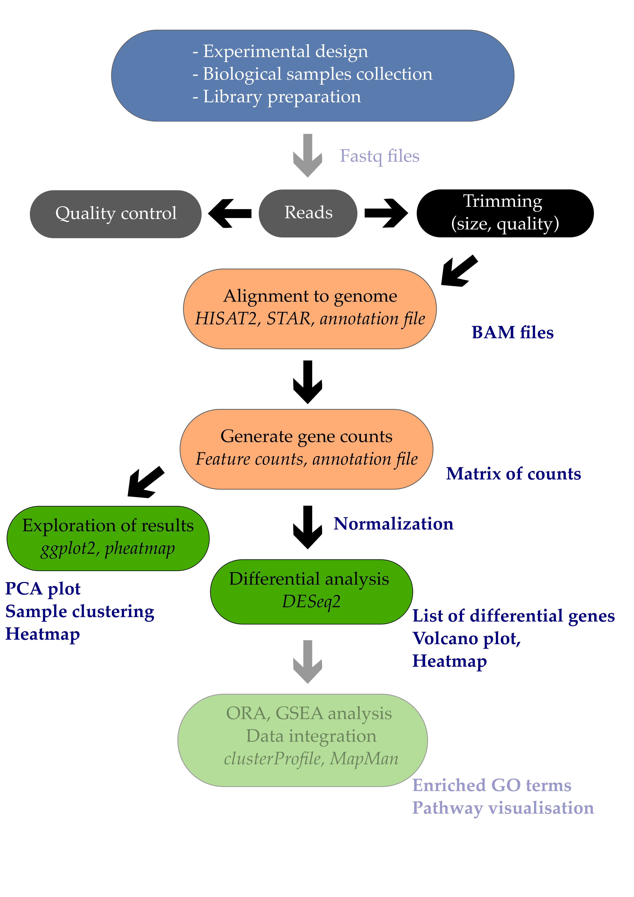
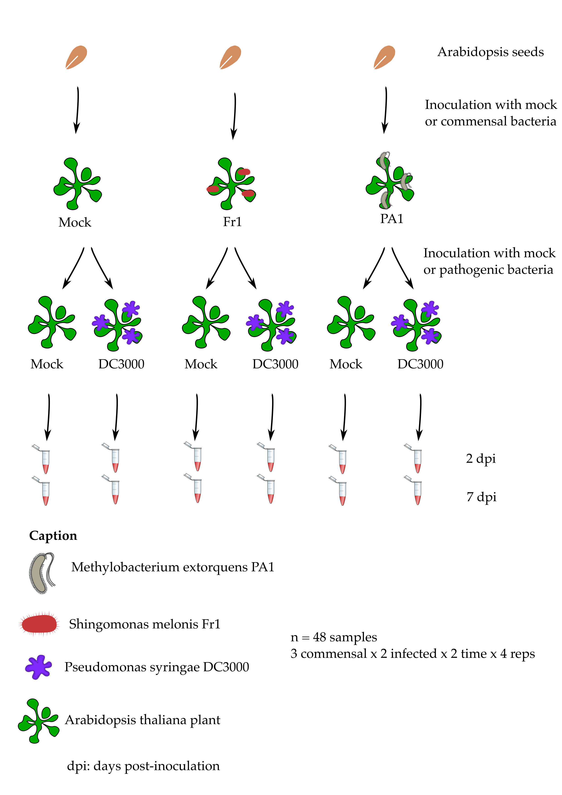

# RNAseq DESeq Part I

## Introduction



Differential expression analysis is the process of determining which of the genes are significantly affected by my experimental design. In the example study that we use, Arabidopsis plants were infected or not by a pathogenic bacteria called Pseudomonas syringae DC3000. One comparison of interest could be to determine which of the Arabidopsis leaf genes are transcriptionally affected by the infection with this pathogenic bacteria.

In this episode, we will see how to perform a simple one-condition experimental comparison with DESeq2. We will compare the transcriptome of Arabidopsis in response to infection by the leaf pathogenic bacteria Pseudomonas syringae DC3000 after 7 days (7 dpi). 



This will yield a table containing genes fold change and their corrected p-values. We will also see how to create a few typical representations classically used to display RNA-seq results such as volcano plots and heatmaps.

Important note For differential expression analysis, you should use the raw counts and not the scaled counts. As the DESeq2 model fit requires raw counts (integers), make sure that you use the raw_counts.csv file. 

### Creating the DESeqDataSet object

Since we do not want to work on all comparisons, we will filter out the samples and conditions that we do not need. Only the mock growth and the P. syringae infected condition will remain.

### Import libraries

```{r}

library("DESeq2")
library("tidyverse")

```

Import the samples to conditions correspondence.

```{r}

xp_design <- read.csv("data/samples_to_conditions.csv", 
                        header = T, 
                        stringsAsFactors = F, 
                        colClasses = rep("character",4))

```

Filter the design file to keep only "mock" and the "infected P. syringae at 7 dpi" conditions.

```{r}

xp_design_mock_vs_infected = xp_design %>% 
                      filter(growth == "MgCl2" & dpi == "7")

```

We then import the gene counting values and call it raw_counts. The gene names have to be changed to the names of the rows of the table for compatibility with DESeq2. This is done using the column_to_rownames() function from the tibble package (contained in tidyverse suite of packages).

Import the gene raw counts.

```{r}

raw_counts <- read.csv("data/raw_counts.csv", header = T, stringsAsFactors = F) %>% column_to_rownames("Geneid")

```   

Reorder counts columns according to the complete list of samples.

```{r}

raw_counts <- raw_counts[ , xp_design$sample]

```

We will now filter both the raw_counts and xp_design objects to keep a one-factor comparison and investigate the leaf transcriptome of Arabidopsis plants whose seeds were MgCl2 treated and whose plants were infected or not with Pseudomonas syringae DC3000 at 7 dpi.

The corresponding code is available below.

Filter count file accordingly (to keep only samples present in the filtered xp_design file)

```{r}

raw_counts_filtered = raw_counts[, colnames(raw_counts) 
                      %in% xp_design_mock_vs_infected$sample]

```

## Creation of the DESeqDataSet

```{r}

dds <- DESeqDataSetFromMatrix(countData = raw_counts_filtered, 
       colData = xp_design_mock_vs_infected, 
       design = ~ infected)

```

You can have a glimpse at the DESeqDataSet dds object that you have created. It gives some useful information already.

```{r}

dds

```

Important note on factor levels:

It is important to make sure that levels are properly ordered so we are indeed using the mock group as our reference level. A positive gene fold change means that the gene is upregulated in the P. syringae condition relatively to the mock condition.

Please consult the dedicated section of the DESeq2 vignette on factor levels.

One way to see how levels are interpreted within the DESeqDataSet object is to display the factor levels.

```{r}

dds$infected

```

This shows that the mock level comes first before the Pseudomonas_syringae_DC3000 level. If this is not correct, you can change it following the dedicated section of the DESeq2 vignette on factor levels.

### Running the DE analysis

Differential gene expression analysis will consist of simply two lines of code:

The first will call the DESeq function on a DESeqDataSet object that you've just created under the name dds. It will be returned under the same R object name dds. Then, results are extracted using the results function on the dds object and results will be extracted as a table under the name res (short for results).

The function `DESeq` is the combination of 3 `DESeq2` functions: 

1. `estimateSizeFactors` to normalize 

2. `estimateDispersions` to estimate mean and variance 

3. `nbinomialWaldTest` to fit the linear model

```{r}

dds <- DESeq(dds)

```

```{r}
res <- results(dds)

```

### Have a peek at the DESeqResults object

```{r}
res

```

Beware of factor levels If you do not supply any values to the contrast argument of the DESeq function, it will use the first value of the design variable from the design file.

In our case, we will perform a differential expression analysis between mock and Pseudomonas_syringae_DC3000.

Q1: Which of these two is going to be used as the reference level? 

A1:


Q2: How would you interpret a positive log2 fold change for a given gene?

A2:


```{r}

all_genes_results <- results(dds, contrast = c("infected",
    # name of the factor
    "Pseudomonas_syringae_DC3000",
    # name of the numerator level for fold change
    "mock")) 
    # name of the denominator level for fold change
    
```

If we now compare the res and all_genes_results DESeqResults objects, they should be exactly the same and return a TRUE value.

```{r}

all_equal(res, all_genes_results)

```

If not, that means that you should check your factor ordering.

### Extracting the table of differential genes

We can now have a look at the result table that contains all information on all genes (p-value, fold changes, etc).

Let's take a peek at the first lines.

```{r}
head(all_genes_results)    
```

Q3: What is the biological meaning of a fold change equal to 1 for gene X?

A3:


Q4: What is the biological meaning of a fold change equal to -1? 

A4:


Q5: In R, compute the fold change ("treated vs untreated") of a gene that has: 1) A gene expression equal to 230 in the "untreated" condition. 2) A gene expression equal to 750 in the "treated" condition.

A5:


Some explanations about the results output:

The results table when printed will provide the information about the comparison, e.g. "log2 fold change (MAP): condition treated vs untreated", meaning that the estimates are of log2(treated / untreated), as would be returned by
contrast=c("condition","treated","untreated").

So in our case, since we specified contrast = c("infected", "Pseudomonas_syringae_DC3000", "mock"), the log2FoldChange will return the log2(Pseudomonas syringae DC3000 / mock).

Additional information on the DESeqResult columns is available using the mcols function.

mcols(all_genes_results)

This will indicate a few useful metadata information about our results.

### False discovery rates

The selected threshold controls for type I error rate: rejecting the null hypothesis (H0 no difference) and therefore affirming that there is a gene expression difference between conditions while there aren't any. This value is often set at at:

0.01 (1%) or 0.001 (0.1%) in RNA-seq analyses.

When you perform thousands of statistical tests (one for each gene), you will by chance call genes differentially expressed while they are not (false positives). You can control for this by applying certain statistical procedures called multiple hypothesis test correction.

We can count the number of genes that are differentially regulated at a certain level.

```{r}

library(dplyr)

```

**threshold of p = 0.01**

```{r}

all_genes_results %>% 
  as.data.frame() %>% 
  filter(padj < 0.01) %>% 
  dim()

```

**threshold of p = 0.001**

```{r}

all_genes_results %>% 
  as.data.frame() %>% 
  filter(padj < 0.001) %>% 
  dim()

```

You should obtain 4979 differentially expressed genes at 0.01 and 3249 at 0.001 which are quite important numbers: indeed, it corresponds to respectively \~15% and \~10% of the whole number transcriptome (total number of mRNA is 33,768).

Histogram p-values This [blog post](http://varianceexplained.org/statistics/interpreting-pvalue-histogram/) explains in detail what you can expect from each p-value distribution profile.

**distribution of adjusted p-values**

```{r}

hist(all_genes_results$padj, col="lightblue", main = "Adjusted p-value distribution")

```

**p-values distribution (corrected for false discovery rate)**

**distribution of non-adjusted p-values**

```{r}

hist(all_genes_results$pvalue, col="grey", main = "Non-adjusted p-value distribution")

```

**p-values distribution (no false discovery rate correction)**

As you can see, the distribution of p-values was already quite similar suggesting that a good proportion of the tests have a significant p-value (inferior to = 0.01 for instance). This suggests that a good proportion of these will be true positives (genes truly differentially regulated).

### Extracting the table of differential genes 
OK, here's the moment you've been waiting for. How can I extract a nicely filtered final table of differential genes? Here it is!

```{r}

diff_genes = all_genes_results %>% 
  as.data.frame() %>% 
  rownames_to_column("genes") %>% 
  filter(padj < 0.01) %>% 
  arrange(desc(log2FoldChange), 
          desc(padj))

head(diff_genes)

```

### Choosing thresholds

Getting a list of differentially expressed genes means that you need to choose an absolute threshold for the log2 fold change (column log2FoldChange) and the adjusted p-value (column *padj*). Therefore you can make different list of differential genes based on your selected thresholds. It is common to choose a log2 fold change threshold of \|1\| or \|2\| and an adjusted p-value of 0.01 for instance. 

You could write this file on your disk with write.csv() for instance to save a comma-separated text file containing your results.

### Volcano plot

For each gene, this plot shows the gene fold change on the x-axis against the p-value plotted on the y-axis.

Here, we make use of a library called EnhancedVolcano which is available through Bioconductor and described extensively on its own GitHub page.

First, we are going to "shrink" the fold changes to remove the noise associated with fold changes coming from genes with low count levels. Shrinkage of effect size (LFC estimates) is useful for visualization and ranking of genes. This helps to get more meaningful log2 fold changes for all genes independently of their expression level.

Need to specify the name or number of the coefficient (LFC) to shrink:

```{r}

library(apeglm)

resLFC <- lfcShrink(dds = dds, 
   res = all_genes_results,
   type = "normal",
   coef = "infected_Pseudomonas_syringae_DC3000_vs_mock") 
# name or number of the coefficient (LFC) to shrink
# 
```

To see what coefficients can be extracted, type:

```{r}

resultsNames(dds)

```

We can build the Volcano plot rapidly without much customization.

Load the library if not done yet.

```{r}

library(EnhancedVolcano)

```

The main function is named after the package

Default volcano plot:
```{r}

EnhancedVolcano(toptable = resLFC,# use shrunken log2 fold change as noise associated with low count genes is removed 
   x = "log2FoldChange",
   # column in resLFC with log2 fold changes
   y = "padj", 
   # column in resLFC that contains the p-value
   lab = rownames(resLFC)
                )

```

Alternatively, the plot can be heavily customized to become a publication-grade figure.

Customized volcano plot:
```{r}

EnhancedVolcano(toptable = resLFC,
   x = "log2FoldChange",
   y = "padj",
   lab = rownames(resLFC),
   xlim = c(-10, +10),
   ylim = c(0,100),
   pCutoff = 1e-06,
   FCcutoff = 2, 
   title = "Pseudomonas syringae DC3000 versus mock", 
subtitle = "fold change cutoff = 2, p-value cutoff = 1e-06",         
   legendLabels=c('Not significant',
                  'Log2 fold-change (but do not pass p-value 
                   cutoff)',
                  'Pass p-value cutoff',
                  'Pass both p-value & Log2 fold change')
                )

```

Once more for fun:
```{r}

EnhancedVolcano(resLFC,
  axisLabSize = 12,
  titleLabSize = 10,
  subtitle ="fold change cutoff = 2, p-value cutoff = 1e-06" ,
  title = "Pseudomonas syringae DC3000 versus mock", 
  subtitleLabSize = 8,
  captionLabSize = 10,
  lab = rownames(resLFC),
  x = 'log2FoldChange',
  y = 'pvalue',
  xlim = c(-2.5,7),
  xlab = bquote(~Log[2]~ 'fold change'),
  pCutoff = 1e-06,
  FCcutoff = 2.0,
  pointSize = 3.0,
  labSize = 3.0,
  colAlpha = 0.75,
  legendLabels = c('NS', expression(Log[2] ~ FC),  
      expression(italic(p - value)), 
      expression(italic(p - value ~ and ~ log[2] ~ FC))),
  legendPosition = 'right',
  legendLabSize = 10,
  legendIconSize = 1.5,
  drawConnectors = TRUE,
  widthConnectors = 0.2,
  colConnectors = 'grey30')

```

### Heatmap

Heatmap is a representation where values are represented on a color scale. It is usually one of the classic figures part of a transcriptomic study. One can also cluster samples and genes to identify groups of genes that show a coordinated behaviour. Let's build a nice looking heatmap to display our differential genes one step at a time.

We are going to make use of a library called pheatmap. Here is a minimal example (mtcars is a dataset that comes included with R).

Basic heatmap:
```{r}

library(pheatmap)
df <- scale(mtcars)
pheatmap(df)

```

**Troubleshooting** 
If you have issues where your heatmap plot is not being shown, run dev.off() and try to plot again. It should solve your issue. 

### Function to scale the raw counts

Let's work on the global raw_counts object that contains the unscaled raw counts for our genes. We will first normalize it by walking through the DESeq2 normalization procedure.

## Normalization for sequencing depth

### Estimate size factors 
To normalize for sequencing depth and RNA composition, DESeq2 uses the median of ratios method. On the user-end there is only one step, but on the back-end there are multiple steps involved, as described below.

Step 1: create a pseudo-reference sample (row-wise geometric mean)

For each gene, a pseudo-reference sample is created that is equal to the geometric mean across all samples.

$$geometricmean = exp(mean(log(x[x>0])))$$

Step 2: calculates ratio of each sample to the reference

For every gene in a sample, the ratios (sample/ref) are calculated (as shown below). This is performed for each sample in the dataset. Since the majority of genes are not differentially expressed, the majority of genes in each sample should have similar ratios within the sample.

Step 3: calculate the normalization factor for each sample (size factor)

The median value (column-wise for the above table) of all ratios for a given sample is taken as the normalization factor (size factor) for that sample, as calculated below. 

The median of ratios method makes the assumption that not ALL genes are differentially expressed; therefore, the normalization factors should account for sequencing depth and RNA composition of the sample (large outlier genes will not represent the median ratio values). This method is robust to imbalance in up-/down-regulation and large numbers of differentially expressed genes.

Usually these size factors are around 1, if you see large variations between samples it is important to take note since it might indicate the presence of extreme outliers.

Step 4: calculate the normalized count values using the normalization factor

This is performed by dividing each raw count value in a given sample by that sample’s normalization factor to generate normalized count values. This is performed for all count values (every gene in every sample).

Let's walk through all this, but be aware it's very close to adjusting by the mean of the colSums, so it's normalizing by median of ratios really isn't as far out as it sounds:

```{r}

dds <- estimateSizeFactors(dds)
sizeFactors(dds)
colSums(counts(dds))

par(pch = 19)
plot(sizeFactors(dds), colSums(counts(dds)))

abline(lm(colSums(counts(dds)) ~ sizeFactors(dds) + 0))

```

## Home-made DESeq normalization function
```{r}

dds = estimateSizeFactors(dds)
counts = counts(dds)

mygeommean  = function(x) x = exp(mean(log(x)))

geo = apply(counts,1,function(x) x = mygeommean(x))

ratio = counts/geo

finite = apply(ratio,2,is.finite)

wfinite = which(finite[,1]==TRUE)

ratio = ratio[wfinite,]

sizeF = apply(ratio,2,median)

table(all.equal(sizeFactors(dds),sizeF))

norm.dds = counts(dds,normalized = T)

```

To calculate the normalized matrix, each columan is divided by the size factors:
```{r}

m = matrix(rep(sizeF,nrow(counts)),ncol = ncol(counts),byrow = TRUE)
ncounts = counts/m

table(all.equal(ncounts,norm.dds ))

```


Let's scale/normalise the raw unscaled counts and display the first lines.

```{r}

geo = apply(raw_counts,1,function(x) x = mygeommean(x))
ratio = raw_counts/geo


finite = apply(ratio,2,is.finite)

wfinite = which(finite[,1]==TRUE)

ratio = ratio[wfinite,]

sizeF = apply(ratio,2,median)

m = matrix(rep(sizeF,nrow(raw_counts)),ncol = ncol(raw_counts),byrow = TRUE)

scaled_counts = raw_counts/m

head(scaled_counts)

```

This scaling procedure does not fundamentally change our gene count values. You can verify this by executing this code:

```{r}

long_scaled_counts = 
  scaled_counts %>% 
  rownames_to_column("gene") %>% 
  pivot_longer(-gene, names_to = "sample", values_to = "counts") %>% 
  mutate(scaled = "yes")

long_raw_counts = 
  raw_counts %>% 
  rownames_to_column("gene") %>% 
  pivot_longer(-gene, names_to = "sample", values_to = "counts") %>% 
  mutate(scaled = "no")

long_raw_and_scaled_counts = bind_rows(long_raw_counts, long_scaled_counts)

ggplot(long_raw_and_scaled_counts, 
       aes(x = scaled, y = counts + 1, fill = scaled)) +
  geom_violin() +
  scale_y_log10() +
  labs(x = "Gene counts scaled/normalised?", y = "Gene counts (raw or scaled)")

```

**Heatmap: Raw vs scaled counts**

### Heatmap: First version

```{r}

# normalize the counts of the diff_genes
counts_normalised_only_diff_genes = 
  scaled_counts %>% 
  rownames_to_column("genes") %>%               
  pivot_longer(- genes,                         
               names_to = "sample", 
               values_to = "counts") %>% 
  filter(genes %in% diff_genes$genes) %>%             
  pivot_wider(names_from = "sample",            
              values_from = "counts")  %>%      
  column_to_rownames("genes") 
# the gene column is converted back to row names to create a matrix usable with pheatmap

dim(counts_normalised_only_diff_genes)
# check that you have the expected number of rows and columns
# 
```

Did everyone catch what we did there?

We indeed find that we have 4979 genes (rows, p < 0.01) and 48 samples (columns) which corresponds to the number of differential genes identified previously between Mock and DC3000 infected conditions at 7 dpi and with a MgCl2 seed coating. You can also use head() to show the first lines of this table.

Let's plot our first version of the heatmap.

```{r}

library(pheatmap)
pheatmap(counts_normalised_only_diff_genes, 
         cluster_rows = FALSE, 
         cluster_cols = FALSE, 
         scale = "none",
         show_rownames = FALSE, 
         show_colnames = TRUE)

```

We have removed the genes names with show_rownames = FALSE since they are not readable anymore for such a high number of genes.

First heatmap version...

Well....not very useful right?

Q6: Do you have an idea of how to improve this heatmap?

A6:


Hint: run the code below to show the distribution of values in the counts_normalised_only_diff_genes table:

```{r}

counts_normalised_only_diff_genes %>% 
    rownames_to_column("genes") %>% 
    pivot_longer(- genes, names_to = "sample", values_to = "counts")     %>% with(., hist(counts, col = "dodgerblue"))

```

Now with log2 counts to spread out the histogram...

```{r}

counts_normalised_only_diff_genes %>% 
    rownames_to_column("genes") %>% 
    pivot_longer(- genes,names_to = "sample", values_to = "counts")      %>% with(., hist(log2(counts), col = "dodgerblue"))

```

If you re-run the code for the first heatmap with a log2 transformation, you will get a simple way to display different gene count levels. We add `+ 1` to account for genes with count values equal to 0.

### Heatmap: Second version:
```{r}

pheatmap(log2(counts_normalised_only_diff_genes + 1), 
     cluster_rows = FALSE, 
     cluster_cols = FALSE, 
     scale = "none",
     show_rownames = FALSE, 
     show_colnames = TRUE)

```

Although the scaling has been slightly improved it is still not really an optimal heatmap.

### Second version with scaling

When creating a heatmap, it is vital to control how scaling is performed. A possible solution is to specify scale = "row" to the pheatmap() function to perform row scaling since gene expression levels will become comparable. Instead, I'd recommend to do it
"manually" to understand and control the scaling procedure.

We can perform a Z-score calculation for each gene so that

where is an individual gene count inside a given sample, the row mean of for that gene across all samples and its standard deviation. Check background and R code instructions here.

For each gene, the row-wise mean should be close to 0 while the row-wise standard deviation should be close to 1. We are going to use the R scale() function to do this and check that our scaling procedure worked out.

Here is a simple example to understand how scale() works.

```{r}

set.seed(1)
x <- runif(7)

```

Z-score -- manually

```{r}

(x - mean(x)) / sd(x)

```

With scale function

```{r}

scale(x)[,1]

```

The two outputs are identical. Let's do it for our dataset. When x is a matrix, scaling is performed column-wise.

```{r}
counts_scaled = 
  counts_normalised_only_diff_genes %>% 
  t(.) %>% # transpose to have the genes in columns 
  scale() %>%# scale(x, center = TRUE, scale = TRUE) 
  t(.)# back in original shape

```

Sanity check: the majority of the values should be around zero.

You can verify that it went well using a histogram of Z-score values.

Histogram of Z-score values:
```{r}
apply(counts_scaled, MARGIN = 1, mean) %>%                          # calculate the mean per row
  hist(., main = "", xlab = "Z-score values", col = "dodgerblue2")  
```

Does this scaling improves our heatmap?

Second version with scaling:
```{r}
pheatmap(counts_scaled, 
         cluster_rows = FALSE, 
         cluster_cols = FALSE, 
         show_rownames = FALSE, 
         scale = "none",# already done "manually"
         show_colnames = TRUE)
```

After applying the scaling procedure, the gene expression levels become more comparable. Still, this heatmap isn't really useful so far...

Notice Have you noticed the two different color scales? 

### Heatmap: Third version with genes and samples grouped by profiles (clustered)

One interesting feature of the heatmap visualisation is the ability to group genes and samples by their expression profile. Similarly to the hierarchical clustering procedure that we have seen in episode 05.

Let's compare how it looks with both gene and sample clustering.

Heatmap: Third heatmap version (clustered):
```{r}

pheatmap(counts_scaled, 
         cluster_rows = TRUE,                      
         cluster_cols = TRUE, 
         show_rownames = FALSE, 
         show_colnames = TRUE,
         main = "Clustering on")

```

This is getting easier to read. Genes with similar profiles that distinguish different samples can be easily visualised.

Q7: Do you know how this gene and sample clustering was done? How can you find this out?

A7:


You can change this default behavior easily and try other clustering methods (see ?hclust for supported methods).

## Discussion

Q8: The gene clusters do not seem to be pretty clear cut though. Do you have an idea why? 

Hint: we still have 48 samples under investigation but we are working on 4979 genes (differential genes between what?).

A8:


### Heatmap: Fourth version of our heatmap with the 8 samples being investigated

But there's even a better and clearer heatmap that can be generated. Since we have "noise" coming from samples that were not under investigation in our comparison (DC3000 vs Mock at 7dpi from seeds treated with MgCl2), we can remove the other samples.

```{r}
counts_scaled_filtered = 
  counts_scaled %>% 
  as.data.frame() %>%
  dplyr::select(xp_design_mock_vs_infected$sample) # keep the 8 samples

head(counts_scaled_filtered)
```

We have 8 columns corresponding to the 8 samples of the xp_design_mock_vs_infected.

Heatmap: Fourth version
```{r}

anno_col_info = xp_design_mock_vs_infected %>% column_to_rownames("sample")

anno_info_colors = list(
  seed = c(MgCl2 = "#d8b365"),
  infected = c(mock = "lightgrey", 
               Pseudomonas_syringae_DC3000 = "black"),
  dpi = c("7" = "dodgerblue4")
)
pheatmap(counts_scaled_filtered, 
         cluster_rows = TRUE,                       
         cluster_cols = TRUE, 
         show_rownames = FALSE, 
         show_colnames = TRUE,
         annotation_col = anno_col_info,
         annotation_colors = anno_info_colors,
         clustering_method = "ward.D",
         main = "Clustering with ward method")
```

### Heatmap: Final heatmap

Challenge (if time allows) 

Q9: Can you can generate a heatmap from differential genes with a fold change higher than 4 (positive) ?

A9:
```{r answer9, eval= FALSE }

```

Cluster genes and samples

```{r eval= FALSE}

```


### Bonus: MA plots

We don't cover MA plots in this lesson but if you are interested, you can have a look at it here.

The MA plot originally comes from microarray studies that compared two conditions. From the DESeq2 vignette:

In DESeq2, the function plotMA shows the log2 fold changes attributable to a given variable over the mean of normalized counts for all the samples in the DESeqDataSet. Points will be colored red if the adjusted p value is less than 0.1. Points which fall
out of the window are plotted as open triangles pointing either up or down.

```{r}

plotMA(dds, alpha = 0.01)

```

Shrinkage of effect size (LFC estimates) is useful for visualization and ranking of genes. It is more useful to visualize the MA-plot for the shrunken log2 fold changes, which remove the noise associated with log2 fold changes from low count genes without
requiring arbitrary filtering thresholds. This helps to get more meaningful log2 fold changes for all genes independently of their expression level.

```{r}

resLFC <- lfcShrink(dds = dds, 
                  res = res,
                  type = "normal",
                  coef = 2) # corresponds to "infected_Pseudomonas_syringae_DC3000_vs_mock" comparison

```

```{r}

plotMA(resLFC, alpha = 0.01)

```

You can see that genes with low counts are now shrunken.

**References** 

Kamil Slowikoski [blog post about heatmap](https://slowkow.com/notes/pheatmap-tutorial/) [Z-score calculations](https://www.datatechnotes.com/2018/02/z-score-with-r.html) 

Type I and type II error rates in [gene expression]
studies(<https://pubmed.ncbi.nlm.nih.gov/28637422/>) 

[p-value histograms explained](http://varianceexplained.org/statistics/interpreting-pvalue-histogram/)

**Key Points**

**Call differentially expressed genes requires to know how to specify the right contrast.**

**Multiple hypothesis testing correction is required because multiple statistical tests are being run simultaneously.**

**Volcano plots and heatmaps are useful representations to visualise differentially expressed genes.**
