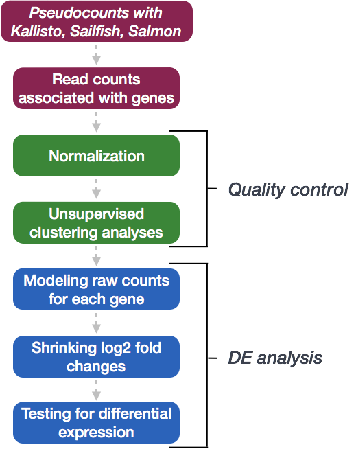

# RNAseq DESeq Part III
```{r}

library(knitr)

```

The Rmd for this file can be found [here](https://github.com/gurinina/omic-sciences/blob/main/18-RNAseq-DESeq2_PartIII.Rmd). RNA-seq is a valuable experiment for quantifying both the types and the amount of RNA molecules in a sample. We've covered the
basic idea of the protocol in lectures, but some early references for RNA-seq include [Mortazavi (2008)](#foot) and [Marioni (2008)](#foot).

In this lab, we will focus on comparing the expression levels of genes across different samples, by counting the number of reads which overlap the exons of genes defined by a known annotation. As described in the lecture, this analysis sets aside the task
of estimating the different kinds of RNA molecules, and the different isoforms for genes with multiple isoforms. One advantage of looking at these matrices of counts is that we can use statistical distributions to model how the variance of counts will
change when the counts are low vs high. We will explore the relationship of the variance of counts to the mean later in this lab.

## Counting reads in genes

In this lab we will examine 8 samples from the airway package, which are from the paper by [Himes et al](http://www.ncbi.nlm.nih.gov/pmc/articles/PMC4057123/): "RNA-seq Transcriptome Profiling Identifies CRISPLD2 as a Glucocorticoid Responsive Gene that
Modulates Cytokine Function in Airway Smooth Muscle Cells".

This lab will focus on a summarized version of an RNA-seq experiment: a count matrix, which has genes along the rows and samples along the columns. The values in the matrix are the number of reads which could be uniquely aligned to the exons of a given
gene for a given sample. As we have seen how to make a count matrix from BAM files, here we will use a pre-made count matrix, to avoid downloading the multi-gigabyte BAM files containing the aligned reads. A new pipeline for building count matrices, which
skips the alignment step, is to use fast pseudoaligners such as Sailfish, Salmon and kallisto, followed by the [tximport](http://bioconductor.org/packages/tximport) package. See the package vignette for more details. Here, we will continue with the read
counting pipeline.

```{r workflow, fig.cap = "DESeq2 workflow", echo = FALSE, dpi = 40}



```

```{r messages=FALSE}

library(airway)
dir <- system.file("extdata", package="airway", mustWork=TRUE)
csv.file <- file.path(dir, "sample_table.csv")
sample.table <- read.csv(csv.file, row.names=1)

```

## Visualizing sample-sample distances

We now load the full *SummarizedExperiment* object, counting reads over all the genes.

```{r, message=FALSE}

library(airway)
data(airway)
airway

```

```{r}

colData(airway)

```

```{r}

rowRanges(airway)

```

The counts matrix is stored in `assay` of a *SummarizedExperiment*.

```{r}

head(assay(airway))

```

This code chunk is not necessary, but helps to make nicer plots below with large axis labels (`mypar(1,2)` can be substituted with `par(mfrow=c(1,2))` below).

```{r}

# library(devtools)
# devtools::install_github("ririzarr/rafalib")
library(rafalib)
mypar()

```

Note that, on the un-transformed scale, the high count genes have high variance. That is, in the following scatter plot, the points start out in a tight cone and then fan out toward the top right. This is a general property of counts generated from
sampling processes, that the variance typically increases with the expected value. We will explore different scaling and transformations options below.

```{r}

plot(assay(airway)[,1:2], cex=.1)

```

### Creating a DESeqDataSet object

We will use the `DESeq2` package to normalize the sample for sequencing depth. The *DESeqDataSet* object is just an extension of the *SummarizedExperiment* object, with a few changes. The matrix in `assay` is now accessed with `counts` and the elements of
this matrix are required to be non-negative integers (0,1,2,...).

We need to specify an experimental *design* here, for later use in differential analysis. The design starts with the tilde symbol `~`, which means, model the counts (log2 scale) using the following formula. Following the tilde, the variables are columns of
the `colData`, and the `+` indicates that for differential expression analysis we want to compare levels of `dex` while controlling for the `cell` differences.

```{r}

library(DESeq2)
dds <- DESeqDataSet(airway, design= ~ cell + dex)

```

We can also make a *DESeqDataSet* from a count matrix and column data.

```{r}

dds.fc <- DESeqDataSetFromMatrix(assay(airway),  
                                 colData=colData(airway), 
                                 design= ~ cell + dex)

```

### Normalization for sequencing depth

The following estimates size factors to account for differences in sequencing depth, and is only necessary to make the `log.norm.counts` object below.

```{r}

dds <- estimateSizeFactors(dds)
sizeFactors(dds)
colSums(counts(dds))
par(pch=19)
plot(sizeFactors(dds), colSums(counts(dds)))
abline(lm(colSums(counts(dds)) ~ sizeFactors(dds) + 0))

```

Size factors are calculated by the median ratio of samples to a pseudo-sample (the geometric mean of all samples). In other words, for each sample, we take the exponent of the median of the log ratios in this histogram.


```{r}
loggeomeans <- rowMeans(log(counts(dds)))
hist(log(counts(dds)[,1]) - loggeomeans, 
     col="grey", main="", xlab="", breaks=40)
```

The size factor for the first sample:

```{r}
exp(median((log(counts(dds)[,1]) - loggeomeans)[is.finite(loggeomeans)]))
sizeFactors(dds)[1]
```

Make a matrix of log normalized counts (plus a pseudocount):

```{r}

log.norm.counts <- log2(counts(dds, normalized=TRUE) + 1)

```

Another way to make this matrix, and keep the sample and gene information is to use the function `normTransform`. The same matrix as above is stored in `assay(log.norm)`.

```{r}

log.norm <- normTransform(dds)

```

Examine the log counts and the log normalized counts (plus a pseudocount).

```{r}

rs <- rowSums(counts(dds))
mypar(1,2)
boxplot(log2(counts(dds)[rs > 0,] + 1)) # not normalized
boxplot(log.norm.counts[rs > 0,]) # normalized

```

Make a scatterplot of log normalized counts against each other. Note the fanning out of the points in the lower left corner, for points less than $2^5 = 32$.

```{r}

plot(log.norm.counts[,1:2], cex=.1)

```

### Stabilizing count variance

To improve the distances/clustering for the PCA and heirarchical clustering visualization methods, we need to moderate the variance across the mean. We will use a more sophisticated transformation, the rlog transformation, which uses the variance model for
count data to shrink together the log-transformed counts for genes with very low counts. For genes with medium and high counts, the `rlog` is very close to `log2`. For further details, see the section in the DESeq2 [paper](#foot).

```{r}

rld <- rlog(dds)

```

Another transformation for stabilizing variance in the *DESeq2* package is `varianceStabilizingTransformation` (*vst*). These two tranformations are similar, the *rlog* might perform a bit better when the size factors vary widely, and the
*varianceStabilizingTransformation* is much faster when there are many samples.

```{r}

vsd <- varianceStabilizingTransformation(dds)

```

```{r}

library("dplyr")
library("ggplot2")

dds <- estimateSizeFactors(dds)

df <- bind_rows(
  as_data_frame(log2(counts(dds, normalized=TRUE)[, 1:2]+1)) %>%
         mutate(transformation = "log2(x + 1)"),
  as_data_frame(assay(vsd)[, 1:2]) %>% mutate(transformation = "vst"),
  as_data_frame(assay(rld)[, 1:2]) %>% mutate(transformation = "rlog"))

colnames(df)[1:2] <- c("x", "y")  

lvls <- c("log2(x + 1)", "vst", "rlog")
df$transformation <- factor(df$transformation, levels=lvls)

ggplot(df, aes(x = x, y = y)) + geom_hex(bins = 80) +
  coord_fixed() + facet_grid( . ~ transformation)  + theme_bw()

```

We can examine the standard deviation of rows over the mean for the *log plus pseudocount* and the *rlog*. Note that the genes with high variance for the *log* come from the genes with lowest mean. If these genes were included in a distance calculation,
the high variance at the low count range might overwhelm the signal at the higher count range.

```{r}

library(vsn)
meanSdPlot(log.norm.counts, ranks=FALSE) 

```

For the rlog:

```{r}

meanSdPlot(assay(rld), ranks=FALSE)

```

For the VST:

```{r}

meanSdPlot(assay(vsd), ranks=FALSE)

```

The principal components (PCA) plot is a useful diagnostic for examining relationships between samples:

```{r}

plotPCA(log.norm, intgroup="dex")

```

Using the rlog:

```{r}

plotPCA(rld, intgroup="dex")

```

Using the VST:

```{r}

plotPCA(vsd, intgroup="dex")

```

We can make this plot even nicer using custom code from the `ggplot2` library:

```{r}

(data <- plotPCA(rld, intgroup=c("dex","cell"), returnData=TRUE))
(percentVar =100*round(attr(data, "percentVar"),2))

```

```{r}

makeLab <- function(x,pc) paste0("PC",pc,": ",x,"% variance")

ggplot(data, aes(PC1,PC2,col=dex,shape=cell)) + geom_point() +
  xlab(makeLab(percentVar[1],1)) + ylab(makeLab(percentVar[2],2))

```

In addition, we can plot a hierarchical clustering based on Euclidean distance matrix:

```{r fig.width=10, fig.height=5}

mypar(1,2)
plot(hclust(dist(t(log.norm.counts))), labels=colData(dds)$dex)
plot(hclust(dist(t(assay(rld)))), labels=colData(rld)$dex)

```

## DESeq step-by-step

```{r deseq, fig.cap = "DESeq2 workflow", echo = FALSE, dpi = 40}

knitr::include_graphics('18-RNAseq/deseq2_workflow_separate.png')

```

Up until now, we haven't really talked about the details of the in the individual steps in the 'DESeq' function, we'll go through that today.

### Differential gene expression

We will now perform *differential gene expression* on the counts, to try to find genes in which the differences in expected counts across samples due to the condition of interest
rises above the biological and technical variance we observe.

To get our differential expression results from our raw count data, we only need to run 2 lines of code!

First we create a DESeqDataSet as we did in the 'Count normalization' lesson and specify the object which contains our raw counts, the metadata variable, and provide our design formula:

## Create DESeq2Dataset object

```{r}
dds <- DESeqDataSet(airway, design= ~ cell + dex)
```

Then, to run the actual differential expression analysis, we use a single call to the function DESeq().

## Run analysis

dds <- DESeq(dds) By re-assigning the results of the function back to the same variable name (dds), we can fill in the slots of our DESeqDataSet object.

Everything from normalization to linear modeling was carried out by the use of a single function! This function will print out a message for the various steps it performs:

estimating size factors estimating dispersions gene-wise dispersion estimates mean-dispersion relationship final dispersion estimates fitting model and testing

NOTE: There are individual functions available in DESeq2 that would allow us to carry out each step in the workflow in a step-wise manner, rather than a single call. We demonstrated one example when generating size factors to create a normalized matrix. By
calling DESeq(), the individual functions for each step are run for you.

With the 2 lines of code above, we just completed the workflow for the differential gene expression analysis with DESeq2. The steps in the analysis are output below:

We will be taking a detailed look at each of these steps to better understand how DESeq2 is performing the statistical analysis and what metrics we should examine to explore the quality of our analysis.

## Step 1: Estimate size factors

The first step in the differential expression analysis is to estimate the size factors, which is exactly what we already did above.

DESeq2 will automatically estimate the size factors when performing the differential expression analysis. However, if you have already generated the size factors using estimateSizeFactors(), as we did earlier, then DESeq2 will use these values.

To normalize the count data, DESeq2 calculates size factors for each sample using the median of ratios method discussed previously in the 'Count normalization' lesson.

Examining the size factors Let's take a quick look at size factor values we have for each sample:

```{r}
sizeFactors(dds)
```

Take a look at the total number of reads for each sample:

Total number of raw counts per sample

```{r}

colSums(counts(dds))

```

How do the numbers correlate with the size factor?

Now take a look at the total depth after normalization using:

## Total number of normalized counts per sample

```{r}

dds = estimateSizeFactors(dds)
colSums(counts(dds, normalized=T))

```

How do the values across samples compare with the total counts taken for each sample?

## Step 2: Estimate gene-wise dispersion

The next step in the differential expression analysis is the estimation of gene-wise dispersions. Before we get into the details, we should have a good idea about what dispersion is referring to in DESeq2.

**What is dispersion?**

Dispersion is a measure of spread or variability in the data. Variance, standard deviation, IQR, among other measures, can all be used to measure dispersion. However, DESeq2 uses a specific measure of dispersion (α) related to the mean (μ) and variance of
the data: Var = μ + α\*μ\^2. For genes with moderate to high count values, the square root of dispersion will be equal to the coefficient of variation (Var / μ). So 0.01 dispersion means 10% variation around the mean expected across biological replicates. 

However, we have to back track a little bit and talk about the negative binomial distribution.

### Modeling raw counts with the negative binomial distribution

Count data is often modeled using the binomial distribution, which can give you the probability of getting a number of heads upon tossing a coin a number of times. However, not all count data can be fit with the binomial distribution. The binomial is based on discrete events and used in situations when you have a certain number of cases.

When the number of cases is very large (i.e. people who buy lottery tickets), but the probability of an event is very small (probability of winning), the Poisson distribution is used to model these types of count data. The Poisson is similar to the
binomial, but is based on continuous events. 

With RNA-Seq data, a very large number of RNAs are represented and the probability of pulling out a particular transcript is very small. Thus, it would be an appropriate situation to use the Poisson distribution. However, a unique property of this
distribution is that the mean == variance. Realistically, with RNA-Seq data there is always some biological variation present across the replicates (within a sample class). Genes with larger average expression levels will tend to have larger observed variances across replicates.

If the proportions of mRNA stayed exactly constant between the biological replicates for each sample class, we could expect Poisson distribution (where mean == variance). But this doesn't happen in practice, and so the Poisson distribution is only
considered appropriate for a single biological sample.

The model that fits best, given this type of variability between replicates, is the Negative Binomial (NB) model. Essentially, the NB model is a good approximation for data where the mean < variance, as is the case with RNA-Seq count data.

We use an overdispersed Poisson distribution -- called the negative binomial -- to model the *raw counts* in the count matrix. The model will include the *size factors* into account to adjust for sequencing depth. The formula will look like:

$$ K_{ij} \sim \text{NB}(s_{ij} q_{ij}, \alpha_i ) $$

where $K_{ij}$ is a single raw count in our count table, $s_{ij}$ is a size factor or more generally a normalization factor, $q_{ij}$ is proportional to gene expression (what we want to model with our design variables), and $\alpha_i$ is a *dispersion
parameter*.

Why bother modeling *raw counts*, rather than dividing out the sequencing depth and working with the normalized counts? In other words, why put the $s_{ij}$ on the right side of the equation above, rather than dividing out on the left side and modeling
$K_{ij} / s_{ij}$, the normalized counts? The reason is that, with the raw count, we have knowledge about the link between the expected value and its variance. So we prefer the first equation below to the second equation, because with the first equation,
we have some additional information about the variance of the quantity on the left hand side.

$$ K_{ij} \sim \text{NB}(\mu_{ij} = s_{ij} q_{ij} ) $$

$$ \frac{K_{ij}}{s_{ij}} \sim \mathcal{L}(\mu_{ij} = q_{ij}) $$

When we sample cDNA fragments from a pool in a sequencing library, we can model the count of cDNA fragments which originated from a given gene with a binomial distribution, with a certain probability of picking a fragment for that gene which relates to
factors such as the expression of that gene (the abundance of mRNA in the original population of cells), its length and technical factors in the production of the library. When we have many genes, and the rate for each gene is low, while the total number
of fragments is high, we know that the Poisson is a good model for the binomial. And for the binomial and the Poisson, there is an explicit link between on observed count and its expected variance.

Below is an example of what happens when we divide or multiply a raw count. Here we show three distributions which all have the expected value of 100, although they have different variances. The first is a raw count with mean 100, the second and third are
raw counts with mean 1000 and 10, which were then scaled by 1/10 and 10, respectively.

```{r}
mypar(3,1)
n <- 10000
brks <- 0:300
hist(rpois(n,100),main="",xlab="",breaks=brks,col="black")
hist(rpois(n,1000)/10,main="",xlab="",breaks=brks,col="black")
hist(rpois(n,10)*10,main="",xlab="",breaks=brks,col="black")
```

So, when we scale a raw count, we break the implicit link between the mean and the variance. This is not necessarily a problem, if we have 100s of samples over which to observe within-group variance, however RNA-seq samples can often have only 3 samples
per group, in which case, we can get a benefit of information from using raw counts, and incorporating normalization factors on the right side of the equation above.

### Counts across biological replicates and over-dispersion

For the negative binomial, the variance parameter is called *disperison*, so that is where that term comes from, and it links the mean value with the expected variance. The reason we see more **dispersion** than in a Poisson is mostly due to changes in the proportions of genes across biological
replicates -- which we would expect due to natural differences in gene expression.

```{r}
mypar(3,1)
n <- 10000
brks <- 0:400
hist(rpois(n,lambda=100),
     main="Poisson / NB, disp=0",xlab="",breaks=brks,col="black")
hist(rnbinom(n,mu=100,size=1/.01),
     main="NB, disp = 0.01",xlab="",breaks=brks,col="black")
hist(rnbinom(n,mu=100,size=1/.1),
     main="NB, disp = 0.1",xlab="",breaks=brks,col="black")
```

The square root of the dispersion is the coefficient of variation -- SD/mean -- after subtracting the variance we expect due to Poisson sampling.

```{r}
disp <- 0.5
mu <- 100
v <- mu + disp * mu^2
sqrt(v)/mu
sqrt(v - mu)/mu
sqrt(disp)
```

**What does the DESeq2 dispersion represent?**
The DESeq2 dispersion estimates are inversely related to the mean and directly related to variance. Based on this relationship, the dispersion is higher for small mean counts and lower for large mean counts. The dispersion estimates for genes with the same
mean will differ only based on their variance. Therefore, the dispersion estimates reflect the variance in gene expression for a given mean value.

The plot of mean versus variance in count data below shows the variance in gene expression increases with the mean expression (each black dot is a gene). Notice that the relationship between mean and variance is linear on the log scale, and for higher
means, we could predict the variance relatively accurately given the mean. However, for low mean counts, the variance estimates have a much larger spread; therefore, the dispersion estimates will differ much more between genes with small means.

To determine differentially expressed genes, we need to identify genes that have significantly different mean expression between groups given the variation within the groups (between replicates).

The variation within group (between replicates) needs to account for the fact that variance increases with the mean expression, as shown in the plot below (each black dot is a gene).

To accurately identify DE genes, DESeq2 needs to account for the relationship between the variance and mean. We don't want all of our DE genes to be genes with low counts because the variance is lower for lowly expressed genes.

Instead of using variance as the measure of variation in the data (since variance correlates with gene expression level), it uses a measure of variation called dispersion, which accounts for a gene's variance and mean expression level. Dispersion is
calculated by:

$$Var = μ + α*μ^2$$

where α represents the dispersion (Var = variance, and μ = mean) giving the relationship:

|                           | Effect on dispersion |
|---------------------------|----------------------|
| Variance increases        | Dispersion increases |
| Mean expression increases | Dispersion decreases |

For genes with moderate to high count values, the square root of dispersion will be equal to the coefficient of variation (Var / μ). So 0.01 dispersion means 10% variation around the mean expected across biological replicates. The dispersion estimates for
genes with the same mean will differ only based on their variance. Therefore, the dispersion estimates reflect the variance in gene expression for a given mean value (given as black dots in image below).

How does the dispersion relate to our model?

To accurately model sequencing counts, we need to generate accurate estimates of within-group variation (variation between replicates of the same sample group) for each gene. With only a few (3-6) replicates per group, the estimates of variation for each
gene are often unreliable (due to the large differences in dispersion for genes with similar means).

To address this problem, DESeq2 shares information across genes to generate more accurate estimates of variation based on the mean expression level of the gene using a method called 'shrinkage'. DESeq2 assumes that genes with similar expression levels have
similar dispersion.

Estimating the dispersion for each gene separately:

DESeq2 estimates the dispersion for each gene based on the gene's expression level (mean counts of replicates) and variance.

## Step 3: Fit curve to gene-wise dispersion estimates

The next step in the workflow is to fit a curve to the gene-wise dispersion estimates. The idea behind fitting a curve to the data is that different genes will have different scales of biological variability, but, across all genes, there will be a
distribution of reasonable estimates of dispersion.

This curve is displayed as a red line in \ref@*meanvar), which plots the estimate for the expected dispersion value for genes of a given expression strength. Each black dot is a gene with an associated mean expression level and maximum likelihood
estimation (MLE) of the dispersion (Step 1).

```{r meanvar, fig.cap = "Dispersion vs normalized counts",fig.show='hold',fig.align='center', echo=FALSE}
knitr::include_graphics(c('18-RNAseq/deseq_dispersion1.png','18-RNAseq/deseq_dispersion2.png'))
```

## Step 4: Shrink gene-wise dispersion estimates toward the values predicted by the curve

The next step in the workflow is to shrink the gene-wise dispersion estimates toward the expected dispersion values.

The curve allows for more accurate identification of differentially expressed genes when sample sizes are small, and the strength of the shrinkage for each gene depends on :

how close gene dispersions are from the curve sample size (more samples = less shrinkage) This shrinkage method is particularly important to reduce false positives in the differential expression analysis. Genes with low dispersion estimates are shrunken
towards the curve, and the more accurate, higher shrunken values are output for fitting of the model and differential expression testing.

Dispersion estimates that are slightly above the curve are also shrunk toward the curve for better dispersion estimation; however, genes with extremely high dispersion values are not. This is due to the likelihood that the gene does not follow the modeling
assumptions and has higher variability than others for biological or technical reasons [1]. Shrinking the values toward the curve could result in false positives, so these values are not shrunken. These genes are shown surrounded by blue circles below.

This is a good plot to examine to ensure your data is a good fit for the DESeq2 model. You expect your data to generally scatter around the curve, with the dispersion decreasing with increasing mean expression levels. If
you see a cloud or different shapes, then you might want to explore your data more to see if you have contamination (mitochondrial, etc.) or outlier samples. Note how much shrinkage you get across the whole range of means in the `plotDispEsts()` plot for any
experiment with low degrees of freedom.

Examples of worrisome dispersion plots are shown in Figure /ref@(baddisp):
```{r baddisp, echo=FALSE,fig.cap="DE analysis: exploring the dispersion estimates and assessing model fit ",out.width="49%", out.height="20%",fig.show='hold',fig.align='center'}
knitr::include_graphics(c('18-RNAseq/bad_dispersion1.png','18-RNAseq/bad_dispersion2.png'))
```

Let's take a look at the dispersion estimates for our data:

## Plot dispersion estimates

Since we have a small sample size, for many genes we see quite a bit of shrinkage. Do you think our data are a good fit for the model (Figure \@ref(fig:mydisp))?

```{r mydisp, fig.cap="Our dispersions vs normalized counts"}
dds <- DESeqDataSet(airway, design= ~ cell + dex)
dds <- estimateSizeFactors(dds)
dds <- estimateDispersions(dds)
plotDispEsts(dds)
```

A number of methods for assessing differential gene expression from RNA-seq counts use the negative binomial distribution to make probabilistic statements about the differences seen in an experiment. A few such methods are
*edgeR*, *DESeq2*, and *DSS*. Other methods, such as *limma+voom* find other ways to explicitly model the mean of log counts and the observed variance of log counts. A very incomplete list of statistical methods for RNA-seq differential expression is
provided in the [footnotes](#foot).

*DESeq2* performs a similar step to *limma*, in using the variance of all the genes to improve the variance estimate for each individual gene. In addition, *DESeq2* shrinks the unreliable fold changes from genes with low
counts, which will be seen in the resulting MA-plot.

### Experimental design and running DESeq2

Remember, we had created the *DESeqDataSet* object earlier using the following line of code (or alternatively using *DESeqDataSetFromMatrix*)

First, we setup the `design` of the experiment, so that differences will be considered across time and protocol variables. We can read and if necessary reset the design using the following code.

```{r}
design(dds)
design(dds) <- ~ cell + dex
```

The last variable in the design is used by default for building results tables (although arguments to `results` can be used to customize the results table), and we make sure the "control" or "untreated" level is the first level, such that log fold changes
will be treated over control, and not control over treated.

```{r}
levels(dds$dex)
dds$dex <- relevel(dds$dex, "untrt")
levels(dds$dex)
```

The following line runs the *DESeq2* model. After this step, we can build a results table, which by default will compare the levels in the last variable in the design, so the *dex* treatment in our case:

```{r}
dds <- DESeq(dds)

res <- results(dds)
```

### Examining results tables

```{r}
head(res)
table(res$padj < 0.1)
```

A summary of the results can be generated:

```{r}
summary(res)
```

For testing at a different threshold, we provide the `alpha` to *results*, so that the mean filtering is optimal for our new FDR threshold.

```{r}
res2 <- results(dds, alpha=0.05)
table(res2$padj < 0.05)
```

### Visualizing results

The MA-plot provides a global view of the differential genes, with the log2 fold change on the y-axis over the mean of normalized counts:

```{r}
plotMA(res, ylim=c(-4,4))
```

We can also test against a different null hypothesis. For example, to test for genes which have fold change more than doubling or less than halving:

```{r}
res.thr <- results(dds, lfcThreshold=1)
plotMA(res.thr, ylim=c(-4,4))
```

A p-value histogram:

```{r}
hist(res$pvalue[res$baseMean > 1], 
     col="grey", border="white", xlab="", ylab="", main="")
```

### Alternative shrinkage estimators

The moderated log fold changes proposed by Love, Huber, and Anders (2014) use a normal prior distribution, centered on zero and with a scale that is fit to the data. The shrunken log fold changes are useful for ranking and visualization, without the need
for arbitrary filters on low count genes. The normal prior can sometimes produce too strong of shrinkage for certain datasets. In DESeq2 version 1.18, we include two additional adaptive shrinkage estimators, available via the type argument of lfcShrink.
For more details, see ?lfcShrink

The options for type are:

apeglm is the adaptive t prior shrinkage estimator from the apeglm package (Zhu, Ibrahim, and Love 2018). As of version 1.28.0, it is the default estimator.

ashr is the adaptive shrinkage estimator from the ashr package (Stephens 2016). Here DESeq2 uses the ashr option to fit a mixture of Normal distributions to form the prior, with method="shrinkage". normal is the the original DESeq2 shrinkage estimator, an
adaptive Normal distribution as prior.

If the shrinkage estimator apeglm is used in published research, please cite:

Zhu, A., Ibrahim, J.G., Love, M.I. (2018) Heavy-tailed prior distributions for sequence count data: removing the noise and preserving large differences. Bioinformatics. 10.1093/bioinformatics/bty895

If the shrinkage estimator ashr is used in published research, please cite:

Stephens, M. (2016) False discovery rates: a new deal. Biostatistics, 18:2. 10.1093/biostatistics/kxw041

In the LFC shrinkage code above, we specified coef="dex_trt_vs_untrt". We can also just specify the coefficient by the order that it appears in resultsNames(dds), in this case coef=5.

```{r}

resultsNames(dds)
```


```{r}

resLFC <- lfcShrink(dds, coef="dex_trt_vs_untrt" , type="apeglm")
resNorm <- lfcShrink(dds, coef=5, type="normal")
# requires an extra package
# resAsh <- lfcShrink(dds, coef=5, type="ashr")
par(mfrow=c(1,3), mar=c(4,4,2,1))
xlim <- c(1,1e5); ylim <- c(-3,3)
plotMA(resLFC, xlim=xlim, ylim=ylim, main="apeglm")
plotMA(resNorm, xlim=xlim, ylim=ylim, main="normal")
plotMA(res, xlim=xlim, ylim=ylim, main="no shrinkage")
```

A sorted results table:

```{r}

resSort <- resLFC[order(resLFC$padj),]
head(resSort)
```

### Plot counts

It can also be useful to examine the counts of reads for a single gene across the groups. A simple function for making this plot is plotCounts, which normalizes counts by the estimated size factors (or normalization factors if these were used) and adds a
pseudocount of 1/2 to allow for log scale plotting. The counts are grouped by the variables in intgroup, where more than one variable can be specified. Here we specify the gene which had the smallest p value from the results table created above. You can
select the gene to plot by rowname or by numeric index.

```{r}
plotCounts(dds, gene=which.min(res$padj), intgroup="dex")
```

For customized plotting, an argument returnData specifies that the function should only return a data.frame for plotting with ggplot.

```{r}
d <- plotCounts(dds, gene=which.min(res$padj), intgroup="dex", 
                returnData=TRUE)
library("ggplot2")
ggplot(d, aes(x=dex, y=count,col=dex)) + 
  geom_point(position=position_jitter(w=0.1,h=0)) + 
  scale_y_log10(breaks=c(500,1000,1500,2000,2500)) 
```

Examine the counts for the top gene, sorting by p-value:

```{r}
plotCounts(dds, gene=which.min(resLFC$padj), intgroup="dex")
```

A more sophisticated plot of counts:

```{r}

data <- plotCounts(dds, gene=which.min(resLFC$padj), intgroup=c("dex","cell"), returnData=TRUE)
ggplot(data, aes(x=dex, y=count, col=cell)) +
  geom_point(position=position_jitter(width=.1,height=0)) +
  scale_y_log10()
```

Connecting by lines shows the differences which are actually being tested by *results* given that our design includes `cell + dex`

```{r}
ggplot(data, aes(x=dex, y=count, col=cell, group=cell)) +
  geom_point() + geom_line() + scale_y_log10() 
```

### A heatmap of the top genes:

```{r}
library(pheatmap)
topgenes <- head(rownames(resSort),20)
mat <- assay(rld)[topgenes,]
mat <- mat - rowMeans(mat)
df <- as.data.frame(colData(dds)[,c("dex","cell")])
pheatmap(mat, annotation_col=df)
```

### Getting alternate annotations

We can then check the annotation of these highly significant genes:

```{r}
library(org.Hs.eg.db)
keytypes(org.Hs.eg.db)
anno <- select(org.Hs.eg.db, keys=topgenes,
               columns=c("SYMBOL","GENENAME"), 
               keytype="ENSEMBL")
anno[match(topgenes, anno$ENSEMBL),]
# for Bioconductor >= 3.1, easier to use mapIds() function
```

### Looking up different results tables

The `contrast` argument allows users to specify what results table should be built. See the help and examples in `?results` for more details:

```{r}
results(dds, contrast=c("cell","N61311","N052611"))
```

## Surrogate variable analysis for RNA-seq

If we suppose that we didn't know about the different cell-lines in the experiment, but noticed some structure in the counts, we could use surrograte variable analysis (SVA) to detect this hidden structure (see PH525x Course 3 for details on the
algorithm).

```{r}
library(sva)
dat <- counts(dds, normalized=TRUE)
idx <- rowMeans(dat) > 1
dat <- dat[idx,]
mod <- model.matrix(~ dex, colData(dds))
mod0 <- model.matrix(~ 1, colData(dds))
svseq <- svaseq(dat, mod, mod0, n.sv=2)
```

Do the surrogate variables capture the cell difference?

```{r}
plot(svseq$sv[,1], svseq$sv[,2], col=dds$cell, pch=16)
```

Using the surrogate variables in a *DESeq2* analysis:

```{r}
dds.sva <- dds
dds.sva$SV1 <- svseq$sv[,1]
dds.sva$SV2 <- svseq$sv[,2]
design(dds.sva) <- ~ SV1 + SV2 + dex
dds.sva <- DESeq(dds.sva)
```

### More information on results columns

Information about which variables and tests were used can be found by calling the function mcols on the results object.

```{r}
mcols(res)$description
```

For a particular gene, a log2 fold change of -1 for condition treated vs untreated means that the treatment induces a multiplicative change in observed gene expression level of 2−1=0.5 compared to the untreated condition. If the variable of interest is
continuous-valued, then the reported log2 fold change is per unit of change of that variable.

Note on p-values set to NA: some values in the results table can be set to NA for one of the following reasons:

If within a row, all samples have zero counts, the baseMean column will be zero, and the log2 fold change estimates, p value and adjusted p value will all be set to NA.

If a row contains a sample with an extreme count outlier then the p value and adjusted p value will be set to NA. These outlier counts are detected by Cook's distance. Customization of this outlier filtering and description of functionality for replacement
of outlier counts and refitting is described below

If a row is filtered by automatic independent filtering, for having a low mean normalized count, then only the adjusted p value will be set to NA. Description and customization of independent filtering is described below

### Session info

```{r}
sessionInfo()
```

### Footnotes <a name="foot"></a>

### RNA-seq introductory papers

Mortazavi A, Williams BA, McCue K, Schaeffer L, Wold B., "Mapping and quantifying mammalian transcriptomes by RNA-seq", Nat Methods. 2008. <http://www.nature.com/nmeth/journal/v5/n7/full/nmeth.1226.html>

John C. Marioni, Christopher E. Mason, Shrikant M. Mane, Matthew Stephens, and Yoav Gilad, "RNA-seq: An assessment of technical reproducibility and comparison with gene expression arrays" Genome Res. 2008.
<http://www.ncbi.nlm.nih.gov/pmc/articles/PMC2527709/>

Trapnell C, Williams BA, Pertea G, Mortazavi AM, Kwan G, van Baren MJ, Salzberg SL, Wold B, Pachter L., "Transcript assembly and quantification by RNA-seq reveals unannotated transcripts and isoform switching during cell differentiation", Nature
Biotechnology, 2010. <http://www.nature.com/nbt/journal/v28/n5/full/nbt.1621.html>

### ReCount

Frazee AC, Langmead B, Leek JT. "ReCount: a multi-experiment resource of analysis-ready RNA-seq gene count datasets". BMC Bioinformatics 12:449 <http://www.ncbi.nlm.nih.gov/pubmed/22087737>

The following sections give just a few examples of the many RNA-seq differential expression software packages:

### Negative binomial count methods

The following methods are available on Bioconductor:

-   **DESeq2**

Michael I Love, Simon Anders, Wolfgang Huber, "Moderated estimation of fold change and dispersion for RNA-seq data with DESeq2" Genome Biology 2014. <http://genomebiology.com/2014/15/12/550>

-   **edgeR**

Mark D. Robinson, Davis J. McCarthy, and Gordon K. Smyth, "edgeR: a Bioconductor package for differential expression analysis of digital gene expression data" Bioinformatics 2010. <http://www.ncbi.nlm.nih.gov/pmc/articles/PMC2796818/>

-   **DSS**

Hao Wu, Chi Wang, Zhijin Wu, "A new shrinkage estimator for dispersion improves differential expression detection in RNA-seq data" Biostatistics 2013. <http://biostatistics.oxfordjournals.org/content/14/2/232>

### Variance-mean modeling followed by linear model

-   **limma-voom** in the *limma* Bioconductor package. Limma also contains gene-set testing methods (see ROAST for example in the Reference Manual)

Charity W Law, Yunshun Chen, Wei Shi and Gordon K Smyth, "voom: precision weights unlock linear model analysis tools for RNA-seq read counts", Genome Biology. 2014. <http://genomebiology.com/2014/15/2/R29>

### Resampling-based methods

-   **SAMseq** in the `samr` package on CRAN

Jun Li and Robert Tibshirani, "Finding consistent patterns: A nonparametric approach for identifying differential expression in RNA-seq data", Stat Methods Med Res. 2013. <http://smm.sagepub.com/content/22/5/519.short>

### Incorporating isoform-abundance

-   **Cuffdiff** (the latest version is `Cuffdiff2`) with `cummeRbund` the accompanying Bioconductor visualization package.

Trapnell C, Hendrickson DG, Sauvageau M, Goff L, Rinn JL, Pachter L., "Differential analysis of gene regulation at transcript resolution with RNA-seq" Nat Biotechnol. 2013. <http://www.ncbi.nlm.nih.gov/pubmed/23222703>

-   **BitSeq** (Bioconductor)

Peter Glaus, Antti Honkela, and Magnus Rattray, "Identifying differentially expressed transcripts from RNA-seq data with biological variation", Bioinformatics. 2012. <http://bioinformatics.oxfordjournals.org/content/28/13/1721>
